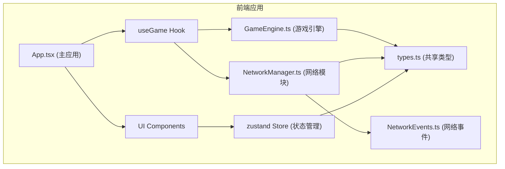
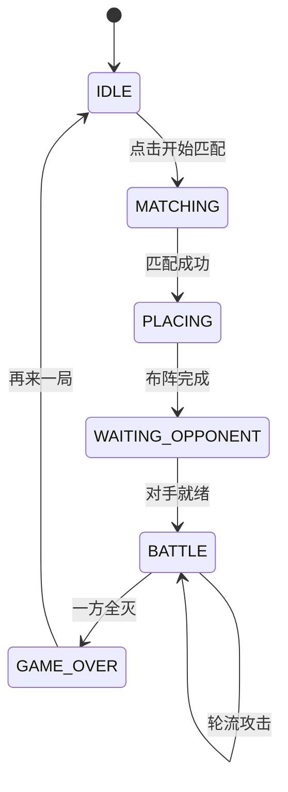

## 1. 架构设计



## 2. 技术描述

- **前端框架**: React@18 + TypeScript
- **构建工具**: Vite@5 + @vitejs/plugin-react
- **状态管理**: zustand@4
- **核心模块分离**:
  - `src/engine/` - 游戏逻辑引擎，与网络完全解耦
  - `src/network/` - 网络对战模块，通过共享接口与引擎通信
- **模拟网络**: 由于是纯前端项目，使用 BroadcastChannel 模拟双人对战（同一浏览器不同标签页）

## 3. 文件结构

| 文件路径 | 作用 |
|---------|------|
| `package.json` | 项目依赖与脚本 |
| `index.html` | 入口HTML |
| `vite.config.ts` | Vite配置（含React插件） |
| `tsconfig.json` | TypeScript配置（strict模式） |
| `src/engine/types.ts` | 共享类型定义 |
| `src/engine/GameEngine.ts` | 游戏核心逻辑（网格、战舰、攻击、胜负） |
| `src/network/NetworkEvents.ts` | 网络事件常量与消息格式 |
| `src/network/NetworkManager.ts` | 网络对战管理（房间、匹配、同步、超时） |
| `src/store/gameStore.ts` | zustand状态管理 |
| `src/hooks/useGame.ts` | 自定义Hook，联接引擎与网络 |
| `src/components/` | UI组件（棋盘、战舰、聊天、状态面板等） |
| `src/App.tsx` | 主应用组件 |
| `src/styles.css` | 全局样式 |
| `src/main.tsx` | 应用入口 |

## 4. 核心类型定义

```typescript
// src/engine/types.ts
export enum CellStatus {
  EMPTY = 'empty',
  SHIP = 'ship',
  HIT = 'hit',
  MISS = 'miss',
  SUNK = 'sunk'
}

export enum GamePhase {
  IDLE = 'idle',
  MATCHING = 'matching',
  PLACING = 'placing',
  WAITING_OPPONENT = 'waiting_opponent',
  BATTLE = 'battle',
  GAME_OVER = 'game_over'
}

export enum ConnectionStatus {
  DISCONNECTED = 'disconnected',
  CONNECTING = 'connecting',
  CONNECTED = 'connected',
  RECONNECTING = 'reconnecting'
}

export interface Ship {
  id: string;
  name: string;
  size: number;
  health: number;
  positions: { row: number; col: number }[];
  orientation: 'horizontal' | 'vertical';
  isPlaced: boolean;
  isSunk: boolean;
}

export interface Player {
  id: string;
  name: string;
  ships: Ship[];
  board: CellStatus[][];
  isReady: boolean;
}

export interface AttackResult {
  row: number;
  col: number;
  isHit: boolean;
  isSunk: boolean;
  sunkShipName?: string;
  isGameOver: boolean;
}

export interface GameState {
  phase: GamePhase;
  currentPlayerId: string;
  player: Player;
  opponent: Player;
  turnTimeLeft: number;
  winnerId: string | null;
  attackHistory: { playerId: string; row: number; col: number; result: AttackResult }[];
  connectionStatus: ConnectionStatus;
}

export interface EmoteBubble {
  id: string;
  playerId: string;
  emote: string;
  timestamp: number;
}
```

## 5. 网络消息格式

```typescript
// src/network/NetworkEvents.ts
export enum NetworkEventType {
  MATCH_REQUEST = 'match_request',
  MATCH_FOUND = 'match_found',
  PLAYER_READY = 'player_ready',
  ATTACK = 'attack',
  ATTACK_RESULT = 'attack_result',
  EMOTE = 'emote',
  PING = 'ping',
  PONG = 'pong',
  RECONNECT = 'reconnect',
  GAME_STATE_SYNC = 'game_state_sync'
}

export interface NetworkMessage<T = unknown> {
  type: NetworkEventType;
  senderId: string;
  roomId: string;
  timestamp: number;
  payload: T;
}
```

## 6. 数据模型与状态流转

### 6.1 游戏状态机



### 6.2 回合超时机制
- 每回合15秒限时
- 超时自动跳过回合
- 5秒未收到对手确认视为连接中断
- 连续3次未确认触发重连机制

## 7. 性能优化策略

1. **zustand 浅比较**: 使用 `shallow` 优化选择器，避免不必要重渲染
2. **组件拆分**: 棋盘格子拆分为单独组件，使用 `React.memo`
3. **动画优化**: 使用 CSS 动画而非 JS 动画，启用 GPU 加速
4. **状态局部更新**: 避免全量状态更新，只更新变化的格子
5. **requestAnimationFrame**: 倒计时和动画使用 RAF 确保60FPS

## 8. 依赖版本

```json
{
  "react": "^18.2.0",
  "react-dom": "^18.2.0",
  "zustand": "^4.5.0",
  "typescript": "^5.4.0",
  "vite": "^5.2.0",
  "@vitejs/plugin-react": "^4.2.0",
  "@types/react": "^18.2.0",
  "@types/react-dom": "^18.2.0"
}
```
