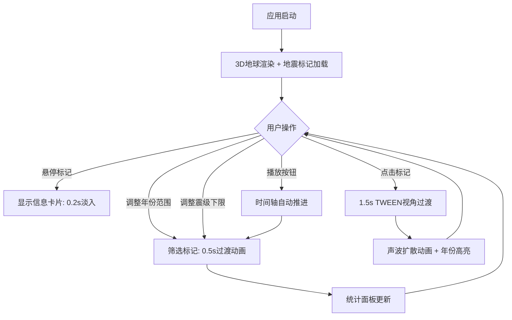

## 1. 产品概述

全球地震活动交互式3D探索器，通过Three.js构建的3D地球和动态时间轴，让用户直观浏览和筛选1900年以来的重大地震事件，解决静态地震目录难以展示地震时间分布、空间聚类和震级关系的问题。

- 目标用户：地质学研究者、灾害管理从业者、科学教育工作者及对地震活动感兴趣的公众
- 核心价值：将120年全球重大地震数据转化为可交互的3D可视化体验，通过空间、时间、震级三维联动筛选，揭示地震活动的分布规律

## 2. 核心功能

### 2.1 用户角色

| 角色 | 使用方式 | 核心权限 |
|------|----------|----------|
| 访客 | 无需注册 | 浏览全部地震数据、交互筛选、查看统计 |

### 2.2 功能模块

1. **3D地球主视图**：旋转地球表面标记地震事件，鼠标悬停查看详情，点击聚焦
2. **控制面板**：年份范围选择、震级下限筛选、播放/暂停时间轴动画
3. **统计面板**：柱状图展示年度地震数量，指标卡显示汇总数据
4. **交互反馈系统**：声波扩散动画、视角平滑过渡、标记出现/消失动画

### 2.3 页面详情

| 页面名称 | 模块名称 | 功能描述 |
|----------|----------|----------|
| 主页面 | 3D地球场景 | 渲染带纹理的3D地球（半径5单位），表面以彩色球体标记地震，颜色按震级分档（6.0-6.9橙色#ff9800，7.0-7.9红色#f44336，8.0+深红#b71c1c），大小正比于震级^1.2，支持鼠标悬停信息卡片和点击聚焦 |
| 主页面 | 侧边控制面板 | 占屏幕宽度25%，背景#1a1a2e半透明毛玻璃效果，包含年份双滑块（1900-2024）、震级下限滑块（6.0-9.0）、播放/暂停按钮，筛选变化时标记0.5s缩放淡入淡出过渡 |
| 主页面 | 底部统计面板 | 高度150px，背景渐变#0f3460→#1a1a2e，Canvas 2D绘制柱状图（宽20px间距5px，#4ecdc4→#ff6b6b渐变圆角3px，悬停显示数值），右侧三个指标卡（总事件数、平均震级、最大震级，圆角12px白色磨砂背景） |
| 主页面 | 交互反馈层 | 左下角高亮选中年份，声波扩散动画（1s半透明环形），点击标记1.5s TWEEN平滑视角过渡到标记上方 |

## 3. 核心流程

用户打开应用 → 看到3D地球缓缓自转，地震标记分布在表面 → 拖动年份范围滑块筛选时间段 → 调整震级下限过滤事件 → 地球标记动态出现/消失 → 悬停标记查看详情卡片 → 点击标记视角聚焦 → 观察底部柱状图变化 → 点击播放按钮自动推进时间轴

## 4. 界面设计

### 4.1 设计风格

- 主色调：深蓝#0f3460、亮青#4ecdc4、暖橙#ff9800，深色科幻风格
- 按钮风格：圆角胶囊型，带微光边框，悬停时亮青色辉光
- 字体：非衬线体，Orbitron作为展示字体，Exo 2作为UI字体
- 布局风格：左侧3D地球为主视区，右侧控制面板为侧边栏，底部统计面板
- 图标风格：线性科幻风，lucide-react图标库

### 4.2 页面设计概览

| 页面名称 | 模块名称 | UI元素 |
|----------|----------|--------|
| 主页面 | 3D地球场景 | 深色太空背景星空粒子，地球居中偏左，自转动画0.001rad/s，标记球体带辉光效果，悬停卡片半透明黑底白字圆角8px淡入0.2s |
| 主页面 | 侧边控制面板 | 25%宽度，#1a1a2e半透明backdrop-filter:blur(10px)，双滑块轨道6px填充区间#ff9800-#f44336，胶囊播放按钮 |
| 主页面 | 底部统计面板 | 150px高度，渐变背景，Canvas柱状图居左，三个指标卡居右，12px圆角磨砂白底 |
| 主页面 | 交互反馈 | 左下角年份高亮，声波环从标记位置1s扩散，1.5s视角过渡 |

### 4.3 响应式适配

- 桌面优先设计，宽度≥768px：侧边栏在右侧25%宽度
- 宽度<768px：侧边栏折叠为底部抽屉，可上拉展开，柱状图面板保持150px高度
- 3D地球自适应缩放填满可用空间

### 4.4 3D场景指引

- 环境：深空黑色背景，点缀微弱星点粒子
- 光照：主方向光模拟太阳（偏暖白），环境光低强度蓝调
- 相机：透视相机，初始位置距离地球约15单位，可鼠标拖拽旋转缩放
- 构图：地球居中偏左，右侧控制面板覆盖在3D场景上方
- 交互：OrbitControls旋转缩放，Raycaster悬停/点击检测
- 后处理：可选Bloom效果增强标记辉光
- 性能预算：500标记时≥30FPS，柱状图渲染<50ms
