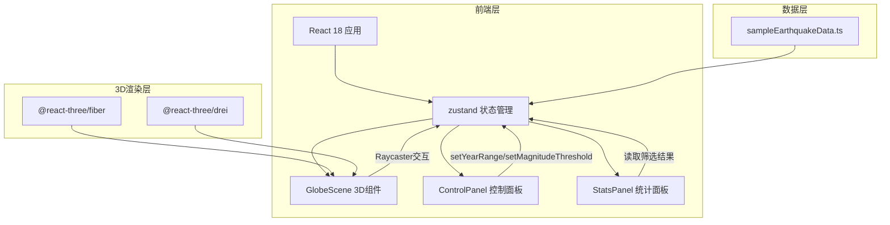
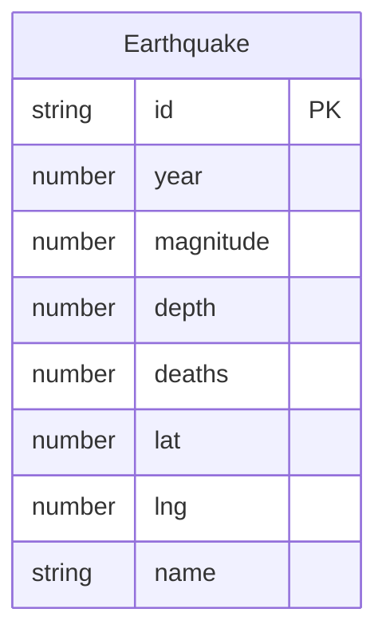

## 1. 架构设计



## 2. 技术说明

- 前端：React@18 + TypeScript + Three.js + @react-three/fiber + @react-three/drei + zustand
- 初始化工具：vite-init (react-ts模板)
- 构建工具：Vite + @vitejs/plugin-react
- 状态管理：zustand
- 后端：无
- 数据库：无，使用静态本地数据集（100+条1900-2024年地震记录）

## 3. 路由定义

| 路由 | 用途 |
|------|------|
| / | 主页面，包含3D地球、控制面板、统计面板 |

## 4. API定义

无后端API，所有数据来自本地静态数据集。

## 5. 服务器架构图

无后端服务。

## 6. 数据模型

### 6.1 数据模型定义



### 6.2 数据定义语言

```typescript
interface Earthquake {
  id: string;
  year: number;
  magnitude: number;
  depth: number;
  deaths: number;
  lat: number;
  lng: number;
  name: string;
}

interface FilterState {
  yearRange: [number, number];
  magnitudeThreshold: number;
  selectedYear: number | null;
  isPlaying: boolean;
}

interface StoreState extends FilterState {
  earthquakes: Earthquake[];
  filteredEarthquakes: Earthquake[];
  setYearRange: (range: [number, number]) => void;
  setMagnitudeThreshold: (threshold: number) => void;
  selectYear: (year: number | null) => void;
  togglePlay: () => void;
}
```

## 7. 文件组织

```
├── package.json
├── index.html
├── vite.config.ts
├── tsconfig.json
├── src/
│   ├── main.tsx
│   ├── App.tsx
│   ├── store/
│   │   └── earthquakeStore.ts
│   ├── components/
│   │   ├── GlobeScene.tsx
│   │   ├── ControlPanel.tsx
│   │   └── StatsPanel.tsx
│   └── data/
│       └── sampleEarthquakeData.ts
```
