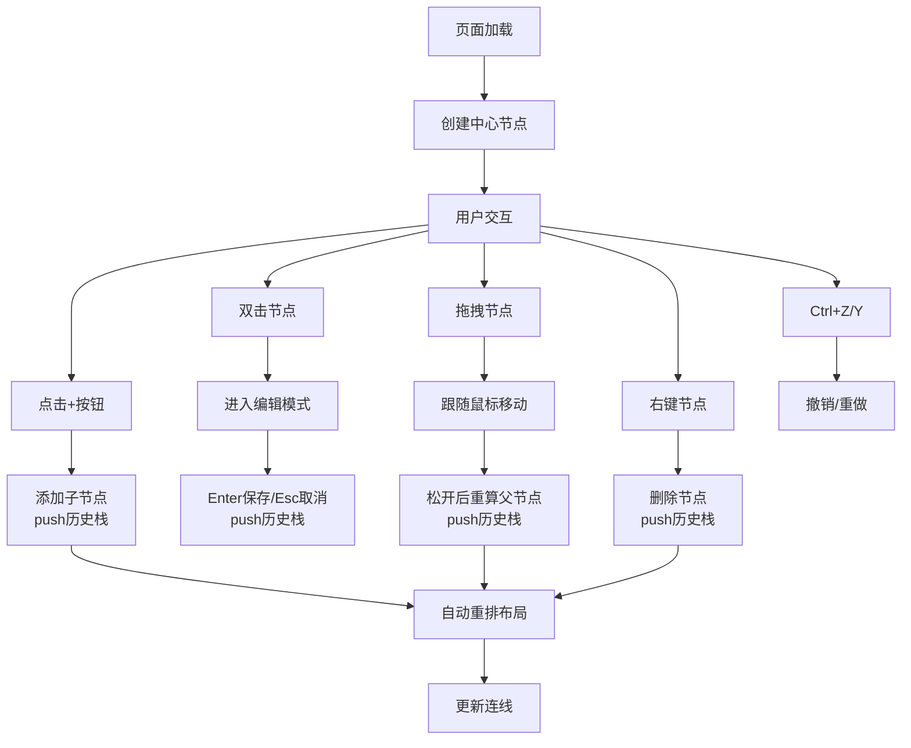

## 1. 产品概述
在线轻量级思维导图编辑与协作应用，面向创意写作和头脑风暴场景，用户无需注册即可快速创建、编辑和分享结构化思维导图。
- 解决问题：现有工具复杂（需注册登录多步操作）、无法实时协作、导出格式受限
- 目标用户：创意工作者、学生、产品经理、会议参与者等需要快速整理思路的人群
- 核心价值：零门槛使用、高效交互、即时导出

## 2. 核心功能

### 2.1 用户角色
| 角色 | 注册方式 | 核心权限 |
|------|----------|----------|
| 访客用户 | 无需注册，直接使用 | 全部功能：创建/编辑/删除节点、拖拽、撤销重做、导出 |

### 2.2 功能模块
1. **主界面**：工具栏、画布区域、节点渲染
2. **节点管理**：添加子节点、编辑文本、删除节点、拖拽移动
3. **布局系统**：自动布局算法、节点连线渲染、缩放平移
4. **历史管理**：撤销（Ctrl+Z）、重做（Ctrl+Y）、50步历史栈
5. **导出功能**：JSON数据导出、PNG图片导出

### 2.3 页面详情
| 页面名称 | 模块名称 | 功能描述 |
|-----------|-------------|---------------------|
| 主页面 | 顶部工具栏 | 应用标题、导出按钮（JSON/PNG下拉菜单）、响应式折叠菜单 |
| 主页面 | 画布区域 | 浅灰背景+网格辅助线、缩放(0.5x-2x)、平移（拖拽空白区） |
| 主页面 | 节点组件 | 圆角矩形、层级渐变背景、双击编辑、拖拽移动、+按钮、右键删除 |
| 主页面 | 连线渲染 | SVG贝塞尔曲线、2px灰色实线、0.3s过渡动画 |
| 主页面 | 编辑交互 | 文本框输入、Enter确认/Esc取消、蓝色编辑边框 |

## 3. 核心流程

### 3.1 主用户流程
用户打开页面 → 自动创建中心节点"中心主题" → 点击+按钮添加子节点 → 双击编辑节点文本 → 拖拽调整位置 → 使用Ctrl+Z/Y撤销重做 → 点击导出按钮选择JSON/PNG → 下载文件

### 3.2 节点操作流程图

## 4. 用户界面设计

### 4.1 设计风格
- **主色调**：浅紫#e8e0f0（一级）、浅蓝#dce7f5（二级）、浅绿#dff0d8（三级）
- **辅助色**：蓝色#4a90d9（编辑边框）、灰色#ddd（分隔线）、#e0e0e0（网格线）
- **背景色**：浅灰#f5f5f5（画布）、白色（工具栏）
- **按钮样式**：圆角6px，hover背景#e8e0f0，0.2s过渡
- **节点样式**：圆角8px矩形，文本居中，层级渐变背景
- **字体**：无衬线字体系统栈，标题20px/粗体，一级节点18px/粗体，子节点14px/常规
- **布局风格**：顶部工具栏固定 + 画布区域自适应填充
- **图标风格**：简洁线性图标（lucide-react）

### 4.2 页面设计概览
| 页面名称 | 模块名称 | UI元素 |
|-----------|-------------|-------------|
| 主页面 | 工具栏 | 48px高白色底、1px底部分隔线、左侧标题"思维导图"、右侧导出按钮+汉堡菜单 |
| 主页面 | 画布 | #f5f5f5背景、20px间距网格线、缩放平移、SVG连线层、节点绝对定位 |
| 主页面 | 节点 | 圆角8px、渐变背景色、14-18px字号、+按钮右侧悬浮、拖拽半透明阴影 |
| 主页面 | 编辑态 | 2px蓝色边框#4a90d9、文本框输入、Enter/Esc快捷键 |
| 主页面 | 导出菜单 | 下拉式、JSON/PNG两项选项、点击触发下载 |

### 4.3 响应式
- 桌面优先设计（>768px）
- 窗口宽度<768px时：
  - 工具栏导出按钮变为汉堡图标菜单
  - 所有节点字号缩小1px
  - 自动布局间距由30px调整为25px
  - 触摸操作优化

### 4.4 性能约束
- 100+节点编辑/拖拽无明显卡顿（≥50fps）
- 200节点以内重排算法≤50ms
- 所有过渡动画0.2s（transform/opacity/background-color）
- 连线动画0.3s过渡
