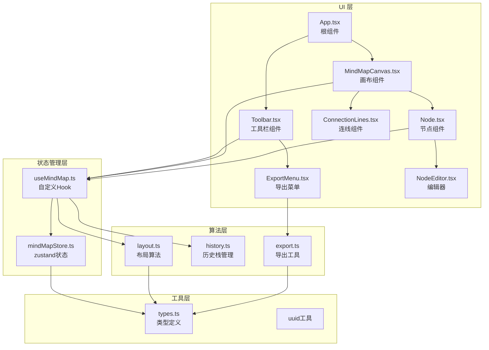

## 1. 架构设计



## 2. 技术选型
- **前端框架**：React 18 + TypeScript 5（严格模式）
- **构建工具**：Vite 5 + @vitejs/plugin-react
- **状态管理**：Zustand 4（轻量级store）
- **导出功能**：html-to-image（PNG截图）、Blob + URL.createObjectURL（JSON下载）
- **ID生成**：uuid v4
- **图标库**：lucide-react（简洁线性图标）
- **测试工具**：无额外测试框架（通过npm run check类型检查）

## 3. 路由定义
| 路由 | 用途 |
|-------|---------|
| / | 主页面（单页应用，无额外路由） |

## 4. 核心类型定义

```typescript
// src/types/mindMap.ts
interface MindMapNode {
  id: string;                    // 唯一ID（uuid）
  text: string;                  // 节点文本
  children: string[];            // 子节点ID数组
  x: number;                     // X坐标
  y: number;                     // Y坐标
  color: string;                 // 背景色（按层级）
  level: number;                 // 层级（根节点=0）
  width?: number;                // 节点宽度
  height?: number;               // 节点高度
}

interface MindMapState {
  nodes: Record<string, MindMapNode>;  // 节点ID→节点映射
  rootId: string;                       // 根节点ID
  selectedNodeId: string | null;        // 当前选中节点
  history: {                            // 历史栈
    past: Snapshot[];
    future: Snapshot[];
  };
  viewport: {                           // 视口状态
    scale: number;                      // 缩放（0.5-2）
    offsetX: number;                    // 平移X
    offsetY: number;                    // 平移Y
  };
}

interface Snapshot {
  nodes: Record<string, MindMapNode>;
  rootId: string;
}
```

## 5. 状态管理架构

### 5.1 Zustand Store 结构（src/store/mindMapStore.ts）
```
mindMapStore
├── state
│   ├── nodes: Record<string, MindMapNode>
│   ├── rootId: string
│   ├── selectedNodeId: string | null
│   ├── history: { past: Snapshot[], future: Snapshot[] }
│   └── viewport: { scale, offsetX, offsetY }
├── actions
│   ├── setNodes()                     // 设置节点树
│   ├── selectNode(id)                 // 选中节点
│   ├── pushHistory()                  // 入历史栈
│   ├── undo()                         // 撤销
│   ├── redo()                         // 重做
│   ├── setViewport()                  // 更新视口
│   └── reset()                        // 重置
```

### 5.2 useMindMap Hook（src/hooks/useMindMap.ts）
**职责**：封装节点操作逻辑，暴露简洁API给组件使用

**操作函数**：
- `addChild(parentId: string)` → 创建子节点+重排+入栈
- `editText(nodeId: string, text: string)` → 更新文本+入栈
- `deleteNode(nodeId: string)` → 删除节点+级联清理+重排+入栈
- `moveNode(nodeId: string, x: number, y: number)` → 直接设置坐标（拖拽中）
- `endDrag(nodeId: string)` → 计算新父节点+重排+入栈
- `onUndo()` / `onRedo()` → 历史操作

**数据流向**：
```
UI组件事件（onClick/onDoubleClick/onDrag）
    ↓
useMindMap操作函数（addChild/editText/...）
    ↓
pushHistory() → 保存快照到past，清空future
    ↓
操作nodes数据结构（增删改）
    ↓
计算布局（layout.ts）→ 更新所有节点x/y坐标
    ↓
zustand store.set() → 更新state
    ↓
订阅store的组件自动重渲染
```

## 6. 布局算法（src/utils/layout.ts）

### 6.1 算法说明
- **根节点**：初始位置为画布中心（viewportWidth/2, viewportHeight/2）
- **子节点排列**：在父节点下方垂直主轴，子节点水平均匀排列
- **间距**：父子垂直间距80px，兄弟水平间距30px（移动端25px）
- **层级缩进**：按level缩进20px（视觉上通过坐标计算实现）

### 6.2 核心函数
```typescript
function calculateLayout(
  nodes: Record<string, MindMapNode>,
  rootId: string,
  options?: { siblingGap: number; levelGap: number }
): Record<string, MindMapNode>
```

### 6.3 最近父节点算法（拖拽结束时）
```typescript
function findNearestParent(
  draggedId: string,
  nodes: Record<string, MindMapNode>
): { parentId: string; insertIndex: number } | null
```
- 遍历除自身及子孙外的所有节点
- 计算与拖拽节点的距离（优先同层级/上一层级）
- 选择距离最近且层级≤draggedLevel的节点作为新父节点
- 按Y坐标确定插入兄弟节点列表的位置

## 7. 文件结构与调用关系

```
src/
├── main.tsx                      # 入口，渲染App，设置全屏样式
├── App.tsx                       # 根组件，组装Toolbar+MindMapCanvas
├── types/
│   └── mindMap.ts                # 类型定义（被所有模块引用）
├── store/
│   └── mindMapStore.ts           # zustand store（被hooks引用）
├── hooks/
│   └── useMindMap.ts             # 自定义Hook（被组件引用，引用store+utils）
├── utils/
│   ├── layout.ts                 # 布局算法（被hooks引用，引用types）
│   ├── history.ts                # 历史栈工具（被hooks引用）
│   └── export.ts                 # 导出工具（被ExportMenu引用）
├── components/
│   ├── Toolbar.tsx               # 工具栏（引用useMindMap+ExportMenu）
│   ├── ExportMenu.tsx            # 导出菜单（引用export.ts）
│   ├── MindMapCanvas.tsx         # 画布核心（引用useMindMap+Node+ConnectionLines）
│   ├── Node.tsx                  # 节点组件（引用useMindMap+NodeEditor）
│   ├── NodeEditor.tsx            # 节点编辑器（引用useMindMap）
│   └── ConnectionLines.tsx       # SVG连线（引用nodes数据）
└── styles/
    └── global.css                # 全局样式（网格线、滚动隐藏）
```

## 8. 性能优化策略

1. **节点组件 memo 化**：使用 React.memo 包装 Node，避免无关重渲染
2. **计算批量更新**：拖拽中使用 rAF 节流，每帧最多更新一次坐标
3. **布局缓存**：节点数未变化时复用上次布局结果
4. **连线渲染优化**：仅渲染实际存在的父子连线，SVG path 复用
5. **历史栈浅拷贝**：使用 Immer 风格的对象展开，仅更新变化节点
6. **Canvas 层级分离**：节点层、连线层、背景层分离渲染
7. **resizeObserver**：监听节点尺寸变化自动触发布局重算

## 9. 构建配置要点

- **vite.config.ts**：React插件启用，路径别名 `@` → `src`
- **tsconfig.json**：strict:true，lib:["ESNext","DOM"]，jsx:"react-jsx"
- **package.json scripts**：`npm run dev`启动开发服务器
