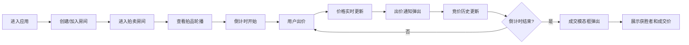

## 1. 产品概述

在线虚拟拍卖会是一个轻量级的实时竞价平台，用户可以在浏览器中创建或加入拍卖房间，对展示的拍品进行实时竞价，适用于线上慈善拍卖、艺术品拍卖、闲置物品竞拍等场景。

- **核心价值**：提供流畅的实时竞价体验，让用户足不出户即可参与拍卖活动
- **目标用户**：拍卖组织者、竞拍参与者、慈善机构等
- **产品定位**：轻量级、易上手、视觉精美的线上拍卖工具

## 2. 核心功能

### 2.1 用户角色

| 角色 | 登录方式 | 核心权限 |
|------|----------|----------|
| 房间创建者 | 输入昵称 | 创建拍卖房间、设置拍品参数、开启拍卖 |
| 竞拍参与者 | 输入昵称 | 加入房间、查看拍品、参与竞价、查看历史 |

### 2.2 功能模块

1. **拍卖房间页面**：拍品展示轮播、当前价格、倒计时、出价按钮、竞价历史时间线、参与者列表
2. **房间创建/加入**：设置房间名称、起拍价、竞价步长
3. **实时竞价系统**：WebSocket 实时通信、出价通知、价格更新
4. **拍卖结算**：倒计时结束、成交模态框、获胜者展示

### 2.3 页面详情

| 页面名称 | 模块名称 | 功能描述 |
|---------|----------|----------|
| 拍卖房间页 | 拍品轮播 | 自动播放，3秒间隔，fade 过渡效果 |
| 拍卖房间页 | 价格展示 | 显示当前最高出价 |
| 拍卖房间页 | 倒计时 | 红色 #ff4444 字体，每秒更新，最后10秒放大+脉冲动画 |
| 拍卖房间页 | 出价按钮 | 金色 #ffd700 渐变，悬停 #ffaa00，按下缩放到 0.95 倍 |
| 拍卖房间页 | 通知卡片 | 右上角半透明弹出，3秒后淡出，显示出价信息 |
| 拍卖房间页 | 竞价历史 | 时间线形式，左右交错进入动画 |
| 拍卖房间页 | 参与者列表 | 右栏展示当前房间参与者 |
| 拍卖房间页 | 成交模态框 | 毛玻璃背景，底部滑入动画，显示成交价和获胜者 |

## 3. 核心流程

用户进入首页 → 创建/加入拍卖房间 → 进入拍卖房间 → 查看拍品和倒计时 → 点击出价 → 实时更新价格和历史 → 倒计时结束 → 弹出成交结果

## 4. 用户界面设计

### 4.1 设计风格

- **主题色调**：深色主题，背景 #1a1a2e，卡片背景 #16213e
- **强调色**：金色 #ffd700（按钮）、红色 #ff4444（倒计时）
- **字体颜色**：白色为主，辅以半透明白色次要信息
- **按钮风格**：圆角设计，金色渐变，悬停和按下有过渡动画
- **卡片风格**：圆角 + 柔和阴影，半透明效果
- **整体风格**：精致高级，类似高端拍卖平台的深色奢华感

### 4.2 页面设计概述

| 页面名称 | 模块名称 | UI 元素 |
|---------|----------|---------|
| 拍卖房间页 | 布局 | 左右两栏，左栏 65% 右栏 35% |
| 拍卖房间页 | 拍品轮播 | 大尺寸展示区，fade 过渡，自动播放 |
| 拍卖房间页 | 价格区 | 大字号当前价格，起拍价参考 |
| 拍卖房间页 | 倒计时 | 红色醒目字体，最后10秒脉冲动画 |
| 拍卖房间页 | 竞价历史 | 时间线样式，交错进入动画 |
| 拍卖房间页 | 出价按钮 | 金色渐变，醒目位置，点击反馈 |
| 拍卖房间页 | 参与者列表 | 头像+昵称，在线状态 |
| 拍卖房间页 | 通知卡片 | 右上角弹出，半透明背景 |
| 拍卖房间页 | 成交模态框 | 毛玻璃背景，底部滑入 |

### 4.3 响应式

- 以桌面端为主要设计目标
- 左右两栏布局在小屏幕下自动调整为上下布局
- 确保触控设备上按钮可点击区域足够大

### 4.4 性能要求

- 所有动画 FPS 稳定在 55 帧以上
- 竞价数据更新延迟不超过 200ms
- WebSocket 连接稳定，支持自动重连
