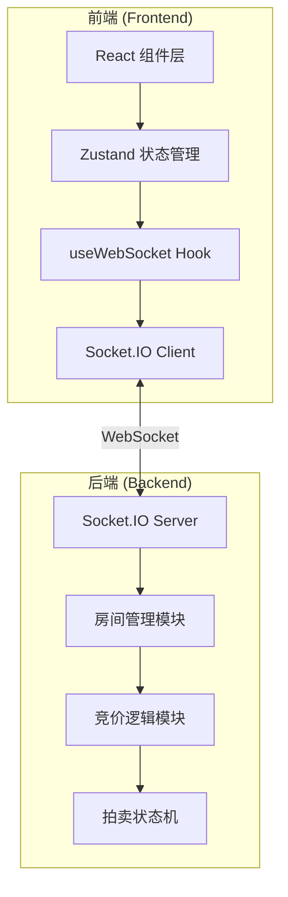
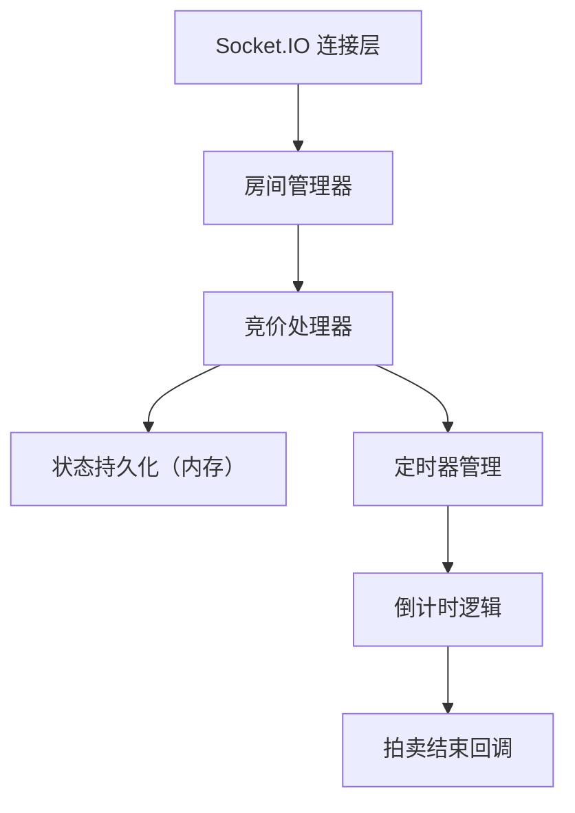

## 1. 架构设计

前后端分离架构，前端负责 UI 渲染和用户交互，后端负责业务逻辑和实时通信，通过 WebSocket 进行双向数据传输。



## 2. 技术描述

- **前端框架**：React 18 + TypeScript
- **构建工具**：Vite 5 + @vitejs/plugin-react
- **状态管理**：zustand 4
- **实时通信**：socket.io-client
- **样式方案**：CSS Modules / 内联样式（动画用 CSS keyframes）
- **后端框架**：Express 4 + TypeScript
- **实时通信**：Socket.IO 4
- **运行方式**：ts-node 开发运行

## 3. 项目结构

### 前端目录结构
```
/
├── package.json          # 前端依赖和脚本
├── index.html            # 入口 HTML
├── vite.config.ts        # Vite 配置
├── tsconfig.json         # TypeScript 配置
└── src/
    ├── main.tsx          # React 挂载入口
    ├── App.tsx           # 主应用组件（路由+全局布局）
    ├── pages/
    │   └── AuctionRoom.tsx  # 拍卖房间页面
    ├── hooks/
    │   └── useWebSocket.ts  # WebSocket 自定义 Hook
    └── store/            # zustand store（可选）
```

### 后端目录结构
```
server/
├── package.json          # 后端依赖和脚本
├── tsconfig.json         # TypeScript 配置
└── index.ts              # Express + Socket.IO 入口
```

## 4. WebSocket 消息定义

### 客户端 → 服务端

| 事件名 | 数据结构 | 描述 |
|--------|----------|------|
| `create-room` | `{ roomName: string, startPrice: number, bidStep: number, userName: string }` | 创建拍卖房间 |
| `join-room` | `{ roomId: string, userName: string }` | 加入拍卖房间 |
| `place-bid` | `{ roomId: string, amount: number }` | 出价 |

### 服务端 → 客户端

| 事件名 | 数据结构 | 描述 |
|--------|----------|------|
| `room-created` | `{ roomId: string }` | 房间创建成功 |
| `room-state` | `{ currentPrice: number, bidders: Bidder[], bidHistory: BidRecord[], timeLeft: number, status: 'waiting' | 'active' | 'ended' }` | 房间状态更新 |
| `bid-placed` | `{ user: string, amount: number, timestamp: number }` | 新出价通知 |
| `auction-ended` | `{ winner: string, finalPrice: number }` | 拍卖结束 |
| `error` | `{ message: string }` | 错误信息 |

### 数据类型定义

```typescript
interface Bidder {
  id: string;
  name: string;
}

interface BidRecord {
  id: string;
  user: string;
  amount: number;
  timestamp: number;
}
```

## 5. 服务端架构



### 核心模块说明

1. **房间管理器**：维护所有活跃房间，处理创建/加入逻辑
2. **竞价处理器**：验证出价合法性（高于当前价、步长正确），更新最高价
3. **定时器管理**：每个房间独立倒计时，每秒更新，最后10秒特殊处理
4. **状态流转**：waiting → active → ended

## 6. 前端状态管理

使用 zustand 管理全局状态，useWebSocket Hook 封装通信逻辑。

### 状态结构
```typescript
interface AuctionState {
  roomId: string | null;
  currentPrice: number;
  bidHistory: BidRecord[];
  participants: Bidder[];
  timeLeft: number;
  status: 'waiting' | 'active' | 'ended';
  winner: string | null;
  finalPrice: number | null;
  notifications: Notification[];
}
```

## 7. 性能优化策略

- **CSS 动画优先**：所有过渡和动画使用 CSS transform 和 opacity，确保 GPU 加速
- **React 优化**：使用 memo、useMemo、useCallback 减少不必要重渲染
- **WebSocket 节流**：高频事件合并处理，避免过于频繁的状态更新
- **图片懒加载**：拍品图片预加载，轮播切换流畅
- **requestAnimationFrame**：倒计时等动画使用 RAF 保证帧率
