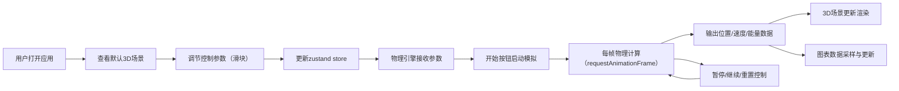

## 1. 产品概述

交互式3D弹簧振子物理模拟与参数可视化应用，面向物理教学和工程模拟场景，帮助学生和工程师直观理解弹簧振子系统在不同阻尼系数和驱动力下的运动规律，解决传统公式和静态图表难以展示连续变化振动轨迹与能量转换过程的问题。

- 目标用户：物理教师、学生、工程仿真工程师
- 产品价值：通过交互式三维可视化，让抽象的物理公式变得直观可感知

## 2. 核心功能

### 2.1 功能模块
1. **主3D场景模块**：展示弹簧振子系统的三维可视化，包含弹簧、质点、天花板固定点、重力指示箭头
2. **物理引擎模块**：基于欧拉法积分实时计算弹簧位移、速度、加速度、动能和势能
3. **控制面板模块**：阻尼系数、弹簧刚度、驱动力幅度、驱动频率参数调节，以及开始/暂停/重置控制
4. **数据可视化模块**：实时绘制位移-时间曲线和能量-时间曲线（动能、势能、总能量）

### 2.2 页面详情
| 页面名称 | 模块名称 | 功能描述 |
|-----------|-------------|---------------------|
| 主应用 | 3D场景模块 | 渲染螺旋线弹簧（10圈，半径0.4）、红色金属质点球（半径0.3）、灰色天花板方块（0.5x0.5x0.3，y=3）、重力方向箭头；渐变天空背景（#1a1a2e到#16213e）；两盏方向光+一盏环境光；相机以质点为中心自动旋转（0.002rad/帧），支持鼠标拖拽覆盖，5秒无交互恢复自动旋转 |
| 主应用 | 控制面板 | 阻尼系数滑块（0-20，步长0.1，蓝色#2196f3）、弹簧刚度滑块（1-10，步长0.1，绿色#4caf50）、驱动力幅度滑块（0-10，步长0.1，橙色#ff9800）、驱动频率滑块（0.1-2，步长0.1，紫色#9c27b0）；每个滑块带实时数值显示；开始（绿色#4caf50）/暂停（橙色#ff9800，暂停后变为继续）/重置（灰色#f44336）按钮，圆角8px，高36px，点击缩放动画0.95→1.0过渡0.15s |
| 主应用 | 图表面板 | 位移-时间曲线（蓝色#2196f3，线宽2px，横轴0-10s，纵轴-2到2单位）；能量-时间曲线（动能青色#00bcd4，势能橙色#ff9800，总能量紫色#9c27b0，线宽1.5px）；图表背景rgba(0,0,0,0.3)，网格线，坐标轴标签10px#888 |

## 3. 核心流程

用户打开应用→查看默认参数下的3D弹簧振子场景→通过滑块调节阻尼/刚度/驱动力/频率参数→点击开始启动模拟→观察质点振动、弹簧伸缩和实时图表数据→可暂停/继续/重置模拟→通过鼠标拖拽多角度观察3D场景

## 4. 用户界面设计

### 4.1 设计风格
- **主色调**：深色主题，背景#1a1a2e，卡片/面板#16213e
- **功能色**：阻尼蓝色#2196f3，刚度绿色#4caf50，驱动力橙色#ff9800，频率紫色#9c27b0
- **按钮色**：开始绿#4caf50，暂停橙#ff9800，重置红#f44336
- **图表色**：位移蓝#2196f3，动能青#00bcd4，势能橙#ff9800，总能紫#9c27b0
- **文字**：主文本#ddd，强调文本#fff，辅助文本#888
- **材质效果**：控制面板和图表面板采用半透明磨砂玻璃（rgba(22,33,62,0.8)，backdrop-filter: blur(8px)）
- **交互过渡**：所有元素0.25s ease平滑过渡，按钮点击0.15s缩放动画
- **按钮风格**：圆角8px，高36px，白色字体
- **滑块**：宽100%，高8px，轨道浅灰#ccc，圆形手柄直径16px，按功能着色

### 4.2 页面设计布局
| 页面名称 | 模块名称 | UI元素布局 |
|-----------|-------------|-------------|
| 主应用 | 整体布局 | Flex横向排列，主3D场景占左侧剩余宽度，右侧面板（宽25%，最小320px）包含控制面板（上）和图表面板（下，高30%） |
| 主应用 | 控制面板 | 参数字段标签+数值（14px#ddd）→ 滑块控件 → 间距后排列三个按钮 |
| 主应用 | 图表面板 | 上下两张子图：位移曲线（上）、能量曲线（下），均带深色半透明背景和网格 |
| 主应用 | 响应式 | 桌面：控制面板右栏；平板<1024px：控制面板移到底部，图表面板折叠为可展开抽屉 |

### 4.3 响应式设计
- **桌面端（>=1024px）**：横向flex布局，3D场景占左侧，右侧控制面板（宽25%，最小320px）+图表面板
- **平板/移动端（<1024px）**：纵向flex布局，3D场景占主区域，控制面板移至底部，图表面板折叠为可展开抽屉
- **触控优化**：滑块和按钮增大触控区域，支持触屏手势旋转3D场景

### 4.4 3D场景设计
- **环境**：渐变天空背景（从#1a1a2e顶部渐变到#16213e底部）
- **灯光**：两盏方向光（主光源+补光）+一盏环境光，营造金属质感
- **相机**：初始位置以质点为中心，透视相机，自动环绕旋转
- **焦点元素**：红色金属质点为主视觉焦点，弹簧螺旋线有金属光泽
- **交互**：OrbitControls支持鼠标拖拽旋转/缩放/平移，松手5秒后恢复自动旋转
- **性能**：物理计算60Hz+，图表采样<=100ms，帧率>=50fps
