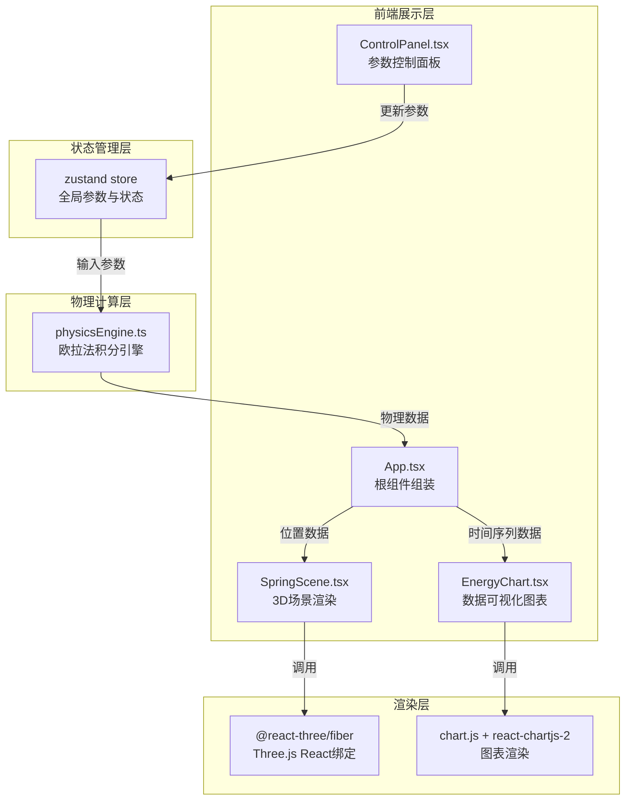

## 1. 架构设计



## 2. 技术栈说明

- **前端框架**：React 18 + TypeScript 5
- **构建工具**：Vite 5（@vitejs/plugin-react，构建目标es2020）
- **3D渲染**：Three.js + @react-three/fiber + @react-three/drei
- **图表库**：chart.js + react-chartjs-2
- **状态管理**：zustand
- **样式方案**：原生CSS（CSS变量，无Tailwind依赖，按用户指定色值）

## 3. 目录结构与文件职责

```
auto99/
├── package.json              # 依赖声明与脚本配置
├── vite.config.js            # Vite构建配置（React插件，es2020目标）
├── tsconfig.json             # TS配置（严格模式，jsx: react-jsx）
├── index.html                # 入口HTML（viewport+标题）
└── src/
    ├── App.tsx               # 根组件：组装3D场景+控制面板+图表面板，数据流中枢
    ├── physicsEngine.ts      # 物理引擎：欧拉法积分，计算位移/速度/加速度/能量
    ├── SpringScene.tsx       # 3D场景：弹簧（螺旋线）+质点+天花板+灯光+相机
    ├── ControlPanel.tsx      # 控制面板：4个滑块+3个按钮，更新zustand状态
    ├── EnergyChart.tsx       # 图表模块：位移曲线+能量曲线（3条线）
    └── store.ts              # zustand全局状态：控制参数+模拟状态+时间序列数据
```

**调用关系与数据流向**：
1. `ControlPanel.tsx` → 用户操作滑块/按钮 → 更新 `store.ts` 中的参数/状态
2. `App.tsx` → 订阅 `store.ts` 参数 → 每帧（requestAnimationFrame）调用 `physicsEngine.ts`
3. `physicsEngine.ts` → 输出当前帧 `{position, velocity, acceleration, kineticEnergy, potentialEnergy}` → 返回给 `App.tsx`
4. `App.tsx` → 将 `position` 传入 `SpringScene.tsx` 渲染3D场景
5. `App.tsx` → 将时间序列数据（最近10秒）传入 `EnergyChart.tsx` 渲染图表

## 4. 数据模型（Zustand Store）

```typescript
interface SimulationState {
  // 控制参数（由滑块更新）
  damping: number          // 阻尼系数 0-20
  stiffness: number        // 弹簧刚度 1-10
  forceAmplitude: number   // 驱动力幅度 0-10
  forceFrequency: number   // 驱动频率 0.1-2

  // 模拟状态（由按钮更新）
  isRunning: boolean       // 是否运行中
  startTime: number        // 模拟开始时间戳
  elapsedTime: number      // 经过时间（秒）

  // 物理状态（由物理引擎每帧更新）
  position: number         // 当前质点位移（y轴，初始0）
  velocity: number         // 当前速度
  acceleration: number     // 当前加速度

  // 时间序列数据（图表用，最多保留10秒，采样<=100ms）
  history: Array<{
    time: number
    position: number
    kineticEnergy: number
    potentialEnergy: number
    totalEnergy: number
  }>

  // Actions
  setDamping: (v: number) => void
  setStiffness: (v: number) => void
  setForceAmplitude: (v: number) => void
  setForceFrequency: (v: number) => void
  start: () => void
  pause: () => void
  reset: () => void
  updatePhysics: (dt: number) => void  // 由App每帧调用，内部调用physicsEngine
}
```

## 5. 物理引擎算法说明

**受力分析**：
- 弹簧恢复力：`F_spring = -k * y`（k为刚度，y为位移）
- 阻尼力：`F_damping = -c * v`（c为阻尼系数，v为速度）
- 驱动力（正弦）：`F_drive = A * sin(ω * t)`（A为幅度，ω=2πf为角频率）
- 重力：`F_gravity = m * g`（m=1kg，g=9.8m/s²简化为常量）

**欧拉法积分**（每帧dt时间）：
```
加速度 a = (F_spring + F_damping + F_drive + F_gravity) / m
速度 v_new = v_old + a * dt
位置 y_new = y_old + v_new * dt
```

**能量计算**：
- 动能：`E_k = 0.5 * m * v²`
- 弹性势能：`E_p = 0.5 * k * y²`
- 总能量：`E_total = E_k + E_p`

## 6. 性能约束实现方案

| 约束 | 实现方案 |
|------|---------|
| 物理更新>=60Hz | 使用`requestAnimationFrame`，dt取帧间真实时间，固定步长可选项 |
| 图表采样<=100ms | App中维护lastSampleTime，距上次采样>=100ms才写入history数组 |
| 帧率>=50fps | 精简Three.js几何体（弹簧用TubeGeometry+CatmullRomCurve3生成螺旋线，适量分段），避免每帧重建几何体，仅更新矩阵/位置 |
| 内存<=150MB（运行10分钟） | history数组定长环形缓冲（10s ÷ 0.1s = 100条上限），超出时FIFO淘汰 |
