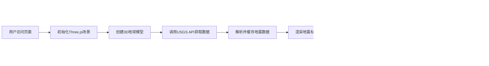

## 1. 产品概述
全球地震分布3D可视化应用，帮助公众和科研人员快速理解地震活动模式。通过交互式3D地球模型展示最近7天的地震数据，支持动态时间轴播放和详细信息查询。

- 主要用途：实时展示全球地震分布与震级动态变化
- 解决问题：地震数据的直观可视化，帮助用户快速识别地震活动模式
- 目标用户：公众、地震科研人员、教育工作者
- 产品价值：将抽象的地震数据转化为直观的3D视觉体验，提升地震科普和研究效率

## 2. 核心特性

### 2.1 用户角色
| 角色 | 注册方式 | 核心权限 |
|------|----------|----------|
| 普通用户 | 无需注册 | 浏览3D地球、查看地震数据、使用时间轴播放 |
| 科研人员 | 无需注册 | 所有普通用户功能，可查看详细地震参数 |

### 2.2 功能模块
1. **3D地球模块**：交互式地球模型，支持旋转、缩放、平移，显示海洋纹理和网格线
2. **地震数据模块**：从USGS API获取最近7天地震数据，包含经纬度、震级、深度、时间
3. **震点可视化模块**：根据震级用不同颜色和半径的球体标记，带半透明光晕效果
4. **时间轴控制模块**：滑动播放，按时间顺序动态显示地震，带播放/暂停按钮
5. **信息卡模块**：点击震点显示详细信息（震级、深度、时间、地点）
6. **UI界面模块**：左侧浮动面板、震级图例、响应式布局

### 2.3 页面详情
| 页面名称 | 模块名称 | 功能描述 |
|----------|----------|----------|
| 主页面 | 3D地球场景 | 全屏3D地球渲染，鼠标交互（旋转/缩放/平移） |
| 主页面 | 左侧浮动面板 | 震级图例、时间轴滑块、播放控制按钮 |
| 主页面 | 信息卡 | 悬浮显示选中地震的详细信息，背景模糊玻璃效果 |

## 3. 核心流程

用户访问页面 → 应用初始化3D场景 → 从USGS API获取地震数据 → 在地球上渲染震点 → 用户可：
- 拖拽旋转地球、滚轮缩放
- 点击震点查看详情
- 使用时间轴播放地震发生过程
- 调节时间轴滑块查看特定时间点的地震

## 4. 用户界面设计

### 4.1 设计风格
- 主色调：深空黑 (#0a0a1a)、深海蓝 (#1a3a5c)、高亮青 (#00d4ff)
- 强调色：地震震级颜色从蓝色 (#0066ff) → 黄色 (#ffcc00) → 红色 (#ff3300) 渐变
- 按钮风格：圆角半透明玻璃效果，0.3s平滑过渡动画
- 字体：Orbitron（标题）、Roboto Mono（数据展示）
- 布局风格：全屏3D场景 + 左侧浮动半透明面板 + 悬浮信息卡
- 视觉效果：背景星空、地球大气辉光、震点半透明光晕、信息卡模糊玻璃效果

### 4.2 页面设计概述
| 页面名称 | 模块名称 | UI元素 |
|----------|----------|--------|
| 主页面 | 3D地球场景 | 深蓝色地球、高亮网格线、大气辉光、星空背景 |
| 主页面 | 左侧浮动面板 | 半透明背景 (rgba(10, 20, 40, 0.7))、震级图例色条、时间轴滑块、播放/暂停按钮 |
| 主页面 | 信息卡 | 模糊玻璃效果 (backdrop-filter: blur(10px))、圆角边框、地震详情数据 |

### 4.3 响应式设计
- 桌面端 (1920x1080 / 1440x900)：左侧面板固定宽度320px，完整显示所有控件
- 平板端 (1024x768)：左侧面板宽度280px，字体适当缩小
- 移动端 (< 768px)：左侧面板可折叠，点击展开按钮显示，信息卡自适应宽度

### 4.4 3D场景指导
- 环境：深空星空背景，使用Points创建随机星点
- 光照：AmbientLight (0x404040) + DirectionalLight (0xffffff, 1.0) 模拟太阳光
- 相机：PerspectiveCamera，初始位置 (0, 0, 2.5)，fov 45度
- 地球：SphereGeometry (radius 1, segments 64)，深蓝色材质，叠加网格线
- 震点：SphereGeometry，根据震级动态调整半径 (0.01 * magnitude)，颜色根据震级从蓝到红渐变，外层半透明光晕
- 交互：OrbitControls 支持旋转、缩放、平移，开启阻尼效果
- 动画：震点淡入 (GSAP opacity 0→1)、地球缓慢自转、时间轴播放时震点按时间顺序出现
- 性能：InstancedMesh 优化大量震点渲染，帧率目标30FPS+
