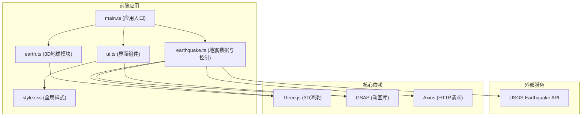

## 1. 架构设计



## 2. 技术描述

- **前端框架**：TypeScript + Vite
- **3D渲染**：Three.js ^0.160.0
- **动画库**：GSAP ^3.12.4
- **HTTP客户端**：Axios ^1.6.2
- **构建工具**：Vite ^5.0.0
- **TypeScript配置**：严格模式，target ES2020，module ESNext
- **初始化工具**：npm create vite-init@latest

## 3. 文件结构

```
auto1/
├── package.json          # 项目依赖与脚本
├── vite.config.js        # Vite构建配置
├── tsconfig.json         # TypeScript配置
├── index.html            # 入口HTML
└── src/
    ├── main.ts           # 应用初始化入口
    ├── earth.ts          # 3D地球创建与控制
    ├── earthquake.ts     # 地震数据获取、震点渲染、时间轴控制
    ├── ui.ts             # UI组件（面板、图例、信息卡）
    └── style.css         # 全局样式
```

## 4. 核心数据结构

### 4.1 地震数据类型
```typescript
interface EarthquakeFeature {
  id: string;
  properties: {
    mag: number;           // 震级
    place: string;         // 地点
    time: number;          // 时间戳
    type: string;
    title: string;
  };
  geometry: {
    coordinates: [number, number, number];  // [经度, 纬度, 深度]
  };
}

interface EarthquakeData {
  features: EarthquakeFeature[];
  metadata: {
    title: string;
    count: number;
  };
}

interface EarthquakePoint {
  id: string;
  lat: number;
  lng: number;
  depth: number;
  magnitude: number;
  place: string;
  time: Date;
  mesh: THREE.Mesh;
  glowMesh: THREE.Mesh;
}
```

## 5. 核心类与接口

### 5.1 Earth 类
```typescript
class Earth {
  constructor(scene: THREE.Scene);
  public update(delta: number): void;
  public getEarthGroup(): THREE.Group;
  public latLngToVector3(lat: number, lng: number, radius: number): THREE.Vector3;
}
```

### 5.2 EarthquakeController 类
```typescript
class EarthquakeController {
  constructor(scene: THREE.Scene, earth: Earth);
  public async fetchData(): Promise<void>;
  public createPoints(): void;
  public updateTime(currentTime: Date): void;
  public play(): void;
  public pause(): void;
  public setTimeIndex(index: number): void;
  public getTotalPoints(): number;
  public getTimeRange(): { start: Date; end: Date };
  public handleClick(intersects: THREE.Intersection[]): EarthquakePoint | null;
}
```

### 5.3 UI 类
```typescript
class UI {
  constructor();
  public updateLegend(minMag: number, maxMag: number): void;
  public updateTimeSlider(currentTime: Date, startTime: Date, endTime: Date): void;
  public showInfoCard(point: EarthquakePoint, screenX: number, screenY: number): void;
  public hideInfoCard(): void;
  public setPlayState(isPlaying: boolean): void;
  public onPlayClick(callback: () => void): void;
  public onTimeChange(callback: (time: Date) => void): void;
  public updateProgress(current: number, total: number): void;
}
```

## 6. USGS API 配置

- **API端点**：`https://earthquake.usgs.gov/earthquakes/feed/v1.0/summary/all_week.geojson`
- **请求方式**：GET
- **响应格式**：GeoJSON
- **数据范围**：最近7天所有地震
- **更新频率**：页面加载时获取，支持手动刷新

## 7. 性能优化策略

1. **3D渲染优化**：
   - 使用 `InstancedMesh` 渲染大量震点（>100个）
   - 降低地球网格细分度（segments 64足够）
   - 震点按需渲染，时间轴外的震点隐藏
   - 使用 `FrustumCulling` 自动剔除不可见物体

2. **动画优化**：
   - GSAP 动画使用 `will-change` 提示
   - 避免每帧创建新对象，复用对象池
   - 淡入动画批量处理，减少重绘

3. **数据处理**：
   - API数据异步加载，显示加载状态
   - 数据缓存，避免重复请求
   - 时间轴数据预索引，快速查找

4. **内存管理**：
   - 页面卸载时调用 `dispose()` 清理Three.js资源
   - 及时清理事件监听器
   - 震点对象复用而非重建
