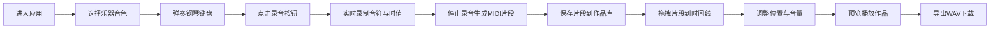

## 1. 产品概述

在线音乐创作与协作Web应用，让用户通过浏览器中的虚拟乐器（钢琴键盘、鼓机）创作简单的旋律和节奏，并组合成可播放的乐曲。

- 主要目的：提供零门槛的在线音乐创作体验，用户无需下载专业软件即可创作音乐片段并组合成完整作品
- 目标用户：音乐爱好者、初学者、教育场景中的学生和教师
- 产品价值：降低音乐创作门槛，通过直观的交互和协作功能，让更多人体验音乐创作的乐趣

## 2. 核心功能

### 2.1 功能模块

1. **虚拟钢琴键盘**：两个八度（C4-B5），支持鼠标点击和键盘快捷键触发音符，按键高亮与下沉动画，水波纹扩散光效
2. **录音与回放模块**：选择乐器音色（钢琴、电钢琴、弦乐），录制键盘输入（音符和时值），实时进度条，生成MIDI片段，支持回放和保存
3. **音轨时间线**：拖拽已保存片段到时间线排列，调整片段开始时间（1/16拍精度）和音量，导出WAV下载
4. **数据存储后端**：Express服务，存储MIDI数据和作品元数据到本地文件系统

### 2.2 页面详情

| 页面名称 | 模块名称 | 功能描述 |
|-----------|-------------|---------------------|
| 主创作页面 | 钢琴键盘区域 | 两个八度虚拟键盘，鼠标/键盘触发音符，按下高亮+下沉+水波纹动画 |
| 主创作页面 | 音色选择器 | 下拉选择钢琴、电钢琴、弦乐三种音色 |
| 主创作页面 | 录音控制面板 | 录音/停止按钮（呼吸灯动画），实时进度条，回放按钮，保存按钮 |
| 主创作页面 | 片段列表 | 显示已保存的MIDI片段，支持拖拽到时间线 |
| 主创作页面 | 音轨时间线 | 多轨道时间线，不同颜色区分片段，悬停显示名称和时长，拖拽调整位置和音量 |
| 主创作页面 | 导出控制 | 播放整个作品，导出WAV格式下载 |

## 3. 核心流程

用户打开应用 → 选择乐器音色 → 弹奏钢琴键盘（鼠标或键盘）→ 点击录音按钮开始录制 → 实时显示录制进度 → 停止录制生成MIDI片段 → 保存片段到本地作品库 → 将多个片段拖拽到音轨时间线 → 调整片段位置和音量 → 播放预览完整作品 → 导出WAV文件下载

## 4. 用户界面设计

### 4.1 设计风格

- **主色调**：深灰蓝背景 (#0f172a)，柔和蓝紫色渐变 (#6366f1 → #a855f7)
- **配色方案**：
  - 背景色：#0f172a（深灰蓝）
  - 主渐变：linear-gradient(135deg, #6366f1 0%, #a855f7 100%)
  - 钢琴白键：#f8fafc，按下时：#e2e8f0
  - 钢琴黑键：#1e293b，按下时：#334155
  - 时间线条块：每个片段使用不同的柔和彩色（#f87171, #60a5fa, #34d399, #fbbf24, #a78bfa）
- **按钮样式**：圆角胶囊型，录音按钮带呼吸灯动画，按下有反馈
- **字体**：现代无衬线字体，标题使用渐变色
- **布局风格**：顶部工具栏 + 中间钢琴键盘 + 下部时间线的三段式布局
- **动效**：
  - 琴键按下：高亮 + 轻微下沉 + 水波纹扩散光效
  - 录音按钮：呼吸灯脉冲动画
  - 片段悬停：缩放 + 信息提示
  - 页面加载：渐入动画

### 4.2 页面设计概述

| 页面名称 | 模块名称 | UI元素 |
|-----------|-------------|-------------|
| 主创作页面 | 顶部工具栏 | 应用Logo、音色选择器、录音控制组、导出按钮 |
| 主创作页面 | 钢琴键盘区域 | 两个八度白黑键、键位标签、水波纹效果层 |
| 主创作页面 | 片段库面板 | 已保存片段卡片列表、拖拽指示器 |
| 主创作页面 | 音轨时间线 | 刻度标尺、多轨道区域、片段色块、音量滑块 |

### 4.3 响应式设计

- 桌面端优先设计
- 平板横屏：键盘和时间线自适应缩放以适应屏幕宽度
- 断点：≥1024px 完整布局，768-1024px 平板横屏优化，<768px 提示使用平板横屏或桌面端
