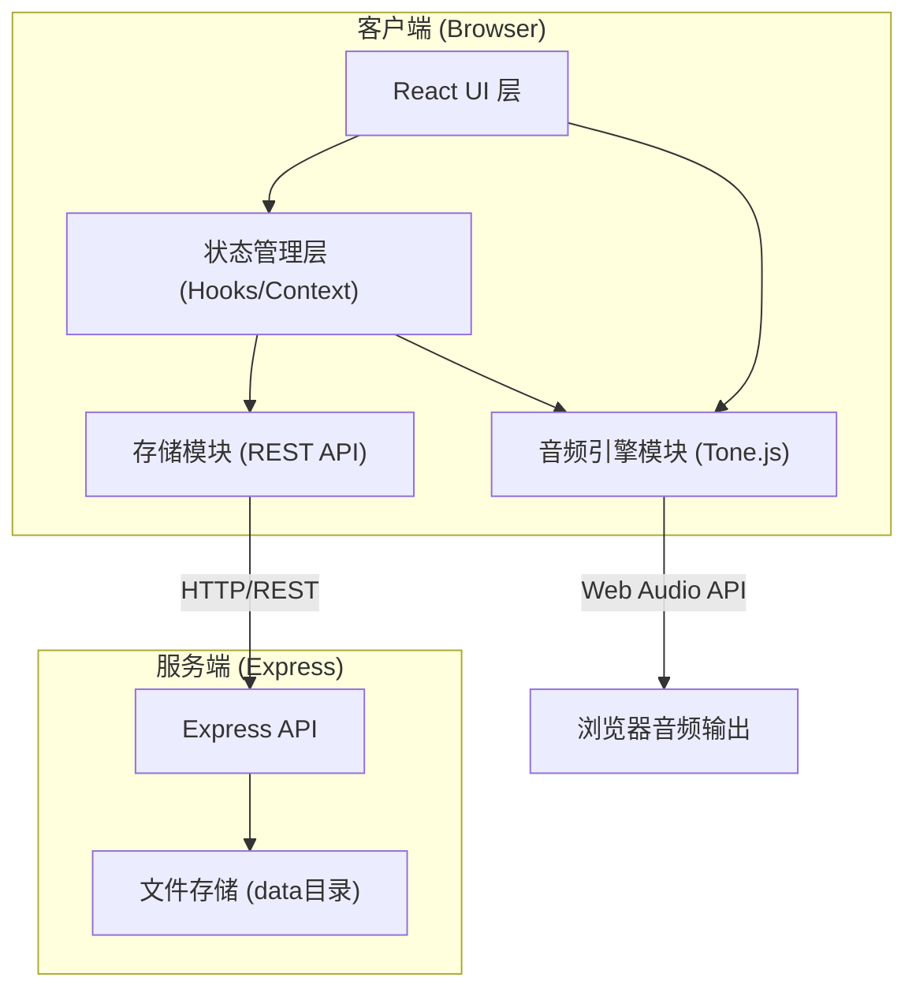

## 1. 架构设计



## 2. 技术选型

- **前端框架**：React 18 + TypeScript
- **构建工具**：Vite 5
- **音频引擎**：Tone.js（Web Audio API封装）
- **UI样式**：原生CSS（配合CSS变量管理主题）
- **后端**：Express.js
- **数据存储**：本地文件系统（data目录，JSON格式）
- **ID生成**：uuid

## 3. 项目文件结构

```
auto10/
├── package.json
├── index.html
├── vite.config.ts
├── tsconfig.json
├── server.js
├── data/                          # 后端存储目录
└── src/
    ├── index.tsx                  # React入口
    ├── App.tsx                    # 主应用组件
    ├── components/
    │   ├── PianoKeyboard.tsx      # 钢琴键盘组件
    │   ├── Recorder.tsx           # 录音模块组件
    │   └── TrackTimeline.tsx      # 音轨时间线组件
    └── modules/
        ├── toneEngine.ts          # Tone.js音频引擎
        └── storage.ts             # 数据存储模块
```

## 4. API 定义

### 4.1 RESTful API 端点

```typescript
// MIDI片段数据结构
interface MidiClip {
  id: string;
  name: string;
  instrument: 'piano' | 'epiano' | 'strings';
  duration: number; // 秒
  createdAt: number;
  notes: MidiNote[];
}

interface MidiNote {
  note: string;      // e.g. 'C4'
  time: number;      // 开始时间（秒，相对于片段起点）
  duration: number;  // 时值（秒）
  velocity: number;  // 力度 0-1
}

// 作品数据结构
interface Composition {
  id: string;
  name: string;
  createdAt: number;
  tracks: Track[];
}

interface Track {
  id: string;
  clips: TrackClip[];
}

interface TrackClip {
  clipId: string;
  startTime: number;  // 在时间线上的开始位置（秒，精确到1/16拍）
  volume: number;     // 0-1
}
```

| 方法 | 路由 | 用途 | 请求体 | 响应 |
|------|------|------|--------|------|
| GET | /api/clips | 获取所有MIDI片段 | - | MidiClip[] |
| POST | /api/clips | 保存新MIDI片段 | MidiClip (无id) | MidiClip (含id) |
| DELETE | /api/clips/:id | 删除MIDI片段 | - | { success: boolean } |
| GET | /api/compositions | 获取所有作品 | - | Composition[] |
| POST | /api/compositions | 保存新作品 | Composition (无id) | Composition (含id) |
| PUT | /api/compositions/:id | 更新作品 | Composition | Composition |
| DELETE | /api/compositions/:id | 删除作品 | - | { success: boolean } |

## 5. 核心模块职责与数据流

### 5.1 toneEngine.ts (音频引擎)
- 初始化Tone.js环境，管理Transport（传输）
- 创建和管理三种音色合成器（Sampler/Synth）
- 提供 `playNote(note, instrument, duration, time)` 接口
- 提供 `setInstrument(instrument)` 切换当前音色
- 提供 `renderToWav(events, duration)` 离线渲染导出WAV
- 提供 `startTransport()` / `stopTransport()` 播放控制

### 5.2 PianoKeyboard.tsx (钢琴键盘)
- 渲染C4-B5两个八度的钢琴键盘UI
- 监听鼠标事件（mousedown/mouseup/mouseenter）
- 监听键盘事件（keydown/keyup，映射A S D F...到音高）
- 按键按下时触发视觉反馈（高亮、下沉、水波纹）
- 调用 toneEngine.playNote() 播放音符
- 录音模式下向Recorder组件发送音符事件

### 5.3 Recorder.tsx (录音模块)
- 维护录音状态（idle/recording/playing）
- 接收PianoKeyboard发送的音符on/off事件
- 记录音符的开始时间、时值、音高
- 录音停止后生成MidiClip对象
- 提供回放功能（通过toneEngine调度播放）
- 调用storage.saveClip()持久化存储

### 5.4 TrackTimeline.tsx (音轨时间线)
- 渲染时间线标尺和多轨道区域
- 支持从片段库拖拽MidiClip到轨道
- 支持拖拽调整片段位置（吸附到1/16拍网格）
- 支持调节每个片段的音量滑块
- 播放时高亮当前播放位置
- 调用toneEngine.renderToWav()合成并导出WAV Blob
- 调用storage保存/加载作品

### 5.5 storage.ts (数据存储)
- 封装fetch调用后端REST API
- `getClips(): Promise<MidiClip[]>`
- `saveClip(clip): Promise<MidiClip>`
- `deleteClip(id): Promise<void>`
- `getCompositions(): Promise<Composition[]>`
- `saveComposition(comp): Promise<Composition>`
- `updateComposition(comp): Promise<Composition>`

### 5.6 数据流方向
```
用户交互 (PianoKeyboard) 
  → 音频事件 (toneEngine.playNote)
  → 音符事件 (Recorder.recordNoteOn/Off)
  → MIDI片段 (storage.saveClip)
  → 时间线编排 (TrackTimeline)
  → 作品存储 (storage.saveComposition)
  → 导出WAV (toneEngine.renderToWav)
```

## 6. 性能关键点

- **低延迟**：Tone.js基于Web Audio API，点击到发声延迟<50ms，需确保Tone.js在用户首次交互时已resume
- **渲染优化**：钢琴键盘使用CSS变量和transform动画，避免重排
- **离线渲染**：导出WAV使用Tone.js OfflineTransport，不阻塞UI
