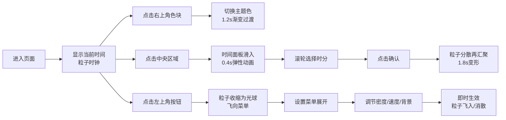

## 1. 产品概述

动态极简主义粒子时钟是一款基于 WebGL 的创意时间展示应用，通过数百个流动的彩色粒子拼出数字时钟，呈现星云般的动态视觉效果。用户可自定义时间、切换主题色、调节粒子密度与运动速度，在纯黑背景上获得沉浸式的视觉体验。

- 核心价值：将时间展示转化为艺术化的动态粒子体验
- 目标用户：设计爱好者、创意工作者、追求独特视觉体验的用户

## 2. 核心功能

### 2.1 用户角色

| 角色 | 注册方式 | 核心权限 |
|------|----------|----------|
| 访客用户 | 无需注册 | 浏览时钟、切换主题、调整设置 |

### 2.2 功能模块

1. **粒子时钟主界面**：WebGL 粒子数字显示、实时时间更新、粒子动态效果
2. **主题切换**：右上角三色主题选择器、平滑颜色过渡
3. **时间设置**：点击中央弹出时间面板、iOS 风格滚轮选择器
4. **设置菜单**：粒子密度调节、运动速度切换、背景明暗切换
5. **交互动画**：粒子变形过渡、菜单展开收起、悬浮动效

### 2.3 页面详情

| 页面名称 | 模块名称 | 功能描述 |
|---------|---------|----------|
| 主页面 | 粒子时钟 | WebGL 渲染数百个粒子组成数字时:分:秒，粒子持续流动旋转 |
| 主页面 | 主题选择器 | 右上角三个圆形色块，点击切换三组预设渐变色，1.2秒平滑过渡 |
| 主页面 | 时间设置面板 | 点击中央区域从底部滑入，包含小时分钟滚轮选择器，弹性动画 |
| 主页面 | 设置菜单 | 左上角悬浮按钮展开，粒子密度/速度/背景三项调节，即时生效 |

## 3. 核心流程

## 4. 用户界面设计

### 4.1 设计风格

- **主色调**：纯黑 / 深灰背景，粒子高对比度白色发光效果
- **主题色**：
  - 晨曦：暖橙渐变 (#ff6b35 → #f7c59f)
  - 深海：蓝紫渐变 (#4a90d9 → #9b59b6)
  - 极光：绿蓝渐变 (#00d4aa → #00a8e8)
- **按钮样式**：毛玻璃效果（背景模糊 8px、边框 1px rgba(255,255,255,0.15)），圆角设计
- **字体**：无衬线字体，最小字号 12px，数字高对比度白色
- **布局**：全屏 100vh 无滚动，粒子数字居中，UI 元素悬浮四角

### 4.2 页面设计概览

| 页面名称 | 模块名称 | UI 元素 |
|---------|---------|---------|
| 主页面 | 粒子时钟 | 居中数字，粒子组成，呼吸脉动效果，三组主题色随机 |
| 主页面 | 主题选择器 | 右上角三个圆形色块，hover 放大发光，active 按压 |
| 主页面 | 时间面板 | 底部滑入，背景模糊 10px，iOS 滚轮选择器，确认/取消按钮 |
| 主页面 | 设置菜单 | 左上角展开，滑块+单选组合，毛玻璃卡片样式 |

### 4.3 响应式

- 桌面端优先，自适应视口高度 100vh
- 粒子大小和密度根据屏幕尺寸自动调整
- 触摸设备支持手势滑动选择时间

### 4.4 3D 场景指引

- **环境**：纯黑/深灰背景，无环境贴图，粒子自发光
- **光照**：粒子使用 Additive Blending，自身发光无需额外光源
- **相机**：正交相机，正对粒子平面，保持数字清晰可读
- **构图**：数字居中，占据视口 60% 宽度，上下留白
- **交互**：粒子根据时间变化触发变形动画，点击触发菜单
- **后处理**：轻微 Bloom 效果增强粒子发光感
- **性能**：500 粒子时保持 55+ fps，使用 BufferGeometry 批量渲染
