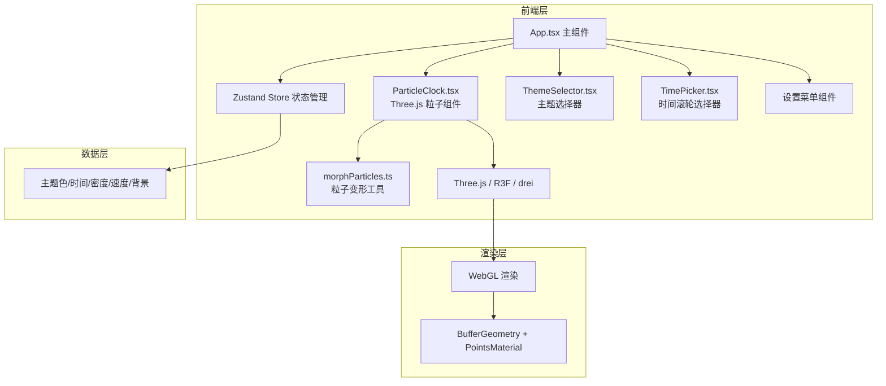

## 1. 架构设计



## 2. 技术说明

- **前端框架**：React 18 + TypeScript 5 + Vite 5
- **3D 渲染**：three.js + @react-three/fiber + @react-three/drei
- **状态管理**：zustand
- **样式方案**：原生 CSS + CSS 变量，不使用 Tailwind
- **构建工具**：Vite，配置 React 插件

## 3. 路由定义

| 路由 | 用途 |
|------|------|
| / | 主页面，粒子时钟展示 |

本项目为单页应用，无需多路由。

## 4. 文件结构

```
src/
├── App.tsx              # 主组件，状态管理与UI布局
├── ParticleClock.tsx    # Three.js粒子时钟组件
├── TimePicker.tsx       # 时间滚轮选择器
├── ThemeSelector.tsx    # 主题色选择器
├── store.ts             # Zustand 状态库
├── morphParticles.ts    # 粒子变形插值工具
├── styles.css           # 全局样式与动画
├── main.tsx             # 入口文件
└── index.css            # 基础样式
```

## 5. 核心技术方案

### 5.1 粒子渲染

- 使用 `THREE.Points` + `BufferGeometry` 批量渲染所有粒子
- 粒子位置存储在 `Float32BufferAttribute` 中，每帧更新
- 颜色使用 `PointsMaterial` 的 vertexColors 模式，每粒子独立颜色
- Additive Blending 实现发光叠加效果

### 5.2 数字形状生成

- 使用离屏 Canvas 绘制数字，采样像素点作为粒子目标位置
- 每个数字约 200 个粒子，按像素密度均匀采样
- 支持 0-9 十个数字及冒号分隔符

### 5.3 粒子动画系统

- **基准位置**：粒子在数字形状上的目标位置
- **布朗运动**：每个粒子围绕基准点做椭圆运动，周期 2-5 秒随机
- **重力效果**：竖直方向轻微加速度下坠后弹回
- **变形动画**：时间变更时，粒子先扩散到随机位置再汇聚到新形状，共 1.8 秒
- **颜色过渡**：主题切换时 1.2 秒 HSL 插值渐变

### 5.4 时间滚轮选择器

- 模拟 iOS UIPickerView 惯性滚动效果
- 使用 CSS transform + transition 实现滚轮动画
- 支持鼠标拖拽和触摸滑动

### 5.5 性能优化

- 使用 `requestAnimationFrame` 驱动动画循环
- 粒子位置计算在 JS 中批量完成，一次性写入 BufferAttribute
- 避免每帧创建新对象，复用数组和向量
- 500 粒子时目标帧率 ≥ 55fps

## 6. 状态模型

### 6.1 Zustand Store 状态定义

```typescript
interface ParticleClockState {
  theme: 'dawn' | 'deepSea' | 'aurora';
  targetTime: { hours: number; minutes: number; seconds: number };
  isRealTime: boolean;
  density: number; // 100-500
  speed: 'slow' | 'medium' | 'fast';
  background: 'dark' | 'black';
  isTimePickerOpen: boolean;
  isSettingsOpen: boolean;
  setTheme: (theme: Theme) => void;
  setTargetTime: (time: { hours: number; minutes: number }) => void;
  setDensity: (density: number) => void;
  setSpeed: (speed: Speed) => void;
  setBackground: (background: Background) => void;
  toggleTimePicker: () => void;
  toggleSettings: () => void;
}
```
