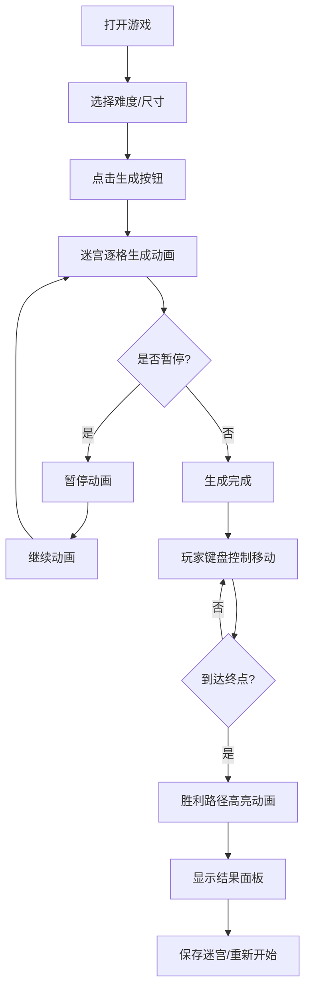

## 1. 产品概述
程序化2D迷宫生成与玩家实时寻路游戏工具，解决手动设计迷宫关卡效率低、缺乏动态难度调节的问题。
- 面向游戏开发者和迷宫爱好者，提供快速生成、测试和保存迷宫的工具
- 核心价值：自动化迷宫生成、可视化动画过程、实时玩家交互、关卡持久化存储

## 2. 核心功能

### 2.1 功能模块
1. **迷宫生成模块**：递归回溯算法生成迷宫，尺寸5x5到20x20可选，生成过程动画逐格呈现
2. **玩家控制模块**：方向键控制角色移动，平滑插值动画，像素级碰撞检测
3. **统计与胜利模块**：实时计时器、步数统计，胜利路径高亮动画，结果面板
4. **存储模块**：localStorage保存/加载迷宫，最多5个，缩略图预览
5. **难度预设模块**：简单(5x5)、中等(10x10)、困难(15x15)，切换时渐变过渡

### 2.2 页面详情
| 页面名称 | 模块名称 | 功能描述 |
|-----------|-------------|---------------------|
| 主游戏界面 | 迷宫画布 | Canvas渲染迷宫、玩家、终点、胜利路径 |
| 主游戏界面 | 顶部信息栏 | 实时计时器、步数统计显示 |
| 主游戏界面 | 底部控制面板 | 生成按钮、尺寸选择、难度预设、保存/加载、暂停/继续 |
| 主游戏界面 | 加载迷宫弹窗 | 缩略图列表展示已保存迷宫，支持选择和删除 |
| 主游戏界面 | 胜利结果面板 | 展示用时、步数，支持重新开始 |

## 3. 核心流程
用户选择难度或自定义尺寸 → 点击生成按钮 → 迷宫逐格动画生成（可暂停） → 玩家通过方向键移动角色 → 到达终点触发胜利动画 → 展示结果面板 → 可保存迷宫或重新开始。

## 4. 用户界面设计
### 4.1 设计风格
- **主色调**：深色主题，背景#1a1a2e，墙面#16213e
- **强调色**：迷宫通道#e0e0e0，终点金色#ffd700，胜利路径绿色渐变(#00ff88到#00cc66)
- **按钮风格**：玻璃态(backdrop-filter: blur(10px))，圆角，悬停缩放1.05并变色
- **字体**：现代无衬线字体，清晰可读

### 4.2 页面设计概述
| 页面名称 | 模块名称 | UI元素 |
|-----------|-------------|-------------|
| 主游戏界面 | 迷宫画布 | 居中Canvas，16:9比例，响应式缩放 |
| 主游戏界面 | 顶部信息栏 | 右上角计时器和步数，半透明背景 |
| 主游戏界面 | 底部控制面板 | 固定底部，玻璃态，横向排列按钮 |
| 主游戏界面 | 移动端菜单 | 汉堡菜单展开控制面板 |

### 4.3 响应式设计
- 桌面端：底部控制面板完全展开
- 移动端：控制面板折叠为汉堡菜单，点击展开
- 迷宫画布保持16:9比例缩放，居中显示

### 4.4 动画效果
- 迷宫生成：每步间隔50ms逐格呈现
- 玩家移动：每步0.2秒平滑插值
- 终点闪烁：周期1.5秒
- 胜利路径：依次高亮，间隔100ms
- 难度切换：旧迷宫渐隐0.5s，新迷宫渐显0.5s
