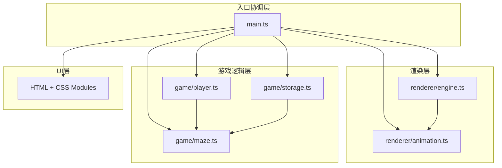

## 1. 架构设计



## 2. 技术描述
- **前端框架**：原生TypeScript (严格模式) + Vite构建工具
- **渲染技术**：Canvas 2D API
- **样式方案**：CSS Modules
- **状态管理**：模块化状态，main.ts协调各模块数据流
- **数据持久化**：localStorage

## 3. 项目文件结构
| 文件路径 | 用途 |
|-------|---------|
| package.json | 项目依赖和脚本配置 |
| index.html | 入口页面，包含canvas和root容器 |
| vite.config.js | Vite配置，开启CSS Modules和sourcemaps |
| tsconfig.json | TypeScript配置，strict: true, target: ES2020 |
| src/renderer/engine.ts | 渲染引擎：canvas管理、游戏循环、帧率统计 |
| src/renderer/animation.ts | 动画工具：补间动画队列、缓动函数、链式调度 |
| src/game/maze.ts | 迷宫生成：递归回溯算法、生成动画状态机 |
| src/game/player.ts | 玩家模块：位置状态、碰撞检测、移动插值 |
| src/game/storage.ts | 持久化：localStorage读写、缩略图生成 |
| src/main.ts | 入口模块：初始化、事件绑定、模块协调 |
| src/styles/*.module.css | CSS Modules样式文件 |

## 4. 模块接口定义

### 4.1 渲染引擎 (engine.ts)
```typescript
export interface Engine {
  startLoop(renderFn: (dt: number) => void): void;
  stopLoop(): void;
  getCanvas(): HTMLCanvasElement;
  getContext(): CanvasRenderingContext2D;
  getFPS(): number;
  resize(width: number, height: number): void;
}
```

### 4.2 动画工具 (animation.ts)
```typescript
export type EasingFn = (t: number) => number;
export interface TweenAnimation {
  duration: number;
  easing: EasingFn;
  onUpdate: (value: number) => void;
  onComplete?: () => void;
}
export interface AnimationQueue {
  add(animation: TweenAnimation): void;
  chain(animations: TweenAnimation[]): void;
  update(dt: number): void;
  isRunning(): boolean;
}
export const easeInOutCubic: EasingFn;
```

### 4.3 迷宫生成 (maze.ts)
```typescript
export type Cell = {
  x: number;
  y: number;
  walls: { top: boolean; right: boolean; bottom: boolean; left: boolean };
  visited: boolean;
};
export type MazeData = Cell[][];
export interface GenerationState {
  isGenerating: boolean;
  isPaused: boolean;
  progress: number;
  currentStep: number;
  totalSteps: number;
}
export function generateMaze(size: number): MazeData;
export function getMazeData(): MazeData | null;
export function startGenerationAnimation(size: number, onStep: (maze: MazeData, state: GenerationState) => void, stepInterval?: number): () => void;
export function pauseGeneration(): void;
export function resumeGeneration(): void;
export function getGenerationState(): GenerationState;
```

### 4.4 玩家模块 (player.ts)
```typescript
export interface PlayerState {
  x: number;
  y: number;
  gridX: number;
  gridY: number;
  isMoving: boolean;
  steps: number;
}
export function movePlayer(direction: 'up' | 'down' | 'left' | 'right', mazeData: MazeData, cellSize: number): boolean;
export function getPlayerPosition(): PlayerState;
export function resetPlayer(startX: number, startY: number, cellSize: number): void;
export function updatePlayerAnimation(dt: number): void;
export function checkCollision(px: number, py: number, mazeData: MazeData, cellSize: number): boolean;
```

### 4.5 存储模块 (storage.ts)
```typescript
export interface SavedMaze {
  id: string;
  name: string;
  size: number;
  data: MazeData;
  thumbnail: string;
  createdAt: number;
}
export function saveMaze(name: string, mazeData: MazeData): SavedMaze | null;
export function loadMazeList(): SavedMaze[];
export function deleteMaze(id: string): boolean;
export function generateThumbnail(mazeData: MazeData): string;
```

## 5. 性能指标
- 20x20迷宫生成耗时：< 500ms
- 游戏帧率：稳定60fps
- 内存占用：< 50MB
