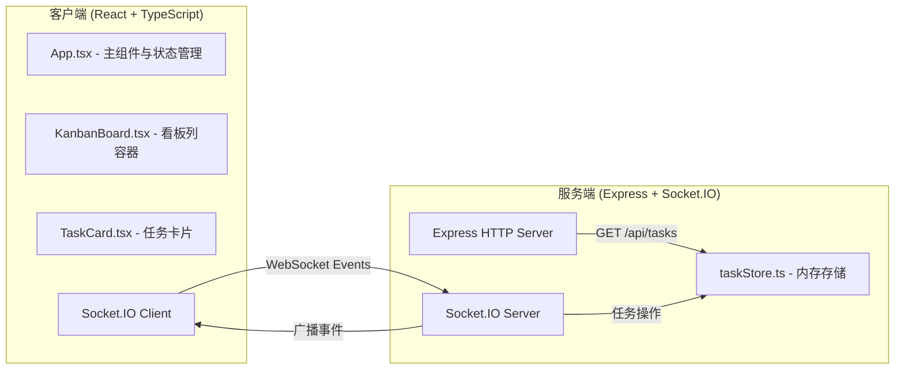
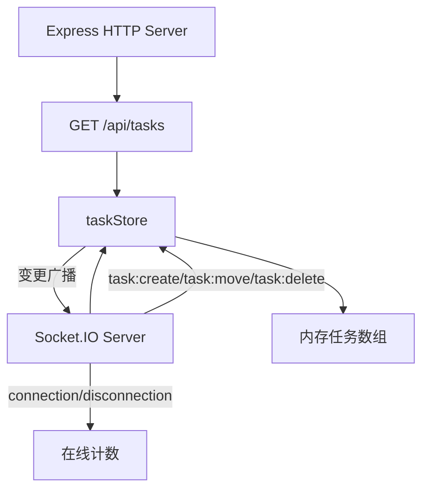

## 1. 架构设计



## 2. 技术描述

- 前端：React 18 + TypeScript + Vite
- 后端：Express 4 + Socket.IO + TypeScript
- 实时通信：Socket.IO (WebSocket)
- 数据存储：内存存储（taskStore模块）
- 构建工具：Vite（前端）、ts-node（后端开发）
- 包管理器：npm

## 3. 项目结构

```
.
├── package.json
├── tsconfig.json
├── vite.config.ts
├── index.html
├── client/
│   └── src/
│       ├── App.tsx
│       ├── KanbanBoard.tsx
│       └── TaskCard.tsx
└── server/
    └── src/
        ├── index.ts
        └── taskStore.ts
```

## 4. API 定义

### 4.1 REST API

| 方法 | 路径 | 用途 |
|------|------|------|
| GET | /api/tasks | 获取初始任务列表 |

**响应格式：**
```typescript
interface Task {
  id: string;
  title: string;
  assignee: string;
  priority: 'high' | 'medium' | 'low';
  status: 'todo' | 'in-progress' | 'done';
}

type TaskList = Task[];
```

### 4.2 Socket.IO 事件

**客户端 → 服务端：**
| 事件名 | 参数 | 用途 |
|--------|------|------|
| task:create | { title, assignee, priority } | 创建新任务 |
| task:move | { taskId, newStatus } | 移动任务到新状态 |
| task:delete | { taskId } | 删除任务 |

**服务端 → 客户端：**
| 事件名 | 参数 | 用途 |
|--------|------|------|
| task:created | Task | 任务已创建 |
| task:moved | { taskId, newStatus } | 任务已移动 |
| task:deleted | { taskId } | 任务已删除 |
| online:count | number | 在线人数更新 |

## 5. 服务端架构



## 6. 数据模型

### 6.1 Task 数据模型

```typescript
type TaskPriority = 'high' | 'medium' | 'low';
type TaskStatus = 'todo' | 'in-progress' | 'done';

interface Task {
  id: string;           // UUID
  title: string;        // 任务标题
  assignee: string;     // 负责人
  priority: TaskPriority;  // 优先级
  status: TaskStatus;   // 看板状态列
}
```

### 6.2 taskStore 接口

```typescript
interface TaskStore {
  getTasks(): Task[];
  getTaskById(id: string): Task | undefined;
  addTask(task: Omit<Task, 'id'>): Task;
  updateTaskStatus(id: string, newStatus: TaskStatus): Task | undefined;
  deleteTask(id: string): boolean;
}
```
