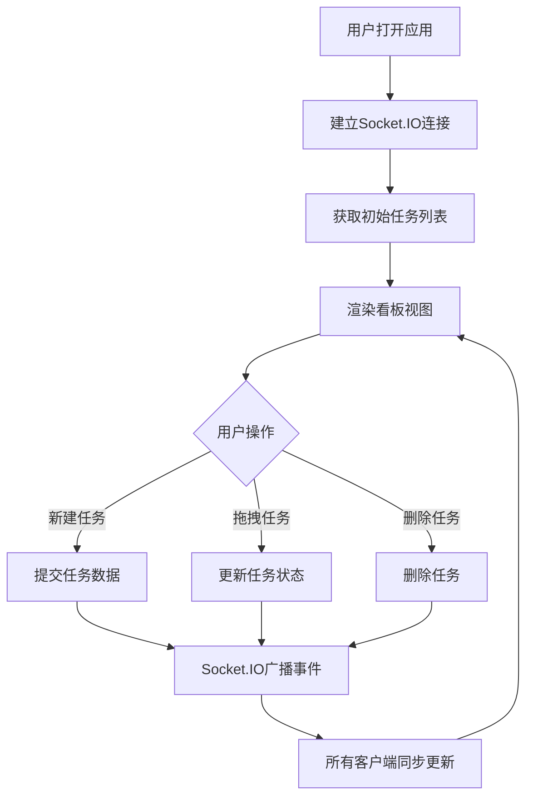

## 1. 产品概述

团队任务看板应用是一个实时协作的任务管理工具，支持多用户同时创建、分配、跟踪任务状态。基于WebSocket实现实时同步，所有用户的操作都能即时反映在其他人的看板视图中。

- 主要用途：团队协作任务管理，可视化任务进度
- 解决问题：传统任务管理工具缺乏实时同步，团队成员无法即时看到任务状态变化
- 目标用户：敏捷开发团队、项目管理团队

## 2. 核心功能

### 2.1 用户角色

| 角色 | 注册方式 | 核心权限 |
|------|---------|---------|
| 普通用户 | 无需注册，连接即用 | 创建任务、分配负责人、拖拽修改任务状态、删除任务 |

### 2.2 功能模块

1. **看板视图**：三列看板（待办、进行中、完成），实时显示任务分布
2. **任务管理**：新建任务、删除任务、修改任务状态
3. **实时同步**：基于Socket.IO的WebSocket实时通信
4. **在线状态**：显示当前在线用户数

### 2.3 页面详情

| 页面名称 | 模块名称 | 功能描述 |
|---------|---------|----------|
| 主看板页面 | 看板头部 | 显示应用标题、在线人数统计、新建任务按钮 |
| 主看板页面 | 看板列容器 | 三列布局，支持拖拽，显示任务数量徽章 |
| 主看板页面 | 任务卡片 | 显示标题、负责人、优先级标签，支持删除 |
| 主看板页面 | 新建任务模态框 | 输入任务标题、负责人、优先级 |

## 3. 核心流程

用户打开应用 → 建立WebSocket连接 → 获取初始任务列表 → 查看/操作任务 → 实时同步到所有在线用户

## 4. 用户界面设计

### 4.1 设计风格
- 主色调：暗色主题，背景 #1e1e2e
- 看板列：半透明毛玻璃效果（backdrop-filter: blur(10px)）
- 任务卡片：深灰色背景 #2a2a3e，圆角8px，轻微阴影
- 字体：白色
- 优先级标签：高-红色、中-黄色、低-绿色
- 按钮风格：圆角，悬停有过渡动画

### 4.2 页面设计概述

| 页面名称 | 模块名称 | UI元素 |
|---------|---------|--------|
| 主看板页面 | 看板头部 | 大标题、在线人数徽章（跳动动画）、新建任务按钮 |
| 主看板页面 | 看板列 | 毛玻璃卡片、列标题、任务数量徽章、任务列表容器 |
| 主看板页面 | 任务卡片 | 标题文字、负责人文字、优先级彩色标签、删除按钮、悬停上浮效果 |
| 主看板页面 | 新建任务模态框 | 缩放淡入动画、输入表单、提交/取消按钮 |

### 4.3 响应式
- 桌面端（≥768px）：三列水平布局，列之间有间距
- 移动端（<768px）：三列垂直堆叠，拖拽功能保持可用
- 拖拽操作：半透明跟随效果，放下时弹入动画（ease-out 200ms）

### 4.4 动画效果
- 模态框缩放淡入：transform: scale(0.9) → scale(1)，opacity 0 → 1
- 任务卡片删除缩出：scale 1 → 0.5 → 0
- 在线人数变化：scale 1.2 → 1 跳动动画
- 拖拽阴影：拖拽时阴影加深
- 任务悬停：轻微上浮效果
