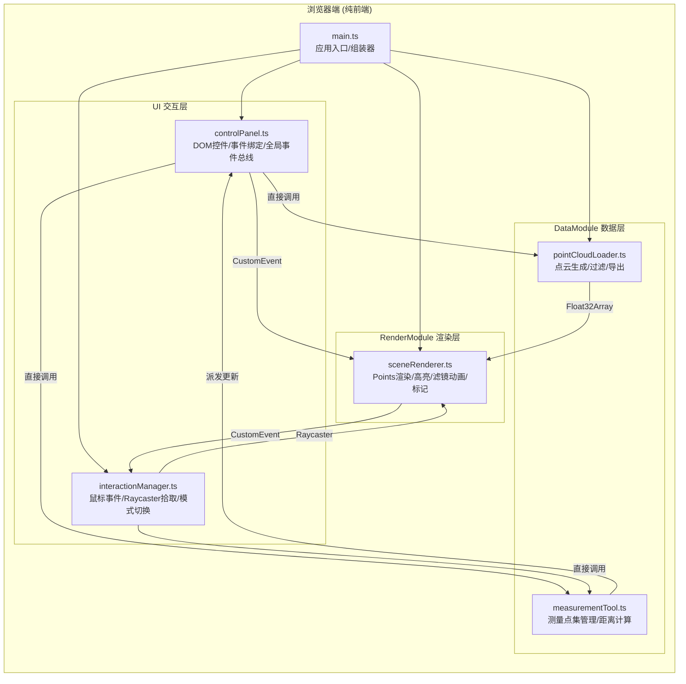

## 1. 架构设计



## 2. 技术说明

- **前端框架**：无UI框架，原生 TypeScript + ES Modules
- **3D引擎**：three@0.160.0（通过 Vite 直接解析 ES Module）
- **构建工具**：Vite@5
- **语言**：TypeScript（严格模式 strict: true，目标 ESNext）
- **通信方式**：模块间通过直接函数调用 + CustomEvent 全局事件总线
- **后端**：无，纯客户端

## 3. 模块调用关系与数据流向

| 调用方 | 被调用方 | 数据/事件 |
|-------|---------|----------|
| main.ts | pointCloudLoader.generate() | 返回 {positions: Float32Array, colors: Float32Array, intensities: Uint8Array} |
| main.ts | sceneRenderer.init() | 传入 Three.js 场景/相机/渲染器 + 点云数据 |
| main.ts | sceneRenderer.start() | 启动 requestAnimationFrame 循环 |
| main.ts | interactionManager.init() | 传入 domElement + camera + renderer |
| main.ts | controlPanel.init() | 传入各模块引用 |
| controlPanel | pointCloudLoader.filterByIntensity(min,max) | 返回可见点索引集合 |
| controlPanel | pointCloudLoader.exportAsXYZ(visibleIndices) | 触发 CSV 下载 |
| controlPanel | measurementTool.startMeasure() | 重置测量状态 |
| controlPanel | sceneRenderer.applyIntensityFilter(min,max) | 平滑更新点大小/可见性 |
| interactionManager | sceneRenderer.raycast(mouse) | 返回最近点 {position, index} |
| interactionManager | measurementTool.addPoint(pos) | 添加测量点，满2点时计算距离 |
| measurementTool | (Event) 'measurement:updated' | 派发 {distance, points} 给 controlPanel |
| sceneRenderer | (Event) 'point:hover' | 派发 {position, screenPos} 给 interactionManager |

## 4. 核心数据结构

```typescript
// pointCloudLoader.ts
interface PointCloudData {
  positions: Float32Array;   // 长度 N*3，[x,y,z, x,y,z, ...]
  colors: Float32Array;      // 长度 N*3，[r,g,b, r,g,b, ...] (0~1)
  intensities: Uint8Array;   // 长度 N，0~255
  count: number;
}

// measurementTool.ts
interface MeasurePoint { x: number; y: number; z: number; }
interface MeasurementResult {
  points: MeasurePoint[];    // 0, 1, 或 2 个点
  distance: number | null;   // 两点间距离，保留两位小数
}

// sceneRenderer.ts 内部
interface FilterState {
  min: number;               // 0~255
  max: number;               // 0~255
  animating: boolean;
  progress: number;          // 0~1 平滑过渡进度
}
```

## 5. 文件结构

```
auto107/
├── package.json              # typescript / vite / three@0.160.0
├── vite.config.js            # 直接解析 three，开发服务器
├── tsconfig.json             # strict, esnext, dom
├── index.html                # canvas 容器 + 侧边栏容器
└── src/
    ├── main.ts               # 入口，组装所有模块
    ├── DataModule/
    │   ├── pointCloudLoader.ts  # 点云生成/过滤/导出
    │   └── measurementTool.ts   # 测量点与距离计算
    ├── RenderModule/
    │   └── sceneRenderer.ts     # Three.js 渲染/滤镜/标记
    └── UI/
        ├── controlPanel.ts      # 侧边栏 DOM 生成与事件
        └── interactionManager.ts # 鼠标事件/Raycaster
```
