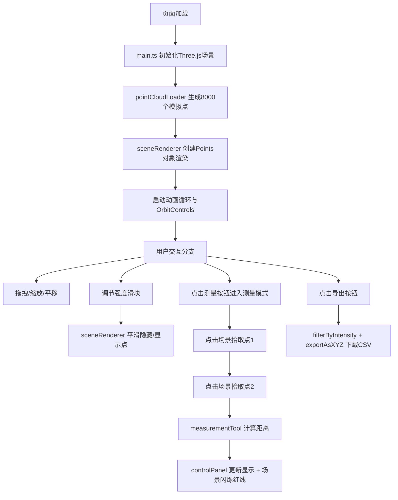

## 1. 产品概述

面向数字孪生和智慧城市领域的浏览器端点云数据可视化与交互测量工具，提供大规模激光雷达点云的渲染、筛选、测量和导出能力。纯客户端实现，无需后端服务，目标用户为GIS工程师、城市规划师和3D可视化开发者。

核心价值：将原本需要专业桌面软件处理的点云交互操作移植到浏览器，实现轻量级、可嵌入、零部署的点云分析体验。

## 2. 核心功能

### 2.1 用户角色

| 角色 | 登录方式 | 核心权限 |
|------|---------|---------|
| 访客用户 | 无需登录 | 加载、浏览、筛选、测量、导出点云数据 |

### 2.2 功能模块

1. **3D场景主视图**：点云渲染、视角控制、高亮与标记
2. **右侧控制面板**：强度滤镜、测量模式切换、数据导出、性能监控
3. **测量交互层**：点拾取、距离计算、连线可视化

### 2.3 页面详情

| 页面名称 | 模块名称 | 功能描述 |
|---------|---------|---------|
| 主界面 | 3D画布 | 渲染约8000个随机点云，支持抗锯齿与点光源；鼠标悬停高亮最近点(1px光晕)，点击标记红色测量球 |
| 主界面 | 控制面板 | 双端强度滑块(0-255)实时滤镜；开始测量按钮；导出CSV按钮；距离显示区；FPS与可见点数统计 |
| 主界面 | 测量系统 | 两点间欧氏距离计算(精度0.01)；闪烁红线标记选中点；测量模式切换为十字准星光标 |

## 3. 核心流程

用户打开页面后，点云自动加载并渲染。用户可通过拖拽旋转、滚轮缩放、右键平移浏览场景。调节强度滑块实时筛选点云，点击测量按钮进入测量模式后依次选取两点即可获得距离，导出按钮下载当前可见点为CSV文件。

## 4. 用户界面设计

### 4.1 设计风格
- **主色**：背景 #1a1a2e（深空蓝黑），按钮默认 #2d3561，悬停 #3f4a8c，文字 #ffffff
- **按钮**：圆角矩形，悬停缩放1.05倍，点击 translateY(1px) 按压下沉
- **字体**：无衬线系统字体 stack，标题 14px/600，正文 12px/400
- **布局**：全屏Canvas + 右侧280px半透明毛玻璃面板(backdrop-filter: blur(10px))
- **交互细节**：滑块自定义圆角渐变填充，测量模式光标变为十字准线(crosshair)

### 4.2 页面设计概览

| 页面名称 | 模块名称 | UI元素 |
|---------|---------|-------|
| 主界面 | 3D视图区 | 全屏深色背景，点云按高度渐变着色(地面绿→顶部蓝)，红色测量球，闪烁红线，点大小3px |
| 主界面 | 控制面板 | 标题栏、强度双滑块(带渐变填充指示)、测量按钮、导出按钮、距离显示卡片、FPS/点数统计 |

### 4.3 响应式
桌面端优先设计。当屏幕宽度 < 768px 时，控制面板自动折叠为顶部横条(高度56px)，点击展开为全屏浮层，支持触摸手势操作。

### 4.4 3D场景指引
- **环境**：纯深色背景无天空盒，营造数字孪生的科技感
- **光照**：1个 PointLight 位于场景上方，强度适中
- **相机**：PerspectiveCamera，fov 60，初始距离以能完整观察点云为准
- **相机运动**：OrbitControls 风格，enableDamping=true，dampingFactor=0.1（对应0.5秒 ease-out 缓动）
- **合成与焦点**：点云位于中心，无后期处理，保持性能
- **性能预算**：8000点，目标60fps，滤镜更新 <100ms，测距/导出 <50ms
