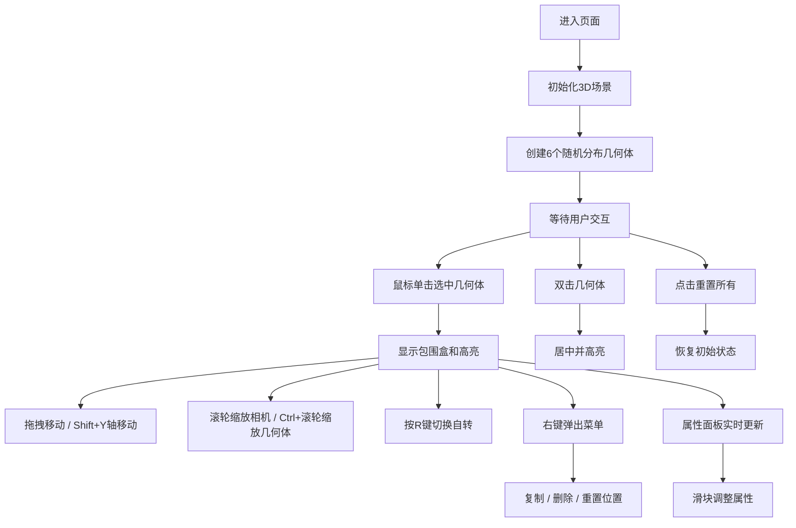

## 1. 产品概述

3D几何体交互排列工具，通过鼠标拖拽和滚轮操作在3D空间中对几何体进行自由排列、旋转和缩放，解决传统2D平面布局无法直观展示物体空间关系的问题。

- 主要用途：帮助用户在三维空间中直观地排列和操作几何体，适用于3D设计、空间规划、教学演示等场景
- 目标用户：设计师、教育工作者、3D爱好者
- 产品价值：提供直观的3D交互体验，降低3D空间操作的学习成本

## 2. 核心特性

### 2.1 功能模块

1. **3D场景模块**：6种不同颜色和形状的几何体（立方体、球体、圆柱体、圆锥、环面、八面体），初始随机分布在半径为10的球体内
2. **交互操作模块**：鼠标拖拽移动、Shift+拖拽Y轴移动、双击居中高亮、右键菜单（复制/删除/重置）
3. **相机控制模块**：滚轮缩放（5-30）、Ctrl+滚轮调整几何体大小（0.5-2.0）
4. **动画控制模块**：R键切换自转、速度可调（0-360度/秒）
5. **属性面板模块**：左下角折叠面板，显示名称/位置/缩放/旋转，滑块实时调整，重置所有按钮

### 2.2 页面详情

| 页面名称 | 模块名称 | 功能描述 |
|---------|---------|---------|
| 主场景页面 | 3D渲染区域 | Three.js渲染的3D场景，包含几何体、网格地面、光源 |
| 主场景页面 | 属性控制面板 | 左下角折叠卡片，实时显示和编辑选中几何体属性 |
| 主场景页面 | 右键上下文菜单 | 右键点击几何体弹出操作菜单 |
| 主场景页面 | 悬浮控制按钮 | 1024px以下屏幕显示，点击展开控制面板 |

## 3. 核心流程

## 4. 用户界面设计

### 4.1 设计风格

- **主背景**：#1a1a2e（深色科技感）
- **霓虹色系几何体**：#ff6b6b（红）、#48dbfb（蓝）、#ff9ff3（粉）、#feca57（黄）、#1dd1a1（绿）、#5f27cd（紫）
- **网格地面**：#2d2d4a网格线，透明度0.3
- **控制面板**：圆角卡片，半透明磨砂玻璃效果（backdrop-filter: blur(10px)），边框1px rgba(255,255,255,0.1)
- **交互效果**：滑块和按钮悬停0.2s颜色渐变过渡，点击时scale 0.95→1.0回弹

### 4.2 页面设计概述

| 页面名称 | 模块名称 | UI元素 |
|---------|---------|---------|
| 主场景页面 | 3D场景 | 深色背景、霓虹几何体（自发光）、自适应网格地面、环境光+点光源 |
| 主场景页面 | 属性面板 | 左下角圆角卡片、滑块控件（位置/缩放/旋转）、重置所有按钮、折叠/展开按钮 |
| 主场景页面 | 右键菜单 | 半透明背景、三个菜单项（复制/删除/重置位置）、悬停高亮 |
| 主场景页面 | 悬浮按钮 | 圆形按钮、右下角定位、1024px以下显示、滑出动画 |

### 4.3 响应式设计

- **桌面端（1024px以上）**：左下角固定显示属性面板
- **移动端/小屏（1024px以下）**：属性面板折叠为悬浮按钮，点击后从左侧滑出
- **触摸优化**：支持触摸拖拽和双指缩放操作

### 4.4 3D场景设计

- **环境**：深色背景，无HDRI，突出几何体霓虹效果
- **光照**：环境光（强度0.4）+ 两个点光源（白色，位置对称）
- **相机**：PerspectiveCamera，初始位置(0, 15, 25)，看向原点
- **后处理**：轻微抗锯齿，几何体自发光效果
- **动画**：requestAnimationFrame驱动，目标帧率60FPS，最低保证45FPS
