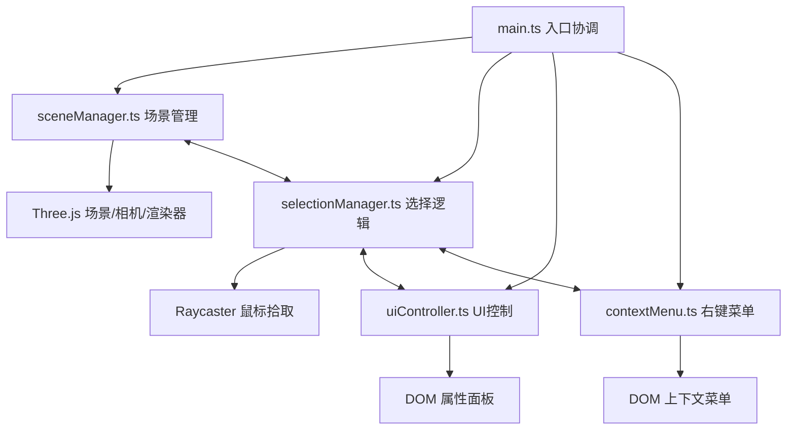

## 1. 架构设计



## 2. 技术描述

- **前端框架**：原生 TypeScript + Three.js @0.160.0（CDN引入）
- **构建工具**：Vite @5.x
- **语言**：TypeScript @5.x（strict模式，target ES2020）
- **无后端**：纯前端应用，状态全部内存管理
- **外部依赖**：仅Three.js通过CDN加载，无其他第三方库

## 3. 文件结构

```
auto108/
├── package.json          # 依赖与脚本
├── index.html            # 入口页面，全屏canvas容器
├── vite.config.js        # Vite配置，base相对路径，CDN外部化Three.js
├── tsconfig.json         # TS配置，strict模式
└── src/
    ├── main.ts           # 入口文件：初始化、动画循环、模块协调
    ├── sceneManager.ts   # 场景管理：几何体创建/销毁、地面、光源
    ├── selectionManager.ts # 选择逻辑：射线拾取、高亮、包围盒、自转
    ├── uiController.ts   # UI控制：属性面板DOM、事件绑定、实时更新
    └── contextMenu.ts    # 右键菜单：DOM管理、复制/删除/重置操作
```

## 4. 模块接口定义

### 4.1 sceneManager.ts

```typescript
// 几何体类型定义
type GeometryType = 'cube' | 'sphere' | 'cylinder' | 'cone' | 'torus' | 'octahedron';

interface GeometryConfig {
  type: GeometryType;
  color: string;
  position: { x: number; y: number; z: number };
  scale: { x: number; y: number; z: number };
  rotation: { x: number; y: number; z: number };
}

// 导出接口
export function initScene(container: HTMLElement): {
  scene: THREE.Scene;
  camera: THREE.PerspectiveCamera;
  renderer: THREE.WebGLRenderer;
};
export function createInitialObjects(): THREE.Mesh[];
export function addObject(config: GeometryConfig): THREE.Mesh;
export function removeObject(mesh: THREE.Mesh): void;
export function resetAll(): void;
export function updateGridDensity(cameraDistance: number): void;
export function render(): void;
export function getObjects(): THREE.Mesh[];
```

### 4.2 selectionManager.ts

```typescript
interface SelectionState {
  selected: THREE.Mesh | null;
  isRotating: boolean;
  rotationSpeed: number;
  boundingBox: THREE.BoxHelper | null;
}

// 导出接口
export function initSelection(
  scene: THREE.Scene,
  camera: THREE.Camera,
  renderer: THREE.WebGLRenderer,
  objects: THREE.Mesh[]
): void;
export function selectObject(mesh: THREE.Mesh): void;
export function deselectAll(): void;
export function getSelected(): THREE.Mesh | null;
export function toggleRotation(): void;
export function setRotationSpeed(speed: number): void;
export function updateSelection(deltaTime: number): void;
export function centerObject(mesh: THREE.Mesh): void;
export function updateObjectsList(objects: THREE.Mesh[]): void;
```

### 4.3 uiController.ts

```typescript
// 导出接口
export function initUI(
  container: HTMLElement,
  onResetAll: () => void,
  onPositionChange: (axis: 'x' | 'y' | 'z', value: number) => void,
  onScaleChange: (axis: 'x' | 'y' | 'z', value: number) => void,
  onRotationChange: (value: number) => void,
  onRotationSpeedChange: (value: number) => void
): void;
export function updateUI(mesh: THREE.Mesh | null): void;
export function updateRotationSpeedUI(speed: number): void;
```

### 4.4 contextMenu.ts

```typescript
interface ContextMenuHandlers {
  onCopy: (mesh: THREE.Mesh) => void;
  onDelete: (mesh: THREE.Mesh) => void;
  onResetPosition: (mesh: THREE.Mesh) => void;
}

// 导出接口
export function initContextMenu(
  container: HTMLElement,
  handlers: ContextMenuHandlers
): void;
export function showMenu(x: number, y: number, mesh: THREE.Mesh): void;
export function hideMenu(): void;
```

## 5. 性能优化策略

1. **几何体数量限制**：最多10个几何体，超过时禁止复制
2. **渲染循环优化**：requestAnimationFrame驱动，仅在需要时更新
3. **内存管理**：删除几何体时正确dispose几何体和材质
4. **自适应网格**：根据相机距离动态调整网格密度，减少绘制调用
5. **事件节流**：鼠标移动事件使用requestAnimationFrame节流
6. **CSS硬件加速**：transform和opacity动画使用GPU加速

## 6. 交互事件映射

| 事件 | 操作 | 处理模块 |
|------|------|---------|
| 单击几何体 | 选中并显示包围盒 | selectionManager |
| 双击几何体 | 居中并高亮 | selectionManager |
| 拖拽（无Shift） | 沿XZ平面移动 | selectionManager |
| 拖拽（+Shift） | 沿Y轴移动 | selectionManager |
| 滚轮（无Ctrl） | 相机缩放（5-30） | main.ts |
| 滚轮（+Ctrl） | 几何体缩放（0.5-2.0） | selectionManager |
| R键 | 切换自转 | selectionManager |
| 右键几何体 | 显示上下文菜单 | contextMenu |
| 滑块拖动 | 更新几何体属性 | uiController |
| 重置按钮 | 恢复初始状态 | sceneManager |
