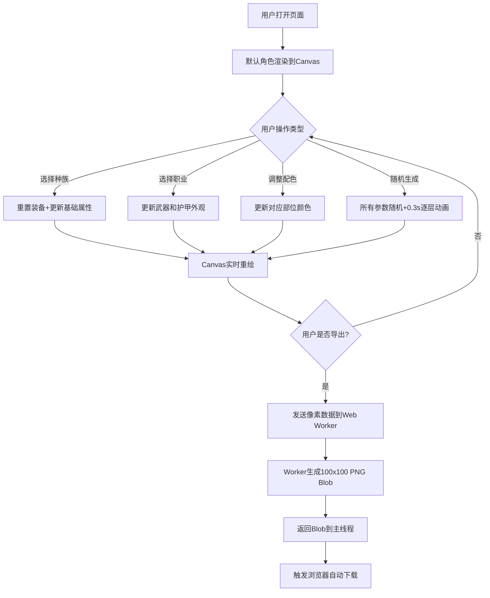

## 1. 产品概述
像素风角色生成器是一款面向创意工坊独立游戏社区的在线工具，帮助用户快速生成独特的2D像素风格游戏角色精灵图，用于玩家头像或游戏内NPC设计。
- 核心目标：降低像素美术创作门槛，提供高度可定制的角色生成体验
- 目标用户：独立游戏开发者、创意工坊社区用户、像素艺术爱好者
- 产品价值：数秒内生成专业级像素角色精灵，支持导出高清PNG用于游戏项目

## 2. 核心功能

### 2.1 用户角色
无需注册，所有用户均可使用全部功能。

### 2.2 功能模块
1. **主控制面板**：种族选择、职业装备、颜色主题、随机生成、导出功能
2. **角色预览区**：Canvas实时渲染像素角色，支持分层动画显示
3. **高清导出模块**：Web Worker后台处理100x100透明背景PNG导出

### 2.3 页面详情
| 页面名称 | 模块名称 | 功能描述 |
|-----------|-------------|---------------------|
| 主页面 | 种族选择器 | 3种种族（人类、精灵、兽人）切换，影响基础肤色、体型和发型，切换时重置装备 |
| 主页面 | 职业装备选择器 | 3种职业（战士、法师、盗贼），每种配备独特武器和护甲外观 |
| 主页面 | 颜色调色板 | 5个独立部位配色（皮肤、衣服、头发、武器、装饰），12色预设+自定义吸色 |
| 主页面 | 随机生成按钮 | 一键随机所有参数，带0.3秒逐层显现动画 |
| 主页面 | 导出精灵图按钮 | 通过Web Worker导出100x100 PNG，透明背景，自动下载 |
| 主页面 | 角色预览Canvas | 分层合成渲染（身体→衣服→武器→发型→装饰），3倍放大显示，柔和发光描边 |

## 3. 核心流程
用户打开页面 → 默认加载角色预览 → 选择种族/职业/装备（实时预览变化）→ 调整各部位配色 → 或点击随机生成（逐层动画显现）→ 满意后点击导出 → Worker处理生成高清PNG → 浏览器自动下载精灵图

## 4. 用户界面设计

### 4.1 设计风格
- **主色调**：赛博朋克暗色主题，主色#1a1a2e（深蓝紫），强调色#e94560（霓虹粉），辅色#0f3460（深海蓝）
- **按钮风格**：圆角矩形渐变（强调色→辅色），悬停上浮4px+加深投影，点击缩放至0.95倍
- **字体选择**：标题使用Press Start 2P（像素风字体），正文使用Roboto Mono（等宽字体）
- **布局风格**：桌面端左右分栏（左60%预览/右40%控制），卡片式垂直排列控制项
- **视觉细节**：深灰预览背景，角色周围柔和发光描边，控制面板半透明磨砂玻璃质感，悬停时强调色10%透明叠加

### 4.2 页面设计概述
| 页面名称 | 模块名称 | UI元素 |
|-----------|-------------|-------------|
| 主页面 | 预览区 | 深灰背景#2a2a3e，角色3倍放大居中，柔和外发光效果，0.2s淡入淡出过渡 |
| 主页面 | 控制面板 | 半透明磨砂玻璃backdrop-filter，浅灰底色rgba(255,255,255,0.05)，圆角16px |
| 主页面 | 选项卡片 | 垂直排列，间距16px，悬停背景强调色10%透明，0.2s过渡动画 |
| 主页面 | 调色板 | 3x4色盘网格，每色块24px方形圆角，选中项外发光+缩放1.1倍 |
| 主页面 | 操作按钮组 | 渐变圆角按钮，间距12px，悬停浮起效果，点击微反馈 |
| 主页面 | 响应式布局 | 平板上下布局，手机端汉堡菜单折叠控制面板 |

### 4.3 响应式
- **桌面端（≥1024px）**：左右分栏，预览区60%，控制面板40%
- **平板端（768-1023px）**：上下布局，预览区在上占50%，控制区在下占50%
- **手机端（<768px）**：预览区占满上半，控制面板默认折叠，汉堡菜单点击展开，触控优化（色块增大至32px）

### 4.4 动画与交互
- 颜色切换：Canvas 200ms内完成重绘
- 随机生成：0.3秒逐层显现（身体→衣服→武器→装饰），全程40fps以上
- 控制面板切换：0.2s淡入淡出过渡
- 预览帧率：任何情况不低于30fps
