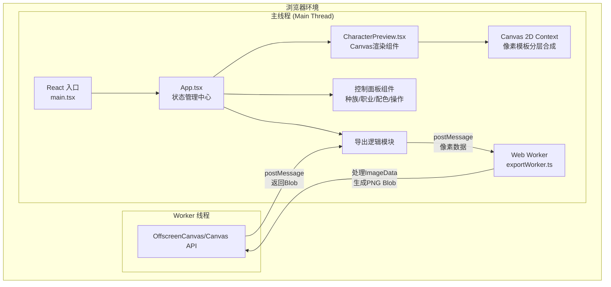

## 1. 架构设计



**数据流向说明**：
- App.tsx 管理全局状态（种族、职业、装备、配色、动画进度）
- 状态变更 → 传递给 CharacterPreview → Canvas 实时重绘
- 导出操作 → App 从 Canvas 获取 ImageData → 发送给 Worker → Worker 处理后返回 Blob → 触发下载

## 2. 技术描述
- **前端框架**：React@18 + TypeScript@5 + Vite@5
- **初始化工具**：vite-init（react-ts模板）
- **构建工具**：Vite + @vitejs/plugin-react
- **渲染技术**：Canvas 2D API 像素级绘制
- **多线程**：Web Worker 处理高清导出
- **样式方案**：原生CSS + CSS变量 + TailwindCSS（可选，按用户需求不强制）
- **后端**：无（纯前端应用）
- **数据库**：无（所有状态内存管理）

**性能保障策略**：
- Canvas 渲染使用 requestAnimationFrame + 脏检查机制，仅在状态变更时重绘
- 像素模板数据预缓存，避免重复计算
- Web Worker 独立线程处理导出，不阻塞UI
- 颜色查找表(LUT)优化像素级颜色替换

## 3. 路由定义
| 路由 | 用途 |
|-------|---------|
| / | 主页面：角色生成器全部功能 |

单页应用，无路由跳转。

## 4. API 定义
无后端API，纯前端应用。内部模块接口定义：

```typescript
// 角色状态类型
type Race = 'human' | 'elf' | 'orc';
type CharacterClass = 'warrior' | 'mage' | 'rogue';

interface CharacterColors {
  skin: string;
  clothes: string;
  hair: string;
  weapon: string;
  accessory: string;
}

interface CharacterState {
  race: Race;
  characterClass: CharacterClass;
  colors: CharacterColors;
}

// Canvas渲染层顺序（用于随机动画）
type RenderLayer = 'body' | 'clothes' | 'weapon' | 'hair' | 'accessory';

// Worker消息协议
interface WorkerRequest {
  type: 'export';
  imageData: ImageData;
  targetSize: number; // 100
}

interface WorkerResponse {
  type: 'export-complete';
  blob: Blob;
  error?: string;
}
```

## 5. 文件结构设计

```
project-root/
├── index.html                      # 单页入口
├── package.json                    # 依赖与脚本
├── vite.config.js                  # Vite配置
├── tsconfig.json                   # TypeScript配置
└── src/
    ├── main.tsx                    # React入口
    ├── App.tsx                     # 主组件+状态管理
    ├── App.css                     # 全局样式+CSS变量
    ├── components/
    │   ├── CharacterPreview.tsx    # Canvas角色预览
    │   ├── ControlPanel.tsx        # 控制面板容器
    │   ├── RaceSelector.tsx        # 种族选择器
    │   ├── ClassSelector.tsx       # 职业选择器
    │   ├── ColorPalette.tsx        # 颜色调色板
    │   └── ActionButtons.tsx       # 操作按钮组
    ├── utils/
    │   ├── pixelTemplates.ts       # 像素模板数据（各部位像素矩阵）
    │   ├── colorUtils.ts           # 颜色转换工具
    │   ├── renderLayers.ts         # 分层渲染逻辑
    │   └── exportWorker.ts         # Web Worker导出处理
    └── types/
        └── character.ts            # 全局类型定义
```

**调用关系**：
1. `main.tsx` → 渲染 `App.tsx`
2. `App.tsx` → 传递状态给 `CharacterPreview` + `ControlPanel`
3. `ControlPanel` → 包含 `RaceSelector`/`ClassSelector`/`ColorPalette`/`ActionButtons`
4. `CharacterPreview` → 引用 `pixelTemplates` + `colorUtils` + `renderLayers`
5. `ActionButtons` → 触发导出时调用 `exportWorker`

## 6. 性能指标与实现策略

| 指标 | 目标 | 实现方案 |
|------|------|---------|
| Canvas帧率 | ≥30fps | 脏检查+requestAnimationFrame，避免无效重绘 |
| 配色响应 | ≤200ms重绘 | 预计算模板偏移+颜色查找表，批量像素操作 |
| 随机动画帧率 | ≥40fps | 分层渲染控制，CSS opacity辅助过渡 |
| 导出响应 | 不卡UI | Web Worker独立线程，使用createImageBitmap |
