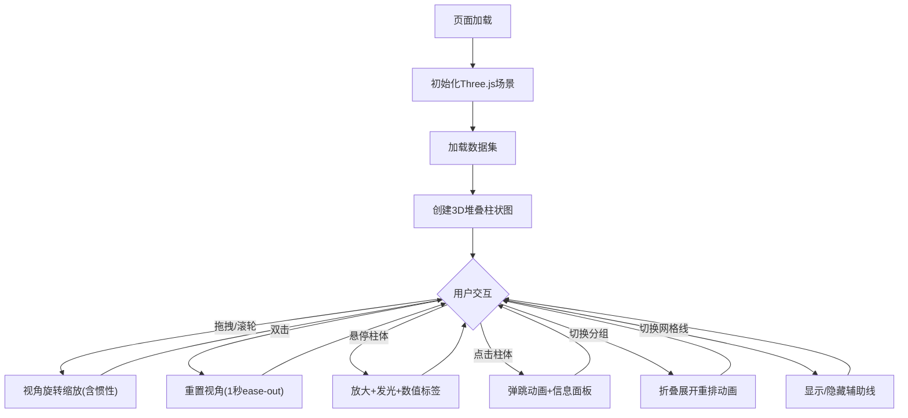

## 1. 产品概述

交互式3D堆叠柱状图可视化工具，面向数据分析师和业务决策者，通过三维空间深度和动态交互解决传统2D柱状图缺乏空间感的问题。支持多数据集对比、视角旋转缩放、悬停高亮和点击详情等交互方式，采用暗色科技风格提供沉浸式数据探索体验。

## 2. 核心功能

### 2.1 功能模块

1. **3D可视化场景页**: 3D堆叠柱状图展示、视角交互、数据标签、图例、控制面板、信息面板

### 2.2 页面详情

| 页面名称 | 模块名称 | 功能描述 |
|---------|---------|---------|
| 3D可视化场景 | 堆叠柱状图渲染 | 3组数据×5类别×3层堆叠柱体，半透明彩色材质+自发光，高度动态计算，居中排列 |
| 3D可视化场景 | 视角交互 | 鼠标拖拽旋转(Y/X轴)、滚轮缩放、惯性缓动(衰减0.95)、双击重置(1秒ease-out) |
| 3D可视化场景 | 悬停交互 | 柱体放大1.15倍+浅蓝外发光(半径0.5)、顶部浮动数值标签(面向相机) |
| 3D可视化场景 | 点击交互 | 弹跳动画(压缩0.8倍→恢复,0.3秒)、左侧信息面板滑出显示详情 |
| 3D可视化场景 | 分组切换 | 下拉菜单切换按类别/按层分组，柱状图折叠展开动画重排(间隔50ms) |
| 3D可视化场景 | 网格辅助线 | 开关控制半透明白色虚线辅助线显示 |
| 3D可视化场景 | 颜色图例 | 底部水平排列，色块20x20px+标签，毛玻璃背景(模糊10px)，悬停色块对应层闪烁 |
| 3D可视化场景 | 右侧控制面板 | 固定280px宽，半透明深色+圆角，数据分组下拉+网格线开关，悬停高亮过渡(0.2秒) |
| 3D可视化场景 | 左侧信息面板 | 初始隐藏，点击柱体后滑出(240px,0.3秒)，显示类别名、各层数值和总和 |
| 3D可视化场景 | 柱体底部阴影 | 半透明圆形阴影，大小随柱体高度变化 |
| 3D可视化场景 | 响应式适配 | <768px右侧面板折叠为图标按钮，左侧面板改为底部弹窗 |

## 3. 核心流程

用户打开页面后，3D堆叠柱状图自动渲染并居中展示。用户可以：
1. 拖拽旋转视角观察不同角度的数据分布
2. 滚轮缩放调整远近
3. 悬停柱体查看数值，点击柱体查看详细信息
4. 通过右侧面板切换分组方式和显示网格线
5. 双击场景重置视角

## 4. 界面设计

### 4.1 设计风格

- **主色调**: 深灰蓝渐变背景(#0f172a → #1e293b)
- **柱体配色**: 蓝紫(#6366f1)、青绿(#06b6d4)、橙黄(#f59e0b)暖冷对比系
- **材质**: 光泽质感(粗糙度0.3，金属度0.1)，半透明+微弱自发光
- **字体**: 标题使用 Orbitron(科技感)，正文使用 Source Sans 3
- **布局**: 3D场景全屏，右侧固定控制面板(280px)，左侧滑动信息面板(240px)
- **按钮/控件**: 扁平板式风格，统一圆角，悬停高亮过渡0.2秒
- **发光效果**: 浅蓝色(#7dd3fc)外发光，半径0.5
- **毛玻璃**: 面板和信息区使用backdrop-filter模糊效果

### 4.2 页面设计概览

| 页面名称 | 模块名称 | UI元素 |
|---------|---------|--------|
| 3D可视化场景 | 3D画布 | 全屏canvas，深灰蓝渐变背景，柱体阵列居中 |
| 3D可视化场景 | 右侧控制面板 | 半透明深色面板(rgba(15,23,42,0.8))，微圆角，含分组下拉菜单和网格线开关 |
| 3D可视化场景 | 左侧信息面板 | 半透明深色滑出面板，显示类别名、层名、数值、总和 |
| 3D可视化场景 | 底部图例 | 水平排列色块+标签，毛玻璃背景(模糊10px) |
| 3D可视化场景 | 悬停标签 | 浮动3D文本，始终面向相机，浅色背景+深色文字 |
| 3D可视化场景 | 柱体阴影 | 半透明圆形贴图，底部投影，大小随高度变化 |

### 4.3 响应式设计

- **桌面端(≥768px)**: 右侧固定控制面板280px，左侧信息面板240px滑出
- **移动端(<768px)**: 右侧面板折叠为可展开图标按钮，左侧信息面板改为底部弹窗
- 触摸优化：支持触摸拖拽旋转和双指缩放

### 4.4 3D场景指引

- **环境**: 深灰蓝渐变背景，无HDRI，使用简单环境光+方向光
- **光照**: 环境光(强度0.4, 偏冷白) + 方向光(强度0.8, 从上方45度) + 半球光(天蓝到深蓝)
- **相机**: 透视相机，FOV 50度，初始位置(15, 12, 15)看向原点
- **构图**: 柱体阵列在XZ平面排列，Y轴为高度，整体居中于原点
- **交互**: 鼠标拖拽旋转、滚轮缩放、悬停高亮、点击弹跳
- **动画**: 惯性缓动旋转、双击重置平滑动画、分组切换折叠展开动画
- **后处理**: 外发光效果(bloom用于悬停高亮)
- **性能预算**: 55fps+，柱体总数≤240，交互延迟≤100ms
