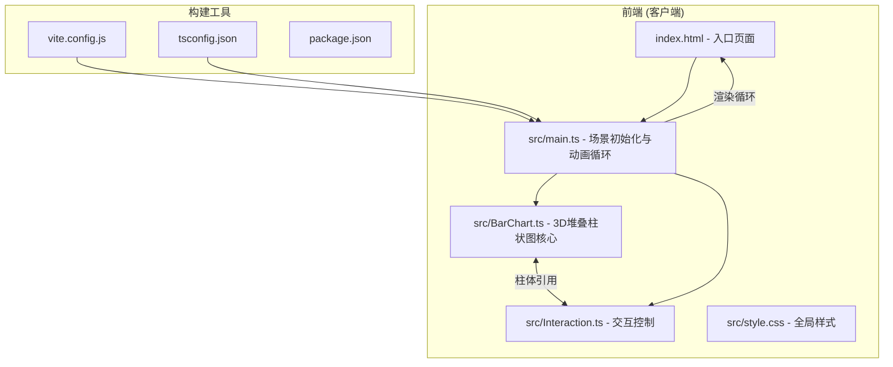
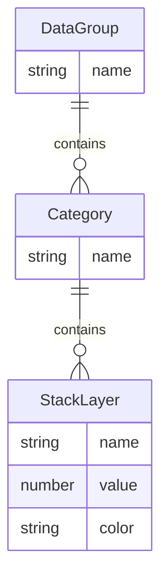

## 1. 架构设计



## 2. 技术说明

- **前端**: TypeScript + Three.js(CDN引入) + Vite
- **初始化工具**: Vite
- **后端**: 无（纯客户端应用）
- **数据库**: 无（内置模拟数据集）
- **3D引擎**: Three.js通过CDN引入，使用importmap映射

### 文件间调用关系与数据流向

```
index.html
  └─ 引入 src/main.ts (通过Vite构建)
       ├─ 创建 Scene, Camera, Renderer
       ├─ 调用 BarChart.createBarChart(data) → 返回柱体Group → 添加到Scene
       │    └─ 数据流向: 数据数组 → 转换为BufferGeometry → 应用MeshPhysicalMaterial → 组装Group
       ├─ 调用 Interaction.init(camera, scene, barChartRef) → 注册事件监听
       │    └─ 数据流向: 鼠标事件 → Raycaster检测 → 柱体引用操作 → UI更新
       └─ 启动 animate() 循环 → 渲染帧 + 更新交互状态
```

## 3. 路由定义

| 路由 | 用途 |
|------|------|
| / | 单页应用，3D可视化场景 |

## 4. API定义

无后端API。数据集内置在客户端代码中。

### 数据类型定义

```typescript
interface StackLayer {
  name: string;
  value: number;
  color: string;
}

interface Category {
  name: string;
  layers: StackLayer[];
}

interface DataGroup {
  name: string;
  categories: Category[];
}

type GroupMode = 'category' | 'layer';
```

## 5. 服务器架构图

无服务器端。纯客户端渲染。

## 6. 数据模型

### 6.1 数据模型定义



### 6.2 内置数据集

3组数据，每组5个类别，每个类别3个堆叠层：

- **组1 - 华东区**: 类别(产品A-E), 层(研发/市场/运营)
- **组2 - 华南区**: 类别(产品A-E), 层(研发/市场/运营)
- **组3 - 华北区**: 类别(产品A-E), 层(研发/市场/运营)

层颜色映射：
- 研发层: #6366f1 (蓝紫)
- 市场层: #06b6d4 (青绿)
- 运营层: #f59e0b (橙黄)
