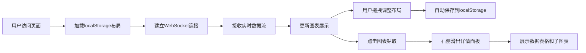

## 1. 产品概述

在线数据看板应用，提供实时数据可视化展示、钻取分析和用户自定义仪表板布局功能。通过WebSocket实现前后端实时数据推送，帮助用户快速洞察业务数据趋势。

- 主要目的：提供实时、可交互、可定制的数据可视化看板
- 解决问题：传统静态报表无法满足实时数据监控和深度分析需求
- 目标用户：数据分析师、运营人员、企业管理者

## 2. 核心特性

### 2.1 用户角色

| 角色 | 注册方式 | 核心权限 |
|------|----------|----------|
| 普通用户 | 直接访问 | 查看仪表板、调整布局、钻取分析、筛选数据 |

### 2.2 功能模块

1. **仪表板页面**：栅格化拖拽布局、图表卡片展示、布局本地持久化
2. **图表组件**：折线图、柱状图、热力图三种图表类型
3. **钻取分析**：点击图表展开详情面板，包含数据表格和子图表
4. **筛选控制**：日期范围选择、数据刷新频率选择
5. **系统状态**：WebSocket连接状态指示灯
6. **右键菜单**：固定卡片、隐藏卡片、复制图表

### 2.3 页面详情

| 页面名称 | 模块名称 | 功能描述 |
|----------|----------|----------|
| 仪表板页面 | 顶部筛选栏 | 日期范围选择器、刷新频率选择器 |
| 仪表板页面 | 系统状态指示 | WebSocket连接状态呼吸灯 |
| 仪表板页面 | 栅格布局区 | 可拖拽调整大小和位置的图表卡片 |
| 仪表板页面 | 钻取面板 | 右侧滑入的数据详情和子图表 |
| 仪表板页面 | 右键菜单 | 固定、隐藏、复制操作 |

## 3. 核心流程

用户访问页面 → 加载本地存储的布局配置 → 建立WebSocket连接 → 接收实时数据并更新图表 → 用户拖拽调整布局 → 自动保存到本地存储 → 点击图表触发钻取 → 右侧滑出详情面板

## 4. 用户界面设计

### 4.1 设计风格

- 主色调：深灰蓝 #1e293b
- 图表配色：柔和渐变（蓝紫 #6366f1 到青 #14b8a6）
- 卡片背景：白色 #ffffff，圆角 12px，浅灰色阴影 0 2px 8px rgba(0,0,0,0.08)
- 页面背景：浅灰 #f1f5f9
- 字体：系统无衬线字体
- 按钮交互：悬停背景色加深10%，0.2秒过渡；点击scale 0.97

### 4.2 页面设计概述

| 页面名称 | 模块名称 | UI 元素 |
|----------|----------|---------|
| 仪表板页面 | 顶部筛选栏 | 日期选择器下拉、频率选择器下拉、状态指示灯 |
| 仪表板页面 | 图表卡片 | 白色卡片、圆角阴影、拖拽手柄、可调整大小 |
| 仪表板页面 | 钻取面板 | 右侧滑入、0.3秒淡出动画、数据表格、子图表 |
| 仪表板页面 | 右键菜单 | 原生风格浮动面板、点击外部关闭 |

### 4.3 响应式

- 桌面端：多列栅格布局
- 屏幕宽度 < 768px：单列排列
- 日期选择器和频率选择器：移动端堆叠显示

### 4.4 动效设计

- 状态指示灯：呼吸动画，亮暗周期2秒
- 钻取面板：0.3秒淡出滑入
- 图表刷新切换：0.5秒横向渐变过渡
- 拖拽时：卡片透明度0.9，显示占位虚线框
- 按钮：悬停过渡0.2秒，点击缩放0.97
