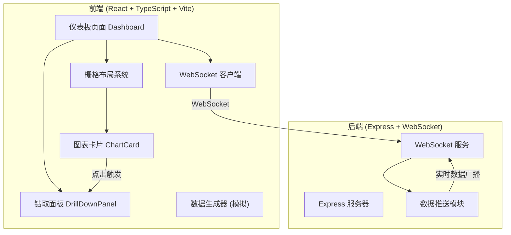

## 1. 架构设计



## 2. 技术描述

- 前端：React 18 + TypeScript + Vite
- 后端：Express 4 + ws (WebSocket库)
- 图表库：Recharts
- 状态管理：React hooks + localStorage 持久化
- 拖拽布局：自定义实现栅格拖拽系统
- 数据模拟：后端定时生成模拟数据

## 3. 项目结构

```
.
├── package.json
├── tsconfig.json
├── vite.config.ts
├── index.html
└── src/
    ├── frontend/
    │   ├── pages/
    │   │   └── dashboard.tsx
    │   ├── components/
    │   │   ├── ChartCard.tsx
    │   │   └── DrillDownPanel.tsx
    │   └── utils/
    │       ├── dataGenerator.ts
    │       └── websocketClient.ts
    └── backend/
        ├── server.ts
        └── dataStream.ts
```

## 4. 数据模型

### 4.1 图表数据类型

```typescript
// 销售趋势数据（折线图）
interface SalesTrendData {
  time: string;
  value: number;
  timestamp: number;
}

// 产品类别销量（柱状图）
interface CategorySalesData {
  category: string;
  value: number;
  products: ProductSalesData[];
}

interface ProductSalesData {
  product: string;
  value: number;
}

// 访问热力图数据
interface HeatmapData {
  hour: number;
  region: string;
  value: number;
}

// 图表卡片配置
interface ChartCardConfig {
  id: string;
  type: 'line' | 'bar' | 'heatmap';
  title: string;
  x: number;
  y: number;
  width: number;
  height: number;
  pinned: boolean;
  hidden: boolean;
}

// WebSocket消息
interface WSMessage {
  type: 'register' | 'data' | 'config';
  channel?: string;
  data?: any;
}

// 连接状态
type ConnectionStatus = 'connected' | 'connecting' | 'disconnected';
```

### 4.2 钻取数据

```typescript
interface DrillDownData {
  sourceChartId: string;
  sourceChartType: string;
  dataPoint: any;
  detailTable: any[];
  subChartData: any[];
}
```

## 5. 核心模块说明

### 5.1 前端模块

| 模块 | 文件 | 职责 |
|------|------|------|
| 仪表板页面 | src/frontend/pages/dashboard.tsx | 主页面，组合所有组件，管理布局状态 |
| 图表卡片 | src/frontend/components/ChartCard.tsx | 可拖拽调整大小的图表容器，支持右键菜单 |
| 钻取面板 | src/frontend/components/DrillDownPanel.tsx | 右侧滑入面板，展示详情表格和子图表 |
| WebSocket客户端 | src/frontend/utils/websocketClient.ts | 管理WebSocket连接、重连、数据分发 |
| 数据生成器 | src/frontend/utils/dataGenerator.ts | 前端模拟数据生成（备用方案） |

### 5.2 后端模块

| 模块 | 文件 | 职责 |
|------|------|------|
| 服务器入口 | src/backend/server.ts | Express + WebSocket服务器，处理连接和广播 |
| 数据流 | src/backend/dataStream.ts | 模拟实时数据流生成，按频道推送 |

## 6. WebSocket 协议

### 6.1 客户端 → 服务端

| 消息类型 | 说明 | 数据 |
|----------|------|------|
| register | 注册频道监听 | `{ channel: string }` |
| unregister | 取消注册 | `{ channel: string }` |
| setFrequency | 设置数据频率 | `{ frequency: number }` |

### 6.2 服务端 → 客户端

| 消息类型 | 说明 | 数据 |
|----------|------|------|
| data | 实时数据更新 | `{ channel: string, data: any }` |
| welcome | 连接成功 | `{ clientId: string }` |

## 7. 性能指标

- 图表更新帧率：≥ 15fps
- WebSocket重连时间：≤ 5秒
- 首次加载时间（DOMContentLoaded）：≤ 2秒（生产构建）
- 布局保存：localStorage 实时持久化
