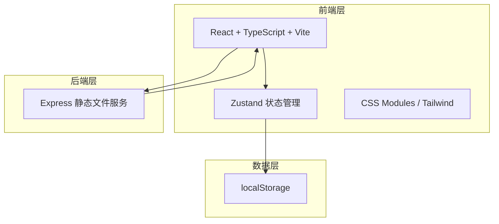
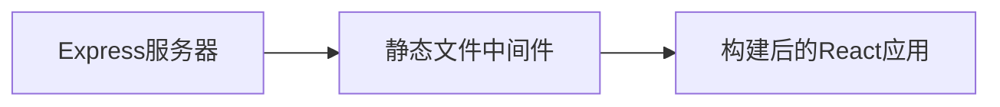
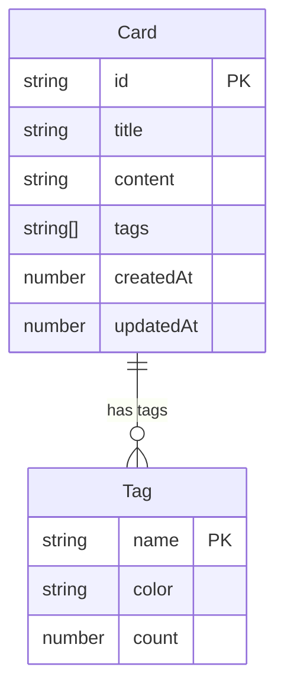

## 1. 架构设计



## 2. 技术说明

- **前端**：React@18 + TypeScript + Vite + Tailwind CSS
- **初始化工具**：vite-init（react-express-ts模板）
- **后端**：Express@4（仅提供静态文件服务）
- **数据库**：无数据库，使用 localStorage 做持久化
- **状态管理**：Zustand
- **Markdown渲染**：react-markdown + remark-gfm
- **路由**：react-router-dom

## 3. 路由定义

| 路由 | 用途 |
|------|------|
| `/` | 主界面：标签侧边栏 + 卡片列表 |
| `/card/new` | 新建卡片编辑器 |
| `/card/:id` | 卡片详情页 |
| `/card/:id/edit` | 编辑卡片 |

## 4. API定义

本项目无REST API，所有数据操作通过localStorage在客户端完成。Express仅提供静态文件服务。

## 5. 服务器架构



Express服务器配置：
- 端口：3001（生产模式）
- 功能：托管Vite构建后的静态文件
- 中间件：`express.static`

## 6. 数据模型

### 6.1 数据模型定义



### 6.2 数据定义

**Card 数据结构（TypeScript）：**
```typescript
interface Card {
  id: string;
  title: string;
  content: string;
  tags: string[];
  createdAt: number;
  updatedAt: number;
}
```

**localStorage 存储键：**
- `knowledge_cards`: Card[] - 所有卡片数据
- `knowledge_tags`: { name: string; color: string }[] - 标签颜色映射

**核心方法：**
- `saveCard(card: Card): void` - 保存单张卡片，延迟 < 50ms
- `loadCards(): Card[]` - 加载所有卡片
- `deleteCard(id: string): void` - 删除卡片
- `searchByTag(tag: string): Card[]` - 按标签筛选，响应 < 100ms
- `findBacklinks(cardId: string): Card[]` - 查找双向链接卡片（全文搜索标题匹配）
- `extractTitle(content: string): string` - 从Markdown内容提取标题（第一级标题或前20字符）

### 6.3 标签颜色方案

预定义8种标签颜色，循环分配：
- `#E07A5F` 赤陶色
- `#3D405B` 深蓝灰
- `#81B29A` 鼠尾草绿
- `#F2CC8F` 淡金色
- `#5B8E7D` 深青绿
- `#C17A74` 玫瑰棕
- `#8E7AA3` 薰衣草紫
- `#6D9DC5` 天蓝色

## 7. 文件结构

```
├── package.json
├── index.html
├── vite.config.ts
├── tsconfig.json
├── server.ts                   # Express静态文件服务
├── src/
│   ├── main.tsx                # React入口
│   ├── App.tsx                 # 应用主组件，路由与全局状态
│   ├── CardEditor.tsx          # 卡片编辑器
│   ├── CardList.tsx            # 卡片网格列表
│   ├── TagSidebar.tsx          # 左侧标签栏
│   ├── store.ts                # Zustand状态管理
│   └── utils/
│       └── storage.ts          # localStorage读写工具
```
