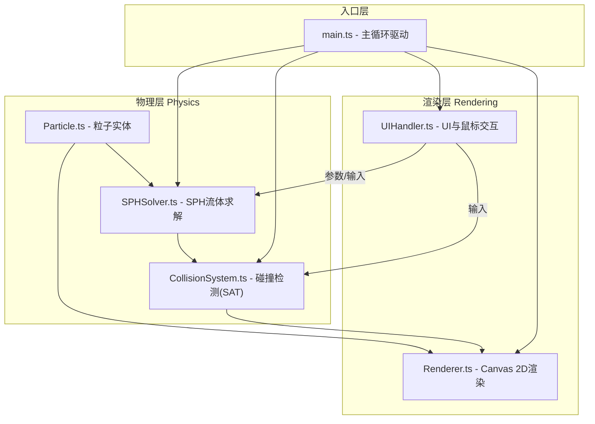

## 1. 架构设计



## 2. 技术说明

- **前端**：TypeScript 5.3 + Vite 5.0 + Canvas 2D API（不使用WebGL）
- **物理引擎**：自实现SPH（光滑粒子流体动力学）算法，不使用第三方物理库
- **构建工具**：Vite默认配置，开发服务器端口3000
- **类型系统**：TypeScript严格模式 + esModuleInterop启用

## 3. 文件组织

```
/
├── package.json          # typescript@5.3, vite@5.0, npm run dev
├── index.html            # 全屏canvas + UI容器入口
├── vite.config.js        # Vite默认配置，端口3000
├── tsconfig.json         # strict, esModuleInterop
└── src/
    ├── main.ts           # 入口：初始化、requestAnimationFrame主循环
    ├── physics/
    │   ├── Particle.ts       # 粒子类：位置/速度/密度/压强/欧拉积分/边界检查
    │   ├── SPHSolver.ts      # SPH求解器：密度/压强/粘滞/表面张力核函数
    │   └── CollisionSystem.ts# 碰撞系统：SAT粒子-障碍物检测、反弹、推动
    └── rendering/
        ├── Renderer.ts       # 渲染器：粒子/障碍物/尾迹/FPS
        └── UIHandler.ts      # UI控制器：滑块/工具栏/鼠标事件
```

## 4. 数据流

```
用户输入
   ↓
UIHandler (参数、鼠标事件)
   ↓
SPHSolver (接收参数、更新粒子加速度)
   ↓
CollisionSystem (粒子-障碍物碰撞检测与响应)
   ↓
Renderer (绘制粒子、障碍物、尾迹、HUD)
```

驱动循环：
1. UIHandler 收集鼠标位置/按键状态 + 参数滑块数值
2. main.ts 每一帧：UIHandler.emitParticles() → SPHSolver.step() → CollisionSystem.resolve() → Renderer.render()
3. Renderer 根据当前FPS自动选择渲染质量（圆形渐变 / 实心方块）

## 5. 核心算法说明

### 5.1 SPH核函数
- **密度核（Poly6）**：W(r,h) = 315/(64πh⁹) * (h² - |r|²)³，0 ≤ |r| ≤ h
- **压强核（Spiky梯度）**：∇W(r,h) = -45/(πh⁶) * (h - |r|)² * r̂
- **粘滞核（拉普拉斯）**：∇²W(r,h) = 45/(πh⁶) * (h - |r|)

### 5.2 空间网格加速
将画布按2h网格划分，每帧重建网格哈希表，粒子仅查询相邻9个网格内的其他粒子，将O(n²)降至O(n)。

### 5.3 碰撞检测（SAT分离轴定理）
对多边形障碍物，将粒子视作半径为r的圆，分别在每条边法向量和粒子-顶点方向上投影检测重叠。

### 5.4 表面张力
使用曲率近似：基于粒子邻域内法向量散度估算表面，沿法向施加回复力。

### 5.5 渲染降级策略
维护滑动窗口平均FPS，连续10帧<45时切换粒子从渐变圆形→实心方块，连续30帧>55时恢复。
