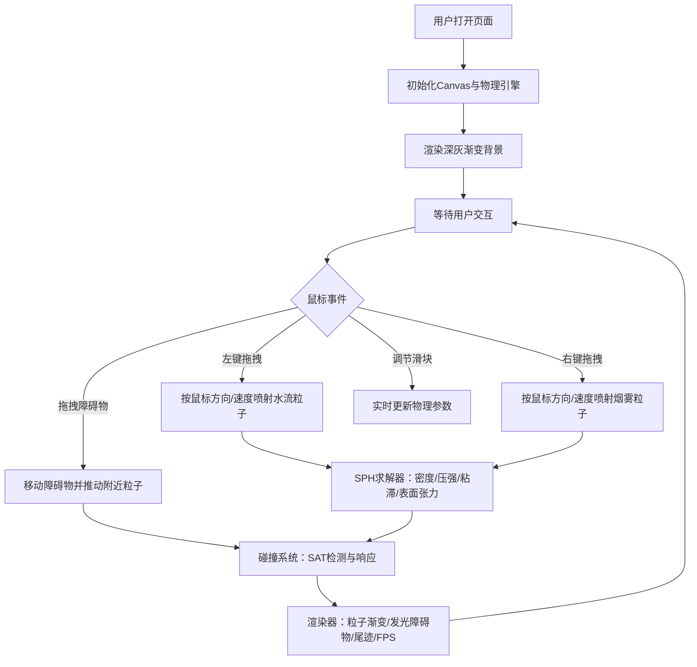

## 1. 产品概述

一款基于SPH（光滑粒子流体动力学）算法的2D粒子物理沙盒工具，让用户通过鼠标交互实时模拟水流与烟雾效果，解决传统粒子模拟缺乏真实流体行为和交互方式单一的问题。

- 目标用户：物理爱好者、游戏开发者、创意设计师、教育工作者
- 核心价值：提供真实、可交互、高性能的流体粒子模拟体验

## 2. 核心特性

### 2.1 功能模块

1. **粒子物理模拟模块**：基于SPH算法模拟水流、烟雾两种流体材质，支持2000+粒子实时运算
2. **交互喷射模块**：鼠标左键发射水流、右键发射烟雾，拖拽方向/速度影响喷射效果
3. **障碍物模块**：矩形与三角形静态障碍物，支持拖拽移动，与粒子产生碰撞反弹和飞溅效果
4. **参数控制模块**：重力强度、粘滞系数、粒子大小、喷射速率四项参数实时调节
5. **渲染与UI模块**：粒子渐变着色、障碍物发光材质、尾迹效果、FPS/粒子数实时显示

### 2.2 页面详情

| 页面名称 | 模块名称 | 功能描述 |
|---------|---------|---------|
| 主画布 | 粒子模拟区 | 全屏Canvas，实时渲染2000+流体粒子，支持鼠标交互喷射 |
| 主画布 | 障碍物交互 | 两个可拖拽多边形障碍物（矩形、三角形），粒子碰撞反弹 |
| 右侧工具栏 | 参数滑块 | 四个参数滑块（重力、粘滞、粒子大小、喷射速率），带刻度与数值 |
| 右侧工具栏 | 折叠控制 | 窄屏自动折叠为图标按钮，支持手动展开/折叠 |
| 左上角 | 状态显示 | 实时粒子数量、FPS计数器（低于30fps变红闪烁） |

## 3. 核心流程

用户打开页面 → 看到全屏画布与右侧工具栏 → 鼠标左键按住拖拽持续喷射水流 → 鼠标右键按住拖拽持续喷射烟雾 → 可拖拽障碍物改变场景布局 → 通过右侧滑块实时调节物理参数 → 左上角实时显示粒子数与FPS。

## 4. 用户界面设计

### 4.1 设计风格

- **主色调**：深灰渐变背景（#1a1a2e → #0f0f1a），粒子从蓝色（#4fc3f7，慢速）渐变至红色（#ff5252，快速）
- **障碍物**：半透明青色发光材质（rgba(100,220,255,0.25)），外围光晕效果
- **工具栏**：毛玻璃效果（backdrop-filter: blur(12px)），背景rgba(255,255,255,0.08)，边框rgba(255,255,255,0.15)
- **滑块**：自定义样式，带刻度线和数值显示，拖拽时弹性反馈动画（transform: scale + transition）
- **字体**：使用 JetBrains Mono 等宽字体，科技感十足，适合工程类工具

### 4.2 页面设计概览

| 页面名称 | 模块名称 | UI元素 |
|---------|---------|---------|
| 主画布 | 粒子区 | 全屏Canvas，深灰径向渐变背景 |
| 主画布 | 障碍物 | 发光矩形与三角形，鼠标悬停高亮，拖拽时阴影加深 |
| 右侧工具栏 | 参数面板 | 毛玻璃卡片，4个滑块组，每组含标签/刻度/数值 |
| 右侧工具栏 | 折叠按钮 | 窄屏显示为悬浮图标按钮，点击展开/收起 |
| 左上角 | HUD | 半透明黑底，白色等宽字体，FPS<30时红色闪烁动画 |

### 4.3 响应式设计

- **桌面端（>1024px）**：右侧工具栏完全展开（宽280px）
- **平板端（768-1024px）**：工具栏展开但宽度缩减
- **窄屏（<768px）**：工具栏自动折叠为右上角图标按钮，点击弹出面板
- 所有Canvas渲染自动适配窗口大小，粒子物理模拟边界随窗口变化

## 5. 性能要求

- 2000粒子场景下稳定60fps
- FPS低于45时自动降级：粒子渲染从渐变圆形切换为实心方块
- 使用空间网格加速SPH邻域查询
- 尾迹效果使用离屏canvas alpha衰减，避免重绘开销
