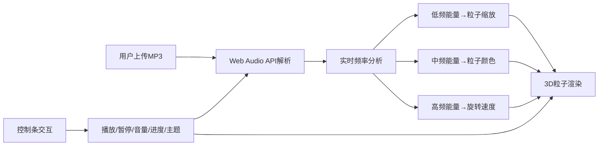

## 1. 产品概述

交互式音乐可视化器是一款基于 Web 的沉浸式音乐体验工具，用户可将本地 MP3 音乐文件拖拽或点击上传至页面，通过 Web Audio API 实时解析音频频谱，在全屏 3D 场景中生成随音乐节奏同步跳动的彩色粒子动画。

- **目标用户：音乐爱好者、视觉艺术爱好者、追求沉浸式音乐体验的用户。
- **核心价值**：将抽象的音频数据可视化为动态 3D 粒子艺术，带来视觉与听觉的双重盛宴。

## 2. 核心功能

### 2.1 功能模块
1. **音频上传与解析**：支持拖拽/点击上传 MP3 文件，Web Audio API 实时频率分析
2. **3D 粒子系统**：800~1200 个粒子的球形粒子系统，随低频/中频/高频能量变化
3. **控制条**：播放/暂停、音量滑块、进度条、主题切换
4. **主题系统**：霓虹、极光、熔岩三种预设主题
5. **移动端适配**：控制条折叠为底部导航栏，触控优化

### 2.2 功能详情
| 模块名称 | 功能描述 |
|---------|---------|
| 音频解析 | 提取低频（控制粒子缩放 0.5~2.0 倍 |
| 音频解析 | 提取中频（控制粒子颜色蓝紫→橙红渐变） |
| 音频解析 | 提取高频（控制粒子绕 Y 轴旋转速度） |
| 粒子系统 | 初始随机分布在半径 20 的球体内 |
| 粒子系统 | 每个粒子为带渐变色的小球 |
| 粒子系统 | 对象池优化，减少 GC 压力 |
| 控制条 | 播放/暂停按钮，悬停放大+点击塌陷微动效 |
| 控制条 | 音量滑块 0~100 |
| 控制条 | 进度条支持拖拽跳转，悬浮时间戳 |
| 主题系统 | 霓虹主题：粒子整体色相+背景星空颜色 |
| 主题系统 | 极光主题：粒子整体色相+背景星空颜色 |
| 主题系统 | 熔岩主题：粒子整体色相+背景星空颜色 |
| 动效系统 | 粒子脉冲光晕（glow effect） |
| 动效系统 | 摄像机缓慢自动环绕（10 秒一圈） |
| 性能优化 | 帧率稳定 45fps 以上 |
| 响应式 | 移动端控制条折叠为底部导航栏 |

## 3. 核心流程

用户拖拽或点击上传 MP3 文件 → Web Audio API 解析音频 → 实时提取低/中/高频能量值 → 粒子系统根据频率数据更新粒子大小/颜色/旋转速度 → 控制条交互控制播放/暂停/音量/进度/主题

## 4. 用户界面设计

### 4.1 设计风格
- **整体风格**：深黑色背景，沉浸式暗黑科技感
- **主色调**：深黑色 (#0a0a0f)，磨砂玻璃效果控制条
- **按钮风格**：圆角，悬停放大，点击塌陷微动效
- **字体**：现代无衬线字体，清晰易读
- **布局**：全屏 3D 场景 + 底部悬浮控制条
- **动效**：粒子脉冲光晕，摄像机环绕，控制条微动效

### 4.2 页面设计概览
| 区域 | 模块名称 | UI 元素 |
|------|---------|--------|
| 全屏 | 3D 粒子场景 | 彩色粒子球、背景星空、光晕效果 |
| 底部 | 控制条 | 播放/暂停按钮、音量滑块、进度条、主题下拉 |
| 移动端 | 底部导航栏 | 折叠式控制条，触控优化 |

### 4.3 响应式设计
- **桌面端**：底部悬浮控制条，完整功能完整显示
- **移动端**：控制条折叠为底部导航栏，核心功能优先显示
- **触控优化**：增大触控区域，优化手势交互

### 4.4 3D 场景设计
- **环境**：深黑色背景 + 星空粒子背景
- **光照**：环境光 + 点光源，营造粒子光晕
- **摄像机**：PerspectiveCamera，自动环绕 Y 轴
- **粒子**：SphereGeometry，渐变色材质
- **后期**：光晕效果（glow）
- **性能**：对象池，InstancedMesh 优化
