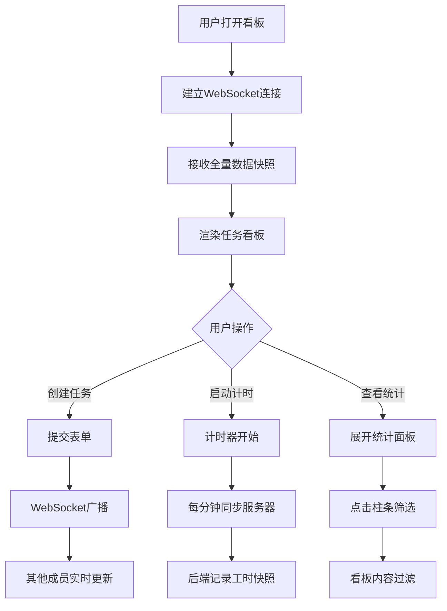

## 1. 产品概述

TeamTime团队工时追踪看板是一个实时协作的项目管理工具，帮助团队可视化追踪任务时间消耗，提升协作效率。
- 解决问题：团队任务时间分配不透明、缺乏直观可视化手段、多成员协作不同步
- 目标用户：研发团队、项目管理团队、需要追踪工时的协作团队
- 产品价值：通过实时看板和计时器，让团队工时透明化、可追踪、可统计

## 2. 核心功能

### 2.1 用户角色
| 角色 | 注册方式 | 核心权限 |
|------|----------|----------|
| 团队成员 | 无需注册，直接访问 | 创建/编辑/删除任务、启动/暂停计时器、查看统计、导出数据 |

### 2.2 功能模块
1. **看板面板**：任务卡片展示、拖拽排序、任务CRUD操作
2. **计时器面板**：嵌入式计时器、开始/暂停/重置、实时进度显示
3. **实时同步系统**：WebSocket多端同步、30秒全量快照推送
4. **统计面板**：成员工时柱状图、成员筛选、展开/收起
5. **数据管理**：内存数据存储、JSON导出功能

### 2.3 页面详情
| 页面名称 | 模块名称 | 功能描述 |
|----------|----------|----------|
| 主看板页 | 顶部导航栏 | 项目名称展示、导出JSON按钮、成员筛选下拉 |
| 主看板页 | 任务看板区域 | 任务卡片网格布局、创建任务按钮、卡片滑入滑出动画 |
| 主看板页 | 任务卡片 | 任务标题/描述、预估工时、负责人标签、嵌入式计时器、进度条 |
| 主看板页 | 计时器面板 | 累计工时显示、开始/暂停/重置按钮、状态视觉反馈 |
| 主看板页 | 统计面板 | 展开式面板、成员工时柱状图、点击筛选交互 |
| 任务编辑弹窗 | 表单模块 | 任务标题/描述输入、预估工时设置、负责人多选 |

## 3. 核心流程

### 3.1 任务创建流程
用户点击"创建任务"按钮 → 弹出编辑表单 → 填写任务信息 → 提交 → 任务卡片从左侧滑入 → WebSocket广播给其他成员

### 3.2 工时追踪流程
用户点击"开始计时" → 计时器每秒更新 → 按钮变绿并脉动 → 任务卡片显示实时进度 → 点击"暂停" → 按钮变橙 → 后端记录工时快照 → 实时同步到所有成员

### 3.3 统计筛选流程
用户点击展开统计面板 → 柱状图展示各成员工时占比 → 点击某成员柱条 → 看板筛选显示该成员任务 → 再次点击取消筛选

## 4. 用户界面设计

### 4.1 设计风格
- **配色方案**：深色主题，主色#1a1a2e，辅色#16213e，强调色#0f3460，卡片深蓝灰
- **按钮样式**：圆角8px，悬停放大1.05倍，开始状态绿色脉动，暂停状态橙色
- **字体**：使用Space Grotesk作为标题字体，Inter作为正文字体
- **布局风格**：卡片式网格布局，任务卡片带微弱发光效果
- **视觉特效**：毛玻璃统计面板、渐变柱状图、平滑过渡动画

### 4.2 页面设计概述
| 页面名称 | 模块名称 | UI元素 |
|----------|----------|--------|
| 主看板页 | 顶部导航 | 深色背景、左侧标题、右侧操作按钮、半透明分隔线 |
| 主看板页 | 任务看板 | 网格布局、响应式列数、卡片间距16px、创建按钮浮动 |
| 主看板页 | 任务卡片 | 深蓝灰背景、发光阴影、标题加粗、标签圆角、进度条渐变 |
| 主看板页 | 计时器 | 大字号数字显示、绿色/橙色状态按钮、脉冲动画 |
| 主看板页 | 统计面板 | 半透明毛玻璃、展开收起动画、渐变柱条、hover高亮 |

### 4.3 响应式设计
- **桌面端（≥1024px）**：4列网格布局，侧边筛选栏展开
- **平板端（768px-1024px）**：2-3列网格布局
- **移动端（<768px）**：单列布局，筛选栏折叠为顶部下拉菜单

### 4.4 动效设计
- 任务删除：滑出动画0.3秒
- 按钮悬停：transform: scale(1.05)
- 计时器运行：pulse动画1.5秒无限循环
- 统计面板：展开/收起平滑过渡
- 数据更新：轻微高亮闪烁提示
