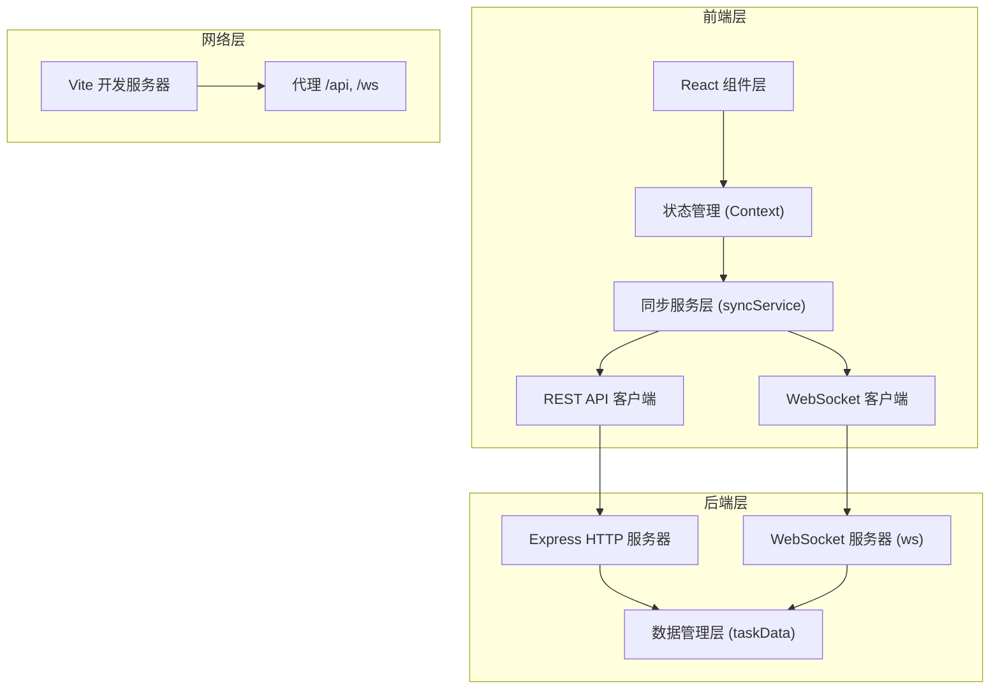
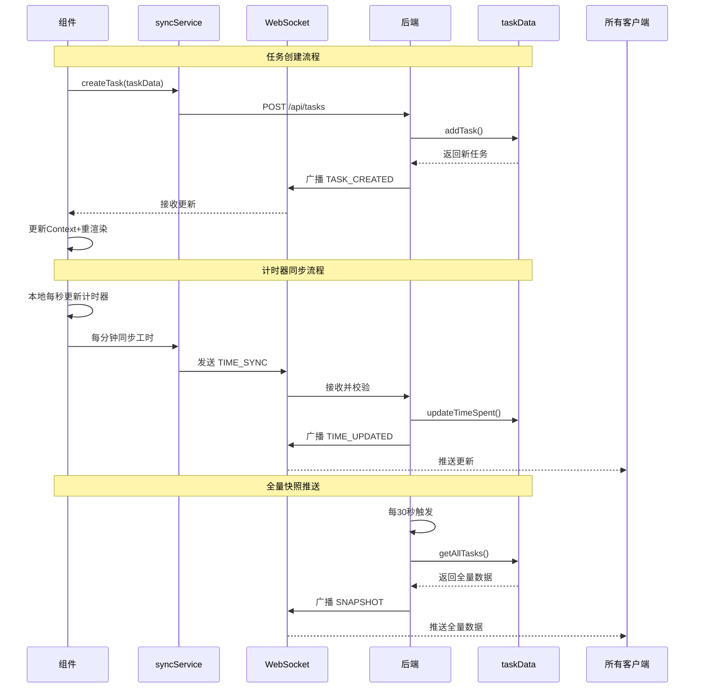
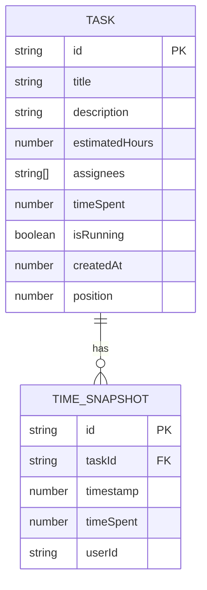
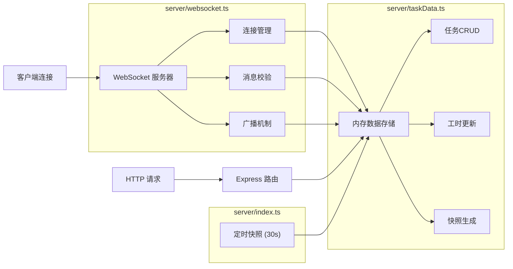

## 1. 架构设计



## 2. 技术描述

### 2.1 技术栈
- **前端**：React 18 + TypeScript 5 + Vite 5
- **状态管理**：React Context + useReducer
- **样式方案**：CSS Modules + CSS Variables
- **后端**：Node.js + Express 4 + ws (WebSocket)
- **构建工具**：Vite 5，含代理配置
- **数据存储**：内存数据结构（重启清空）

### 2.2 核心依赖
```json
{
  "react": "^18.2.0",
  "react-dom": "^18.2.0",
  "typescript": "^5.3.0",
  "vite": "^5.0.0",
  "express": "^4.18.2",
  "ws": "^8.14.2",
  "uuid": "^9.0.1"
}
```

### 2.3 项目初始化
- 使用 Vite 初始化 React + TypeScript 项目
- 手动配置 Express + WebSocket 后端
- npm run dev 同时启动前后端（concurrently）

## 3. 目录结构

```
auto117/
├── package.json              # 项目配置与依赖
├── index.html                # SPA入口
├── tsconfig.json             # TypeScript配置（严格模式）
├── vite.config.js            # Vite配置+代理
├── server/
│   ├── index.ts              # 服务器入口
│   ├── websocket.ts          # WebSocket服务器
│   └── taskData.ts           # 内存数据管理
└── src/
    ├── App.tsx               # 主应用+状态容器
    ├── main.tsx              # 应用入口
    ├── types/
    │   └── index.ts          # 类型定义
    ├── context/
    │   └── AppContext.tsx    # 全局状态Context
    ├── components/
    │   ├── TaskBoard.tsx     # 看板面板
    │   ├── TaskCard.tsx      # 任务卡片
    │   ├── TimerList.tsx     # 计时器列表
    │   ├── StatsPanel.tsx    # 统计面板
    │   ├── TaskModal.tsx     # 任务编辑弹窗
    │   └── Header.tsx        # 顶部导航
    ├── api/
    │   └── syncService.ts    # 网络服务层
    ├── hooks/
    │   └── useTimer.ts       # 计时器自定义Hook
    └── styles/
        ├── variables.css     # CSS变量
        └── global.css        # 全局样式
```

## 4. 数据流向图



## 5. API 定义

### 5.1 REST API

```typescript
// 任务类型定义
interface Task {
  id: string;
  title: string;
  description: string;
  estimatedHours: number;
  assignees: string[];
  timeSpent: number; // 秒
  isRunning: boolean;
  createdAt: number;
  position: number;
}

interface TimeSnapshot {
  taskId: string;
  timestamp: number;
  timeSpent: number;
  userId: string;
}

// GET /api/tasks - 获取所有任务
// Response: Task[]

// POST /api/tasks - 创建任务
// Request: Omit<Task, 'id' | 'timeSpent' | 'isRunning' | 'createdAt'>
// Response: Task

// PUT /api/tasks/:id - 更新任务
// Request: Partial<Task>
// Response: Task

// DELETE /api/tasks/:id - 删除任务
// Response: { success: boolean }

// GET /api/export - 导出JSON
// Response: JSON文件下载
```

### 5.2 WebSocket 消息类型

```typescript
type WSMessage = 
  | { type: 'TASK_CREATED'; payload: Task }
  | { type: 'TASK_UPDATED'; payload: Task }
  | { type: 'TASK_DELETED'; payload: string } // taskId
  | { type: 'TIMER_STARTED'; payload: { taskId: string; timestamp: number } }
  | { type: 'TIMER_PAUSED'; payload: { taskId: string; timeSpent: number } }
  | { type: 'TIMER_RESET'; payload: { taskId: string } }
  | { type: 'TIME_SYNC'; payload: { taskId: string; timeSpent: number } }
  | { type: 'SNAPSHOT'; payload: Task[] }
  | { type: 'ERROR'; payload: string };
```

## 6. 数据模型



## 7. 服务器架构



## 8. 性能约束实现方案

### 8.1 WebSocket 延迟优化
- 使用二进制消息序列化（可选，初期用JSON）
- 消息合并：100ms内的同类消息合并发送
- 增量更新：仅发送变更字段而非全量对象

### 8.2 DOM 性能优化
- 虚拟滚动：任务数量超过50时启用
- 组件懒加载：统计面板按需加载
- React.memo 优化 TaskCard 重渲染
- useMemo/useCallback 减少不必要计算

### 8.3 渲染帧率保障
- 使用 requestAnimationFrame 处理计时器更新
- 批量更新 React state，减少重渲染次数
- CSS transforms 和 opacity 实现动画，避免重排

## 9. 调用关系

| 模块 | 被调用者 | 调用关系说明 |
|------|----------|--------------|
| App.tsx | AppContext, TaskBoard, StatsPanel, Header | 主组件，组合所有子组件，提供状态 |
| TaskBoard.tsx | TaskCard, syncService | 渲染任务列表，处理拖拽，调用API |
| TaskCard.tsx | TimerList, TaskModal | 单个任务卡片，内嵌计时器 |
| TimerList.tsx | useTimer, syncService | 计时器逻辑，每分钟同步服务器 |
| StatsPanel.tsx | syncService | 统计面板，柱状图展示 |
| syncService.ts | WebSocket, fetch | 网络层封装，对外提供Promise接口 |
| server/websocket.ts | taskData.ts | 处理WS消息，调用数据层 |
| server/index.ts | express, ws, taskData | 服务器入口，启动HTTP和WS服务 |
