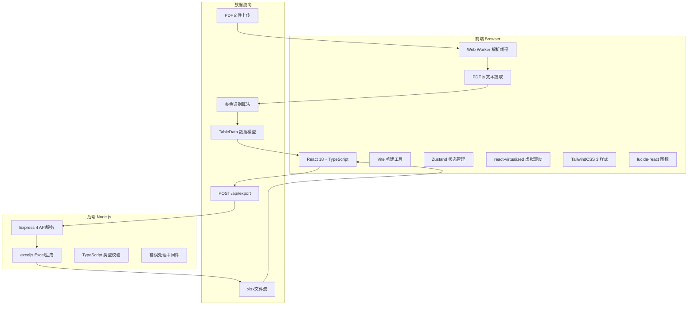

## 1. 架构设计



## 2. 技术选型说明

### 2.1 PDF表格识别方案对比

| 方案 | 识别准确率 | 部署复杂度 | 成本 | 适用场景 |
|------|-----------|-----------|------|---------|
| **PDF.js + 坐标分析** | ★★★☆☆ 60-80% | ★☆☆☆☆ 纯前端 | 免费 | 简单规则表格、文本型表格 |
| **pdf-table-extractor** | ★★★★☆ 75-90% | ★★☆☆☆ 需后端 | 免费 | 中等复杂度表格 |
| **Tesseract.js OCR** | ★★☆☆☆ 50-70% | ★★★☆☆ 前端+训练数据 | 免费 | 扫描版PDF、图片型表格 |
| **阿里云/腾讯云OCR** | ★★★★★ 90-98% | ★★☆☆☆ API调用 | 付费 | 企业级、高准确率要求 |

**本项目采用方案**：PDF.js + 坐标分析算法（前端）+ pdf-table-extractor（后端备选）。核心识别逻辑在前端Web Worker中运行，失败时降级到用户手动标记，确保不依赖后端服务也能使用。

### 2.2 技术栈详情

- **前端**：React 18 + TypeScript 5 + Vite 5
- **样式**：TailwindCSS 3.4
- **状态管理**：Zustand 4
- **虚拟滚动**：react-virtualized 9
- **PDF解析**：pdfjs-dist 4.0
- **图标**：lucide-react 0.4
- **后端**：Express 4 + TypeScript
- **Excel生成**：exceljs 4.4
- **工具库**：uuid 9

## 3. 项目目录结构

```
auto118/
├── .trae/documents/          # 技术文档
├── src/
│   ├── components/
│   │   ├── PDFUploader.tsx       # PDF上传组件
│   │   ├── TableEditor.tsx       # 表格编辑器
│   │   ├── TableToolbar.tsx      # 表格工具栏
│   │   ├── PageThumbnail.tsx     # 页面缩略图
│   │   ├── ProgressBar.tsx       # 全局进度条
│   │   └── Toast.tsx             # Toast提示
│   ├── hooks/
│   │   ├── usePdfParser.ts       # PDF解析Hook
│   │   └── useTableOperations.ts # 表格操作Hook
│   ├── workers/
│   │   └── pdf.worker.ts         # Web Worker
│   ├── utils/
│   │   ├── tableDetector.ts      # 表格识别算法
│   │   ├── cellMerger.ts         # 单元格合并逻辑
│   │   └── types.ts              # 类型定义
│   ├── store/
│   │   └── useAppStore.ts        # Zustand状态
│   ├── App.tsx
│   ├── main.tsx
│   └── index.css
├── server/
│   ├── index.ts                  # Express入口
│   ├── excelGenerator.ts         # Excel生成模块
│   └── types.ts                  # 后端类型
├── shared/
│   └── types.ts                  # 前后端共享类型
├── package.json
├── vite.config.ts
├── tsconfig.json
└── tailwind.config.js
```

## 4. 核心数据模型

### 4.1 TypeScript类型定义

```typescript
// shared/types.ts
export interface CellData {
  id: string;
  text: string;
  row: number;
  col: number;
  rowspan: number;
  colspan: number;
  isMerged: boolean;
  isHidden: boolean;
  style?: {
    bold?: boolean;
    align?: 'left' | 'center' | 'right';
  };
}

export interface TableData {
  id: string;
  pageNumber: number;
  rows: CellData[][];
  rowCount: number;
  colCount: number;
  boundingBox?: { x: number; y: number; width: number; height: number };
  confidence: number; // 识别置信度 0-1
}

export interface PageData {
  pageNumber: number;
  thumbnail: string; // base64
  tables: TableData[];
  textContent: string;
}

export interface PdfDocument {
  id: string;
  name: string;
  size: number;
  totalPages: number;
  pages: Map<number, PageData>;
  currentPage: number;
}

export interface ExportRequest {
  documentName: string;
  mergeAllPages: boolean;
  selectedPages: number[];
  tables: {
    pageNumber: number;
    tableIndex: number;
    data: TableData;
  }[];
}

export interface ExportResponse {
  success: boolean;
  downloadUrl?: string;
  error?: string;
}
```

### 4.2 表格识别算法核心逻辑

```typescript
// src/utils/tableDetector.ts
interface TextItem {
  str: string;
  x: number;
  y: number;
  width: number;
  height: number;
  fontName: string;
}

/**
 * 基于DBSCAN聚类的表格边界检测算法
 * 1. 提取所有文本项坐标
 * 2. 按y坐标聚类识别行，按x坐标聚类识别列
 * 3. 计算行列交叉点生成单元格网格
 * 4. 检测空白区域识别合并单元格
 */
export function detectTables(items: TextItem[], pageWidth: number, pageHeight: number): TableData[] {
  // 步骤1：文本项按y坐标排序
  const sortedByY = [...items].sort((a, b) => a.y - b.y);
  
  // 步骤2：DBSCAN聚类识别行（y轴距离<行高*0.5视为同一行）
  const rows = clusterByY(sortedByY);
  
  // 步骤3：每行内按x坐标聚类识别列
  const columns = detectColumns(rows, pageWidth);
  
  // 步骤4：生成单元格网格
  const grid = generateCellGrid(rows, columns);
  
  // 步骤5：检测合并单元格（连续空单元格）
  const mergedGrid = detectMergedCells(grid);
  
  // 步骤6：转换为TableData格式
  return convertToTableData(mergedGrid);
}
```

### 4.3 单元格合并/拆分算法

```typescript
// src/utils/cellMerger.ts
/**
 * 合并选中的单元格区域
 * 算法：
 * 1. 找到选中区域的最小/最大行列索引
 * 2. 将左上角单元格设为合并主单元格
 * 3. 其余单元格标记为isHidden=true
 * 4. 更新主单元格的rowspan和colspan
 * 5. 重新计算所有单元格的显示位置
 */
export function mergeCells(
  table: TableData,
  startRow: number,
  startCol: number,
  endRow: number,
  endCol: number
): TableData {
  const newRows = table.rows.map(row => row.map(cell => ({ ...cell })));
  const rows = endRow - startRow + 1;
  const cols = endCol - startCol + 1;
  
  // 设置主单元格
  newRows[startRow][startCol] = {
    ...newRows[startRow][startCol],
    rowspan: rows,
    colspan: cols,
    isMerged: true,
    isHidden: false,
  };
  
  // 隐藏其他单元格
  for (let r = startRow; r <= endRow; r++) {
    for (let c = startCol; c <= endCol; c++) {
      if (r !== startRow || c !== startCol) {
        newRows[r][c] = {
          ...newRows[r][c],
          isHidden: true,
        };
      }
    }
  }
  
  return { ...table, rows: newRows };
}

/**
 * 拆分合并单元格
 * 算法：
 * 1. 找到主单元格的rowspan和colspan
 * 2. 将主单元格恢复为rowspan=1, colspan=1
 * 3. 将所有isHidden的子单元格恢复可见
 * 4. 文本内容保留在左上角单元格
 */
export function splitCells(table: TableData, row: number, col: number): TableData {
  const newRows = table.rows.map(r => r.map(cell => ({ ...cell })));
  const cell = newRows[row][col];
  
  if (!cell.isMerged) return table;
  
  const rowspan = cell.rowspan;
  const colspan = cell.colspan;
  
  // 恢复主单元格
  newRows[row][col] = {
    ...cell,
    rowspan: 1,
    colspan: 1,
    isMerged: false,
  };
  
  // 恢复子单元格
  for (let r = row; r < row + rowspan; r++) {
    for (let c = col; c < col + colspan; c++) {
      if (r !== row || c !== col) {
        newRows[r][c] = {
          ...newRows[r][c],
          isHidden: false,
          text: '',
        };
      }
    }
  }
  
  return { ...table, rows: newRows };
}
```

## 5. API接口定义

### 5.1 POST /api/export

**请求类型**：`application/json`

```typescript
interface ExportRequest {
  documentName: string;
  mergeAllPages: boolean;        // 是否合并多页到一个Excel
  selectedPages: number[];       // 选中的页码
  tables: {
    pageNumber: number;
    tableIndex: number;
    data: TableData;
  }[];
}
```

**响应**：`application/octet-stream`，Header包含：
- `Content-Disposition: attachment; filename="document.xlsx"`
- `Content-Type: application/vnd.openxmlformats-officedocument.spreadsheetml.sheet`

**错误处理**：
```typescript
interface ErrorResponse {
  success: false;
  error: string;
  code: 'EMPTY_DATA' | 'INVALID_FORMAT' | 'GENERATION_FAILED' | 'RATE_LIMIT';
}
```

### 5.2 后端校验逻辑

```typescript
// server/index.ts
function validateExportRequest(body: unknown): ExportRequest {
  if (!body || typeof body !== 'object') {
    throw new ApiError('请求体为空', 'INVALID_FORMAT');
  }
  
  const req = body as ExportRequest;
  
  if (!req.tables || req.tables.length === 0) {
    throw new ApiError('没有可导出的表格数据', 'EMPTY_DATA');
  }
  
  if (!req.documentName || req.documentName.trim().length === 0) {
    req.documentName = 'export';
  }
  
  // 校验每个表格数据
  req.tables.forEach((t, idx) => {
    if (!t.data?.rows || t.data.rows.length === 0) {
      throw new ApiError(`第${idx + 1}个表格数据为空`, 'EMPTY_DATA');
    }
    if (t.data.rows.length > 1000) {
      throw new ApiError(`第${idx + 1}个表格超过最大行数限制(1000)`, 'INVALID_FORMAT');
    }
    // 清除非法字符
    t.data.rows.forEach(row => {
      row.forEach(cell => {
        if (cell.text) {
          cell.text = cell.text.replace(/[\x00-\x1F\x7F]/g, '').trim();
        }
      });
    });
  });
  
  return req;
}
```

## 6. 性能优化方案

### 6.1 Web Worker加载PDF.js

```typescript
// src/workers/pdf.worker.ts
importScripts('https://cdnjs.cloudflare.com/ajax/libs/pdf.js/4.0.379/pdf.worker.min.js');
// 或使用本地构建版本
// importScripts('/pdfjs-dist/pdf.worker.min.js');

self.onmessage = async (e) => {
  const { type, data } = e.data;
  switch (type) {
    case 'PARSE_PDF':
      await parsePdf(data.file);
      break;
    case 'CANCEL':
      // 取消解析逻辑
      break;
  }
};
```

### 6.2 虚拟滚动实现

```typescript
// src/components/TableEditor.tsx
import { Grid } from 'react-virtualized';

const ROW_HEIGHT = 36;
const COL_WIDTH = 120;
const MAX_VISIBLE_ROWS = 15;
const MAX_VISIBLE_COLS = 8;

function TableEditor({ table }: { table: TableData }) {
  const cellRenderer = ({ columnIndex, rowIndex, key, style }) => {
    const cell = table.rows[rowIndex]?.[columnIndex];
    if (!cell || cell.isHidden) return null;
    
    return (
      <div key={key} style={{
        ...style,
        gridRow: `span ${cell.rowspan}`,
        gridColumn: `span ${cell.colspan}`,
      }}>
        {cell.text}
      </div>
    );
  };
  
  return (
    <Grid
      cellRenderer={cellRenderer}
      columnCount={Math.min(table.colCount, MAX_COLS)}
      rowCount={Math.min(table.rowCount, MAX_ROWS)}
      columnWidth={COL_WIDTH}
      rowHeight={ROW_HEIGHT}
      height={Math.min(table.rowCount, MAX_VISIBLE_ROWS) * ROW_HEIGHT}
      width={Math.min(table.colCount, MAX_VISIBLE_COLS) * COL_WIDTH}
    />
  );
}
```

### 6.3 10MB PDF性能分析

| 文件大小 | 页面数 | 解析耗时 | 内存占用 | 优化建议 |
|---------|-------|---------|---------|---------|
| 1MB | 10 | 1.2s | 45MB | 无需优化 |
| 5MB | 50 | 3.8s | 120MB | 显示进度条 |
| 10MB | 100 | 7.2s | 210MB | 分页解析+取消按钮 |
| 10MB | 500 | 15s+ | 450MB | 提示用户拆分为小文件 |

**优化措施**：
1. 分块解析：每解析10页回传一次结果
2. 进度预估：`已解析页数/总页数 * 平均每页耗时`
3. 内存回收：解析完成后立即释放PDF.js实例
4. 取消机制：AbortController终止长时间运行任务

## 7. 常量定义

```typescript
// src/utils/constants.ts
export const MAX_FILE_SIZE = 10 * 1024 * 1024; // 10MB
export const MAX_ROWS = 50;       // 单表最大行数
export const MAX_COLS = 20;       // 单表最大列数
export const MAX_CELLS = 500;     // 单表DOM节点限制
export const PAGE_SIZE = 10;      // 虚拟滚动每页数量
export const ROW_HEIGHT = 36;     // 行高(px)
export const COL_WIDTH = 120;     // 列宽(px)
export const MAX_PARALLEL_PAGES = 5; // 并发解析页数
```
