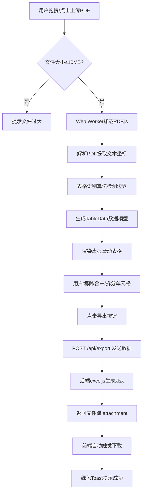

## 1. 产品概述

PDF转Excel智能提取工具，解决手动从PDF中复制表格数据效率低、容易出错的问题。支持拖拽上传PDF、AI辅助表格识别、可视化编辑修正、一键导出Excel文件。

- 核心目标：将PDF文档中的表格数据自动化提取为结构化Excel，降低手动操作成本
- 目标用户：财务、行政、数据分析师等需要频繁处理PDF表格的办公人员
- 市场价值：相比传统OCR方案，提供更高的识别准确率和灵活的人工修正能力

## 2. 核心功能

### 2.1 用户角色

| 角色 | 注册方式 | 核心权限 |
|------|---------|---------|
| 普通用户 | 无需注册，直接使用 | 上传PDF、编辑表格、导出Excel |

### 2.2 功能模块

1. **PDF上传模块**：拖拽/点击上传（≤10MB），Web Worker后台解析，进度显示
2. **表格识别模块**：PDF.js + 坐标分析算法，自动检测表格边界和单元格
3. **页面导航模块**：左侧缩略图列表，点击切换页面，移动端Tab切换
4. **表格编辑模块**：单元格编辑、合并/拆分、行列增删、虚拟滚动
5. **数据导出模块**：单页/多页合并导出，exceljs生成.xlsx文件
6. **全局状态模块**：进度条显示、Toast提示、异常降级处理

### 2.3 页面详情

| 页面名称 | 模块名称 | 功能描述 |
|---------|---------|----------|
| 主页面 | 上传区域 | 虚线边框拖拽动画，文件大小校验，10MB限制 |
| 主页面 | 缩略图侧边栏 | 卡片式排列，hover放大1.05倍，移动端顶部Tab |
| 主页面 | 表格编辑器 | 斑马纹行，选中高亮，合并/拆分单元格，虚拟滚动 |
| 主页面 | 工具栏 | 行列操作按钮，合并/拆分按钮，导出按钮带spinner动画 |
| 主页面 | 全局进度条 | 右侧显示已编辑表格/总表格比例 |

## 3. 核心流程

用户上传PDF文件 → Web Worker解析PDF提取文本坐标 → 表格识别算法检测边界和单元格 → 渲染可编辑预览表格 → 用户修正表格数据（合并/拆分/编辑） → 点击导出按钮 → 前端发送数据到后端 → 后端生成Excel文件 → 返回下载链接 → 前端自动下载 → 弹出成功Toast。

## 4. 用户界面设计

### 4.1 设计风格

- **主色调**：#2B6CB0（蓝色）搭配 #F7FAFC（浅灰背景）
- **按钮风格**：圆角8px，hover放大1.1倍，click缩放0.95倍，0.2s过渡
- **字体**：标题使用 Noto Sans SC Bold，正文使用 Noto Sans SC Regular
- **布局**：三栏布局（左：缩略图 240px，中：表格编辑区，右：进度条）
- **图标**：使用 lucide-react 线性图标，与主色调一致

### 4.2 页面设计概述

| 页面名称 | 模块名称 | UI元素 |
|---------|---------|--------|
| 主页面 | 上传区域 | 虚线边框 #CBD5E0，拖拽时变为实线#2B6CB0并闪烁2次 |
| 主页面 | 缩略图卡片 | 圆角12px，阴影md，hover:scale(1.05) transition:0.2s |
| 主页面 | 表格行 | 斑马纹 odd:bg-white even:bg-F7FAFC，选中行bg:#EBF8FF |
| 主页面 | 导出按钮 | 背景#2B6CB0，文字白色，点击后显示spinner旋转 |
| 主页面 | Toast提示 | 绿色#38A169，圆角8px，3秒自动消失，从顶部滑入 |

### 4.3 响应式

- **桌面端**（≥768px）：左侧缩略图240px固定宽度，中间表格区自适应
- **移动端**（<768px）：缩略图折叠为顶部Tab切换，进度条隐藏
- **触摸优化**：按钮最小高度44px，表格支持横向滑动

## 5. 技术约束与风险

### 5.1 性能约束
- PDF解析在Web Worker中进行，不阻塞主线程
- 表格DOM节点≤500个，采用react-virtualized虚拟滚动
- maxRows: 50, maxCols: 20，超出时自动分页
- 页面渲染帧率≥45fps

### 5.2 风险降级方案
| 风险场景 | 降级方案 |
|---------|---------|
| 10MB PDF解析耗时>5秒 | 显示进度条+预估剩余时间，允许取消 |
| 表格识别失败 | 提示用户手动标记表格区域，提供行/列分割线工具 |
| 单元格合并检测不准确 | 高亮显示疑似合并区域，一键确认或手动调整 |
| 网络中断导出失败 | 本地缓存数据，支持重试，3次失败后提示用户 |
