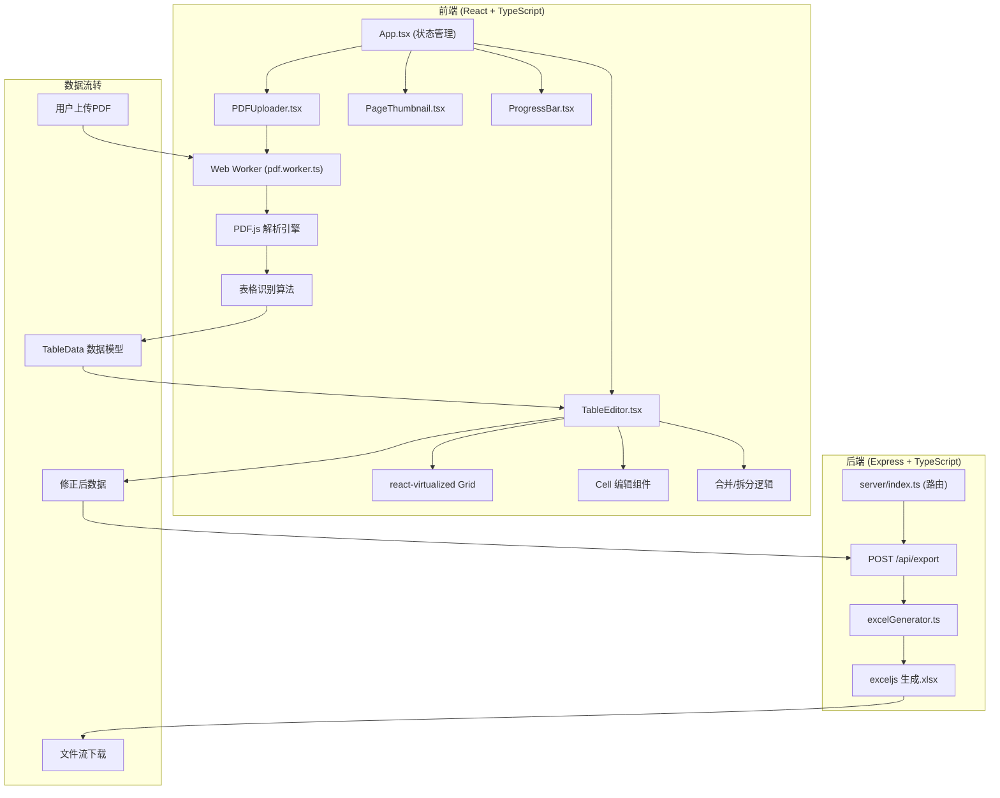

## 1. 架构设计

## 2. 技术选型与对比

### 2.1 前端技术栈

| 技术 | 版本 | 用途 | 选型理由 |
|-----|------|------|---------|
| React | ^18.2.0 | UI框架 | 组件化开发，生态丰富 |
| TypeScript | ^5.3.0 | 类型系统 | 严格类型检查，避免运行时错误 |
| Vite | ^5.0.0 | 构建工具 | 开发体验好，热更新快 |
| TailwindCSS | ^3.4.0 | CSS框架 | 快速开发，设计系统统一 |
| pdfjs-dist | ^4.0.0 | PDF解析 | Mozilla官方库，提取文本坐标 |
| react-virtualized | ^9.22.5 | 虚拟滚动 | 大列表性能优化，DOM节点≤500 |
| lucide-react | ^0.294.0 | 图标库 | 轻量级，风格统一 |
| zustand | ^4.4.7 | 状态管理 | 轻量无依赖，API简洁 |

### 2.2 PDF表格识别方案对比

| 方案 | 准确率 | 依赖 | 部署复杂度 | 推荐场景 |
|-----|-------|------|-----------|---------|
| **PDF.js + 坐标分析算法** | 65-85% | pdfjs-dist | 低，纯前端 | 结构化较好的财务报表、简单表格 |
| pdf-table-extractor | 70-80% | pdfjs-dist + 自研算法 | 中 | 通用表格提取 |
| Camelot (Python) | 80-90% | Python + ghostscript | 高，后端部署