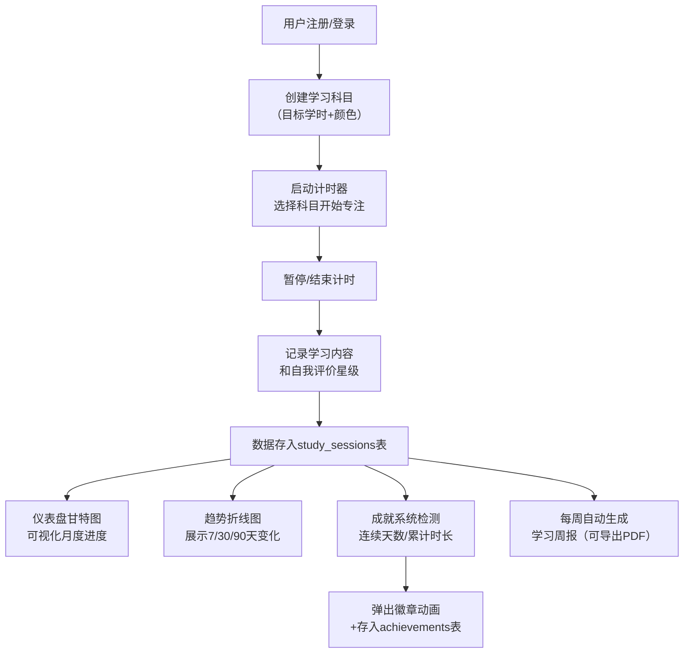

## 1. 产品概述
个人学习进度追踪仪表盘，解决学习者难以感知长期努力累积效果、缺乏持续学习动力的问题。通过可视化展示、专注计时、成就系统等功能，帮助用户建立学习习惯、量化学习成果。

- 面向人群：需要长期学习的学生、职场人士、自学者
- 核心价值：将抽象的"学习努力"转化为可视化的数据、图表和成就徽章，提供即时正向反馈

## 2. 核心功能

### 2.1 用户角色
| 角色 | 注册方式 | 核心权限 |
|------|----------|----------|
| 普通用户 | 用户名+密码注册 | 管理科目、记录专注会话、查看统计、获取成就 |

### 2.2 功能模块
1. **认证模块**：用户注册、登录、JWT鉴权
2. **仪表盘主页**：月度甘特图、本周总学时、成就徽章展示
3. **科目管理**：多科目创建、每周目标学时设置、颜色标识
4. **专注计时器**：开始/暂停/结束、学习内容备注、自我评价星级
5. **趋势分析**：7/30/90天学习时长折线图、冷色到暖色渐变
6. **个人中心**：头像昵称编辑、学习时段提醒、历史记录表格
7. **周报系统**：每周自动生成、科目占比圆环图、PDF导出
8. **成就系统**：连续学习徽章、累计时长徽章、动画弹出效果

### 2.3 页面详情
| 页面名称 | 模块名称 | 功能描述 |
|----------|----------|----------|
| 登录/注册页 | 表单模块 | 用户名密码输入、表单验证、注册登录切换 |
| 仪表盘主页 | 甘特图模块 | 月度日历热力图、按科目颜色填充、悬停显示详情 |
| 仪表盘主页 | 统计卡片 | 本周总学时、连续学习天数、今日目标进度 |
| 仪表盘主页 | 成就徽章区 | 已解锁徽章展示、悬停查看详情 |
| 趋势页面 | 折线图模块 | 7/30/90天切换、冷色暖色渐变、逐段描画动画 |
| 趋势页面 | 日期选择器 | 时间段切换按钮、数据自动更新 |
| 周报页面 | 周报详情 | 本周数据汇总、科目占比圆环图、鼓励语 |
| 周报页面 | PDF导出 | 一键导出周报为PDF文件 |
| 个人中心 | 用户信息编辑 | 头像上传、昵称修改、默认学习时段设置 |
| 个人中心 | 历史记录 | 倒序表格、搜索过滤、展开查看详细备注 |

## 3. 核心流程
用户注册登录后，首先创建学习科目并设置每周目标。然后在学习时启动计时器选择对应科目，专注结束后记录内容和星级。系统会自动收集数据，在仪表盘以甘特图展示月度学习情况，在趋势页面以折线图展示长期变化，并根据连续学习天数和累计时长解锁成就徽章。每周自动生成包含详细统计的学习周报。

## 4. 用户界面设计

### 4.1 设计风格
- **主色调**：蓝紫色 #7c6fff（主色）、金黄色 #f5c542（辅色）
- **深色模式**：背景 #1e1e2e、卡片 #2a2a3e、文字 #e4e4e7
- **按钮风格**：圆角8px、悬停提升亮度10%、0.2s过渡曲线
- **字体**：系统默认无衬线字体（Segoe UI、PingFang SC等）
- **布局**：上下结构 + 左侧可收起侧边栏 + 卡片式主内容区
- **图标**：Lucide React SVG内联图标

### 4.2 页面设计概述
| 页面名称 | 模块名称 | UI元素 |
|----------|----------|--------|
| 登录/注册页 | 表单区 | 居中卡片设计、渐变背景、柔和阴影、输入框聚焦动画 |
| 仪表盘主页 | 顶部导航 | Logo、搜索框、用户头像下拉菜单 |
| 仪表盘主页 | 侧边栏 | 科目列表+本周进度条、可收起为图标栏、选中高亮 |
| 仪表盘主页 | 甘特图卡片 | 日历网格布局、渐变色填充、悬停Tooltip、月份切换 |
| 仪表盘主页 | 统计卡片组 | 数字大字体、趋势箭头、彩色装饰条 |
| 仪表盘主页 | 计时器浮层 | 右上角固定、展开/收起动画、数字时钟字体 |
| 趋势页面 | 折线图卡片 | 图表画布、逐段描画动画、冷色→暖色渐变线条 |
| 周报页面 | 周报卡片 | 分栏布局、圆环图、数据对比卡片、鼓励语卡片 |
| 个人中心 | 历史记录表格 | 斑马纹、展开/收起行、搜索过滤框、分页控件 |

### 4.3 响应式设计
- **桌面端（>1024px）**：完整侧边栏展开、双栏布局、甘特图横向展示
- **平板端（≤1024px）**：侧边栏自动收起为图标栏、单栏布局、图表自适应宽度
- **手机端（≤768px）**：导航栏变为汉堡菜单、计时器浮层改为底部固定、图表转为竖屏布局、表格横向滚动
- **触控优化**：按钮最小点击区域44x44px、关键操作有视觉反馈

### 4.4 动画设计
- **计时器展开**：淡入 + 向上滑入（300ms ease-out）
- **计时器收起**：收缩消失（200ms ease-in）
- **徽章弹出**：旋转360° + 缩放粒子效果（500ms cubic-bezier）
- **折线图描画**：从左至右逐段绘制（1500ms ease-out）
- **按钮悬停**：亮度提升 + 轻微放大（200ms ease）
- **页面切换**：淡入淡出过渡（250ms）
