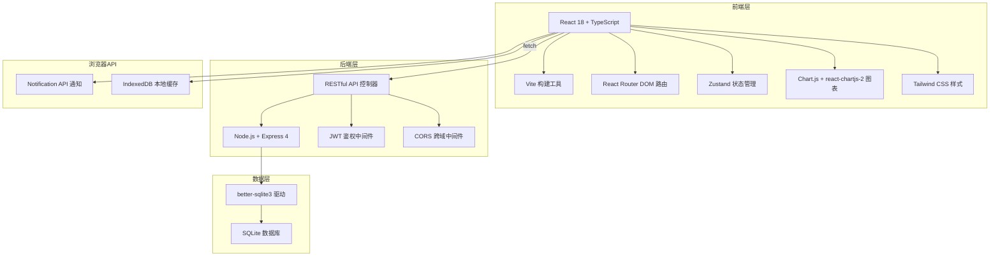
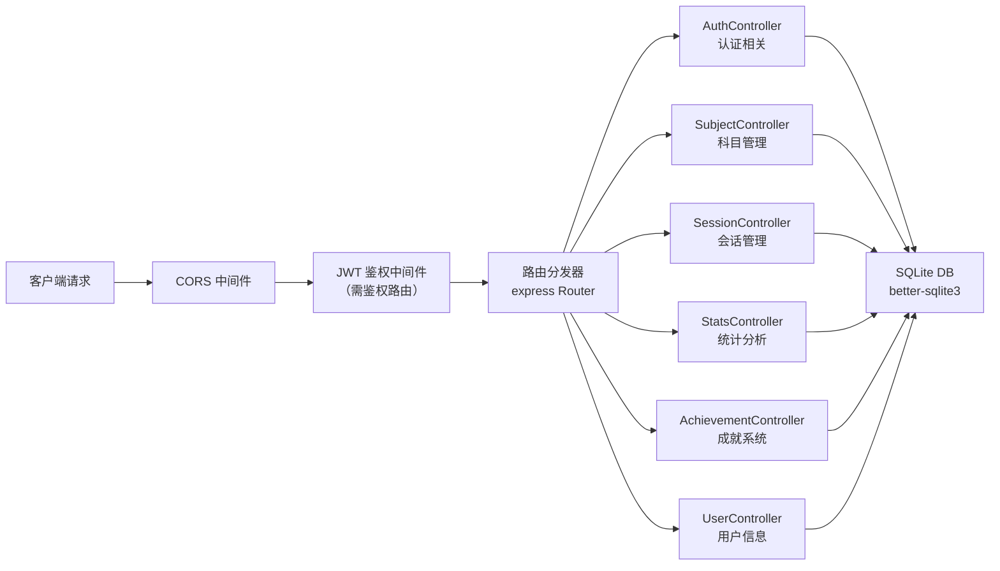
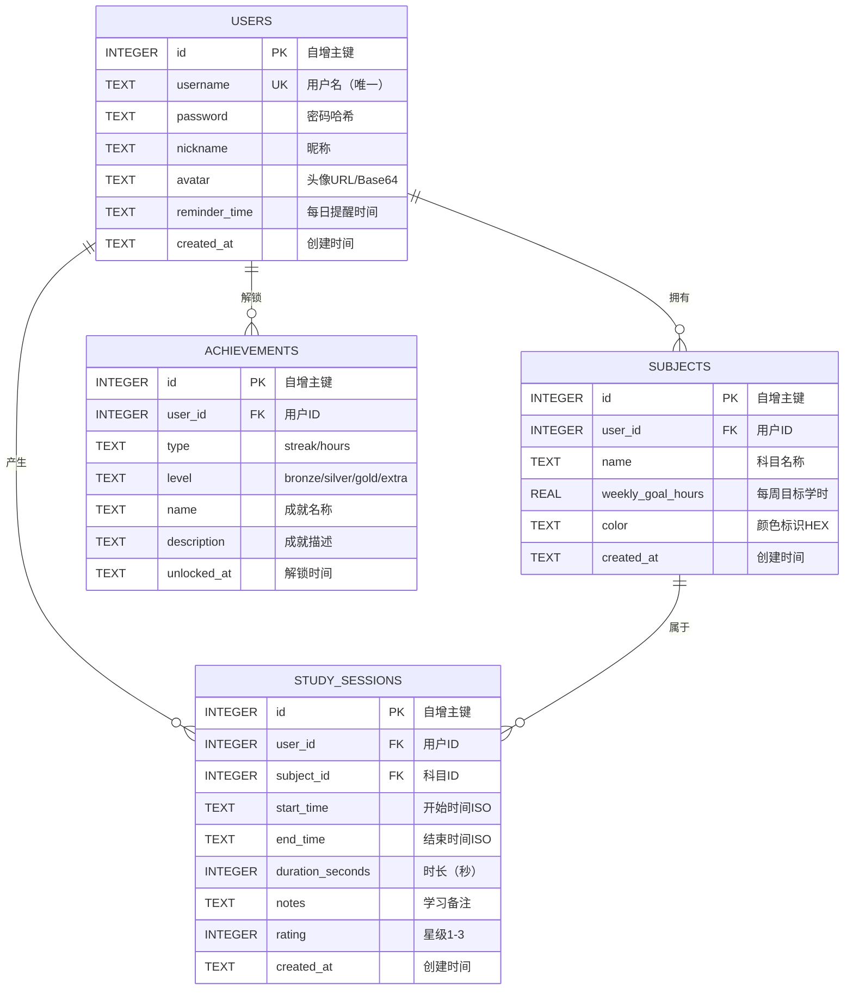

## 1. 架构设计



## 2. 技术说明
- **前端框架**：React 18 + TypeScript（strict模式）
- **构建工具**：Vite 5（@vitejs/plugin-react）
- **后端服务**：Node.js + Express 4
- **数据库**：SQLite（better-sqlite3 同步驱动）
- **路由**：react-router-dom v6
- **状态管理**：Zustand
- **图表库**：Chart.js 4 + react-chartjs-2 5
- **样式方案**：Tailwind CSS 3
- **图标库**：lucide-react
- **鉴权方案**：JWT（jsonwebtoken）
- **拖拽（预留）**：react-beautiful-dnd
- **唯一ID**：uuid

## 3. 路由定义
| 路由路径 | 页面组件 | 用途说明 | 是否需鉴权 |
|----------|----------|----------|------------|
| /login | Login.tsx | 用户登录页 | 否 |
| /register | Register.tsx | 用户注册页 | 否 |
| / | Dashboard.tsx | 仪表盘主页（甘特图+统计） | 是 |
| /trends | Trends.tsx | 趋势分析页面 | 是 |
| /weekly | WeeklyReport.tsx | 学习周报页面 | 是 |
| /profile | Profile.tsx | 个人中心页面 | 是 |
| * | NotFound.tsx | 404页面 | - |

## 4. API 定义

### 4.1 类型定义
```typescript
interface User {
  id: number;
  username: string;
  password?: string;
  nickname: string;
  avatar: string;
  reminder_time: string | null;
  created_at: string;
}

interface Subject {
  id: number;
  user_id: number;
  name: string;
  weekly_goal_hours: number;
  color: string;
  created_at: string;
}

interface StudySession {
  id: number;
  user_id: number;
  subject_id: number;
  start_time: string;
  end_time: string;
  duration_seconds: number;
  notes: string;
  rating: number;
  created_at: string;
}

interface Achievement {
  id: number;
  user_id: number;
  type: 'streak' | 'hours';
  level: 'bronze' | 'silver' | 'gold' | 'extra';
  name: string;
  description: string;
  unlocked_at: string;
}
```

### 4.2 接口列表
| Method | Path | 请求参数 | 响应格式 | 说明 |
|--------|------|----------|----------|------|
| POST | /api/register | {username, password, nickname} | {token, user} | 用户注册 |
| POST | /api/login | {username, password} | {token, user} | 用户登录 |
| GET | /api/subjects | - | Subject[] | 获取用户科目列表 |
| POST | /api/subjects | {name, weekly_goal_hours, color} | Subject | 创建学习科目 |
| PUT | /api/subjects/:id | {name, weekly_goal_hours, color} | Subject | 更新科目信息 |
| DELETE | /api/subjects/:id | {success: true} | - | 删除科目 |
| GET | /api/sessions | ?start_date=&end_date= | StudySession[] | 查询专注会话记录 |
| POST | /api/sessions | {subject_id, start_time, end_time, duration_seconds, notes, rating} | StudySession | 保存专注会话 |
| GET | /api/statistics | ?range=7\|30\|90 | {trend, weekly, streak} | 获取统计数据 |
| GET | /api/achievements | - | Achievement[] | 获取已解锁成就列表 |
| PUT | /api/profile | {nickname, avatar, reminder_time} | User | 更新用户信息 |
| POST | /api/export-pdf | {week_start} | binary PDF | 导出周报PDF |

## 5. 服务端架构图



## 6. 数据模型

### 6.1 ER图



### 6.2 DDL语句

```sql
CREATE TABLE IF NOT EXISTS users (
  id INTEGER PRIMARY KEY AUTOINCREMENT,
  username TEXT UNIQUE NOT NULL,
  password TEXT NOT NULL,
  nickname TEXT NOT NULL,
  avatar TEXT DEFAULT '',
  reminder_time TEXT,
  created_at TEXT DEFAULT (datetime('now', 'localtime'))
);

CREATE TABLE IF NOT EXISTS subjects (
  id INTEGER PRIMARY KEY AUTOINCREMENT,
  user_id INTEGER NOT NULL,
  name TEXT NOT NULL,
  weekly_goal_hours REAL NOT NULL DEFAULT 5,
  color TEXT NOT NULL DEFAULT '#7c6fff',
  created_at TEXT DEFAULT (datetime('now', 'localtime')),
  FOREIGN KEY (user_id) REFERENCES users(id) ON DELETE CASCADE
);
CREATE INDEX IF NOT EXISTS idx_subjects_user_id ON subjects(user_id);

CREATE TABLE IF NOT EXISTS study_sessions (
  id INTEGER PRIMARY KEY AUTOINCREMENT,
  user_id INTEGER NOT NULL,
  subject_id INTEGER NOT NULL,
  start_time TEXT NOT NULL,
  end_time TEXT NOT NULL,
  duration_seconds INTEGER NOT NULL,
  notes TEXT DEFAULT '',
  rating INTEGER DEFAULT 0,
  created_at TEXT DEFAULT (datetime('now', 'localtime')),
  FOREIGN KEY (user_id) REFERENCES users(id) ON DELETE CASCADE,
  FOREIGN KEY (subject_id) REFERENCES subjects(id) ON DELETE CASCADE
);
CREATE INDEX IF NOT EXISTS idx_sessions_user_date ON study_sessions(user_id, start_time);
CREATE INDEX IF NOT EXISTS idx_sessions_subject ON study_sessions(subject_id);

CREATE TABLE IF NOT EXISTS achievements (
  id INTEGER PRIMARY KEY AUTOINCREMENT,
  user_id INTEGER NOT NULL,
  type TEXT NOT NULL,
  level TEXT NOT NULL,
  name TEXT NOT NULL,
  description TEXT NOT NULL,
  unlocked_at TEXT DEFAULT (datetime('now', 'localtime')),
  FOREIGN KEY (user_id) REFERENCES users(id) ON DELETE CASCADE,
  UNIQUE(user_id, type, level)
);
CREATE INDEX IF NOT EXISTS idx_achievements_user ON achievements(user_id);
```
