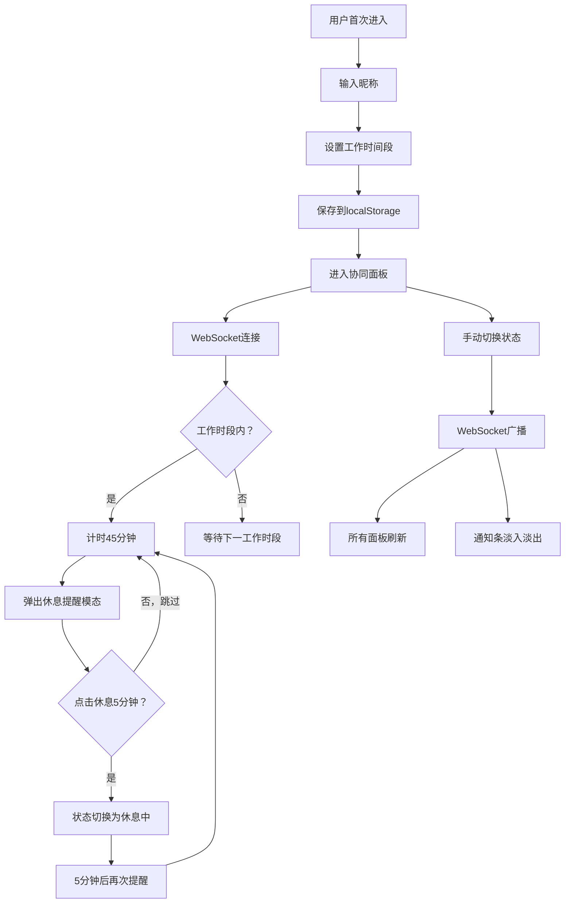

## 1. 产品概述

远程团队休息提醒协同面板，帮助分布式团队管理工作和休息节奏，增强团队协作温度。团队成员可设置工作时间段，系统自动每45分钟弹出毛玻璃休息提醒，同时面板实时展示所有成员的工作状态（工作中/休息中/离开中），通过WebSocket实现状态同步与通知。

- 目标用户：远程办公团队、自由职业者协作小组
- 核心价值：减少久坐疲劳、增强团队感知、提升协作温度

## 2. 核心功能

### 2.1 用户角色

| 角色 | 注册方式 | 核心权限 |
|------|----------|----------|
| 团队成员 | 首次进入输入昵称 | 设置工作时段、查看成员状态、切换自身状态 |

### 2.2 功能模块

1. **协同面板页**：成员状态面板、休息提醒模态、通知条、状态切换

### 2.3 页面详情

| 页面名称 | 模块名称 | 功能描述 |
|----------|----------|----------|
| 协同面板页 | 昵称输入弹窗 | 首次进入时弹出，输入昵称后保存到localStorage |
| 协同面板页 | 工作时段设置 | 设置工作时间段（如09:00-12:00, 14:00-18:00），保存到localStorage |
| 协同面板页 | 休息提醒模态 | 工作45分钟后弹出毛玻璃模态，含渐变动画沙漏图标、"该休息啦"文字、"休息5分钟"和"跳过"按钮 |
| 协同面板页 | 成员状态面板 | 中央展示最多8人头像色块、昵称、状态标签（绿=工作中，橙=休息中，灰=离开中） |
| 协同面板页 | 状态切换下拉 | 手动切换自身状态（工作中/休息中/离开中），WebSocket广播 |
| 协同面板页 | 通知条 | 顶部0.8秒淡入淡出通知，显示"某某 切换到了 xxx 状态" |

## 3. 核心流程

1. 用户首次进入 → 输入昵称 → 设置工作时间段 → 数据保存localStorage → 进入面板
2. 工作时段内，每45分钟弹出休息提醒 → 点击"休息5分钟"或"跳过" → 若休息5分钟后再次提醒
3. 用户切换状态 → WebSocket广播 → 所有面板0.5秒内刷新 → 顶部通知条淡入淡出
4. 成员上线/离线 → WebSocket广播 → 成员列表实时更新

## 4. 用户界面设计

### 4.1 设计风格

- 主色调：深蓝灰（#2D3748）搭配翠绿点缀（#48BB78）
- 卡片：白色圆角设计（border-radius: 16px），充足留白
- 背景：浅灰色到白色的径向渐变
- 按钮：圆角胶囊型，翠绿色主按钮，灰色次要按钮
- 字体：标题使用 Outfit，正文使用 DM Sans
- 图标：lucide-react 图标库
- 所有过渡动画：ease-in-out曲线，0.3秒

### 4.2 页面设计概览

| 页面名称 | 模块名称 | UI元素 |
|----------|----------|--------|
| 协同面板页 | 成员状态面板 | 径向渐变背景、4列网格（桌面端）、2列网格（移动端）、白色圆角卡片 |
| 协同面板页 | 成员卡片 | 圆形头像色块（颜色由昵称哈希生成）、昵称、状态圆点+标签、悬停放大1.05倍+投影加深、状态切换0.3秒背景色淡入过渡 |
| 协同面板页 | 休息提醒模态 | 半透明模糊毛玻璃背景、渐变动画沙漏图标、"该休息啦"文字、"休息5分钟"翠绿按钮、"跳过"灰色按钮 |
| 协同面板页 | 通知条 | 顶部固定条、0.8秒淡入淡出、深蓝灰背景+白色文字 |
| 协同面板页 | 昵称输入弹窗 | 居中弹窗、毛玻璃背景、输入框+确认按钮 |
| 协同面板页 | 工作时段设置 | 时间选择器、添加/删除时段、保存按钮 |

### 4.3 响应式设计

- 桌面端（≥768px）：4列网格布局
- 移动端（375px宽度）：2列网格布局，卡片缩小但保留所有信息
- 触摸优化：按钮最小44px触控区域

### 4.4 动效设计

- 沙漏图标：渐变旋转/翻转动画，CSS keyframes实现
- 通知条：fadeInOut动画，0.8秒
- 成员卡片状态切换：背景色0.3秒ease-in-out淡入过渡
- 成员卡片悬停：transform scale(1.05)，box-shadow加深，0.3秒过渡
