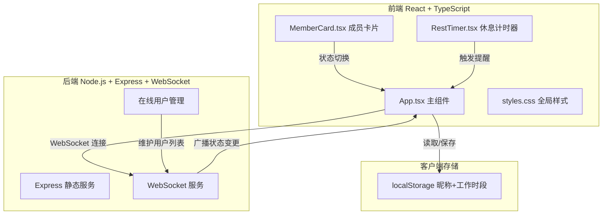
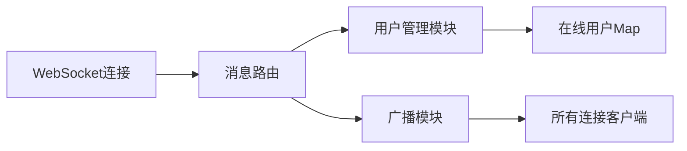

## 1. 架构设计



## 2. 技术说明

- 前端：React@18 + TypeScript + Vite
- 初始化工具：vite-init（react-express-ts模板）
- 后端：Express@4 + ws（WebSocket）
- 状态管理：zustand
- 样式：CSS（全局样式 + CSS变量主题）
- 数据持久化：localStorage（昵称、工作时段）
- 实时通信：WebSocket（ws库）

## 3. 路由定义

| 路由 | 用途 |
|------|------|
| / | 协同面板单页面应用 |

## 4. API定义

### 4.1 WebSocket消息类型

```typescript
interface WSMessage {
  type: 'join' | 'status_change' | 'user_list' | 'user_left' | 'notification';
  payload: {
    userId?: string;
    nickname?: string;
    status?: 'working' | 'resting' | 'away';
    users?: UserState[];
    message?: string;
  };
}

interface UserState {
  userId: string;
  nickname: string;
  status: 'working' | 'resting' | 'away';
}
```

### 4.2 消息流

| 消息类型 | 方向 | 说明 |
|----------|------|------|
| join | 客户端→服务端 | 用户加入，携带昵称 |
| status_change | 客户端→服务端 | 用户切换状态 |
| user_list | 服务端→客户端 | 当前在线用户列表 |
| notification | 服务端→客户端 | 状态变更通知 |
| user_left | 服务端→客户端 | 用户离开 |

## 5. 服务端架构



## 6. 数据模型

### 6.1 客户端数据模型（localStorage）

```typescript
interface LocalUserData {
  nickname: string;
  workPeriods: { start: string; end: string }[];
}
```

### 6.2 服务端内存数据

```typescript
interface OnlineUser {
  userId: string;
  nickname: string;
  status: 'working' | 'resting' | 'away';
  ws: WebSocket;
}
```

服务端使用Map维护在线用户，无需数据库。
