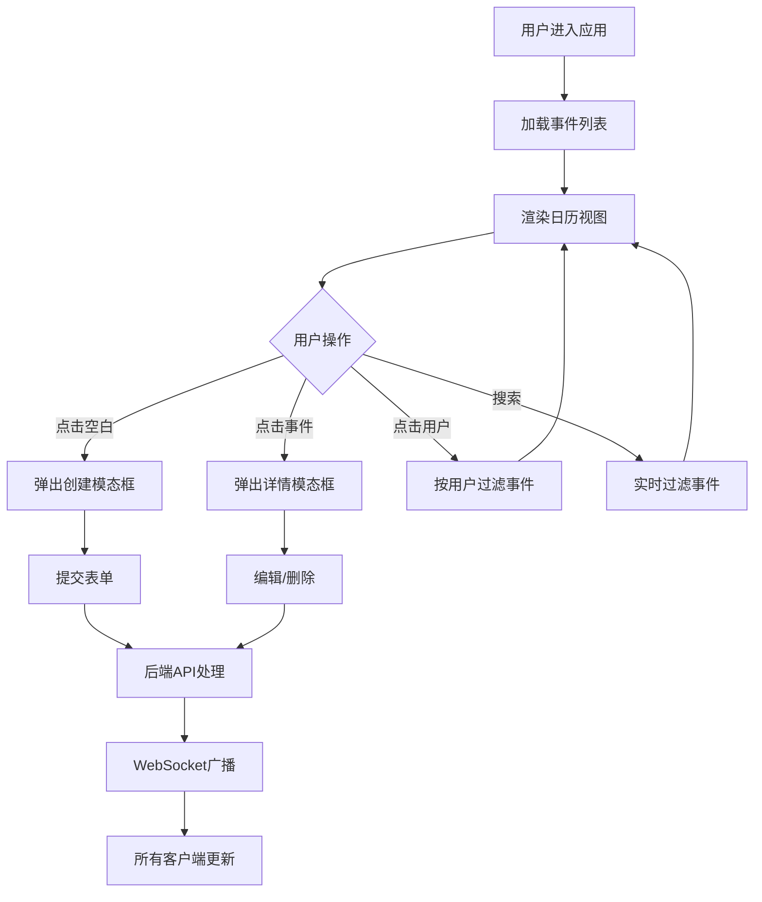

## 1. 产品概述
在线事件日历与日程共享应用，让用户能够创建、管理个人日程，并与团队成员共享事件，避免时间冲突。面向团队协作场景，提供实时同步的日历管理功能。

- 主要目标：解决团队日程共享、时间冲突避免问题
- 目标用户：团队成员、项目协作者
- 产品价值：提高团队协作效率，减少时间冲突，实现日程透明化管理

## 2. 核心功能

### 2.1 用户角色
| 角色 | 注册方式 | 核心权限 |
|------|----------|----------|
| 普通用户 | 内置虚拟用户 | 创建、编辑、删除个人事件，查看团队成员日程，切换用户视图 |

### 2.2 功能模块
1. **日历主页面**：月/周/日视图切换、事件卡片展示、时间冲突可视化
2. **事件管理**：创建、编辑、删除事件，详情弹窗展示
3. **用户筛选**：侧边栏用户列表、在线状态显示、按用户过滤事件
4. **实时同步**：WebSocket多端实时同步事件变更
5. **搜索与导出**：事件标题搜索、JSON格式导出

### 2.3 页面详情
| 页面名称 | 模块名称 | 功能描述 |
|----------|----------|----------|
| 日历主页面 | 日历视图 | 默认月视图，支持切换周/日视图，显示事件卡片，点击空白创建事件，点击卡片查看详情 |
| 日历主页面 | 顶部工具栏 | 搜索输入框（实时过滤）、导出按钮（导出JSON） |
| 日历主页面 | 左侧边栏 | 用户列表（Alice、Bob、Charlie）、在线状态、点击过滤当前用户事件 |
| 事件模态框 | 创建/编辑表单 | 标题（必填，50字符）、时间选择器、描述（200字符）、类别下拉选择 |
| 事件模态框 | 详情弹窗 | 展示事件详情、编辑按钮、删除按钮 |

## 3. 核心流程

### 3.1 创建事件流程
用户点击日历空白时段 → 弹出创建模态框 → 填写表单 → 提交 → 后端保存 → WebSocket广播 → 所有客户端更新日历

### 3.2 编辑/删除事件流程
用户点击事件卡片 → 弹出详情模态框 → 点击编辑/删除 → 提交请求 → 后端更新/删除 → WebSocket广播 → 所有客户端更新

### 3.3 用户筛选流程
用户点击侧边栏用户 → 前端过滤事件列表 → 日历仅显示该用户创建的事件

### 3.4 流程图

## 4. 用户界面设计

### 4.1 设计风格
- 主色调：白底 #ffffff，深蓝文字 #1e293b
- 主按钮：蓝色渐变 #3b82f6 → #2563eb
- 类别颜色：会议 #3b82f6（蓝）、个人任务 #10b981（绿）、截止日期 #ef4444（红）、其他 #6b7280（灰）
- 侧边栏：毛玻璃效果 backdrop-filter: blur(8px)，半透明浅灰 #f8fafc
- 事件卡片：圆角 6px，字体 12px，左侧 4px 颜色条，间距 4px
- 动画：模态框缩放 0.9→1.0（0.3s ease-out），搜索框展开 200px→350px，按钮悬停上移 -1px

### 4.2 页面设计概述
| 页面名称 | 模块名称 | UI 元素 |
|----------|----------|----------|
| 日历主页面 | 布局 | 顶部工具栏（高度64px）、左侧边栏（宽度240px）、主内容区（日历） |
| 日历主页面 | 事件卡片 | 标题、开始时间、颜色标签，悬停阴影 0 1px 3px → 0 4px 8px（0.2s ease） |
| 日历主页面 | 在线状态 | 绿色圆点（在线）、灰色圆点（离线），WebSocket心跳维护 |
| 日历主页面 | 用户高亮 | 选中用户背景 #eef2ff，左侧 3px 蓝色边框 |
| 事件模态框 | 表单 | 半透明遮罩 rgba(0,0,0,0.4)，缩放动画，表单元素间距统一 |

### 4.3 响应式设计
- 桌面端（≥768px）：左侧边栏 240px，事件卡片显示完整信息
- 移动端（<768px）：侧边栏变为底部导航栏（高度 60px），用户以水平滚动圆点头像展示；日历事件显示为紧凑圆点标记，点击弹出浮层

### 4.4 性能要求
- 事件列表加载到渲染 ≤ 500ms（useMemo 缓存过滤结果）
- WebSocket 广播后状态更新 ≤ 200ms
- 搜索防抖 300ms
