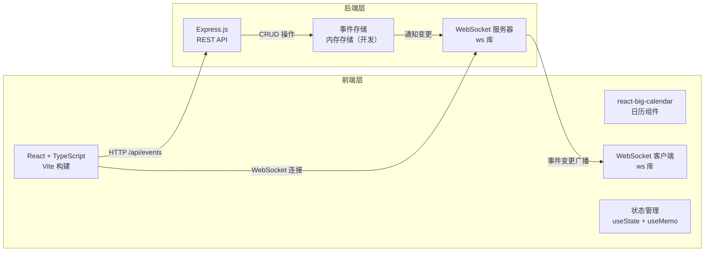
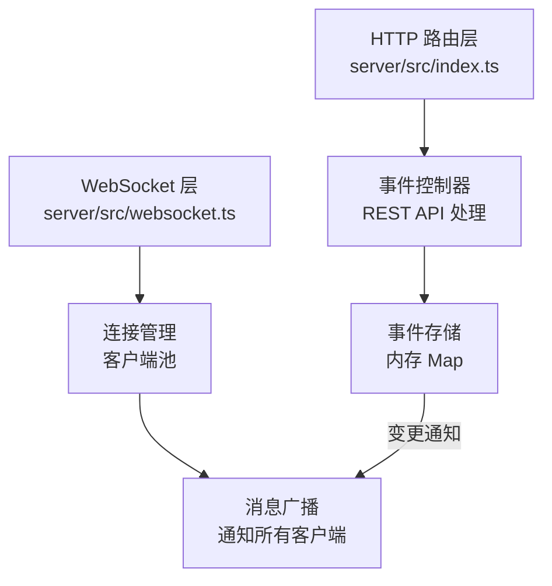

## 1. 架构设计



## 2. 技术描述
- **前端**：React 18 + TypeScript + Vite 5
- **日历组件**：react-big-calendar + moment
- **WebSocket**：ws（前后端统一）
- **后端**：Express 4 + TypeScript
- **ID 生成**：uuid
- **开发服务**：concurrently 同时启动前后端，Vite 代理 /api 到后端 3001 端口
- **前端端口**：3000
- **后端端口**：3001

## 3. 路由定义

| 路由 | 方法 | 用途 |
|------|------|------|
| / | GET | 单页面应用入口（Vite 托管） |
| /api/events | GET | 获取所有事件列表 |
| /api/events | POST | 创建新事件 |
| /api/events/:id | PUT | 更新指定事件 |
| /api/events/:id | DELETE | 删除指定事件 |
| /ws | WebSocket | 实时事件同步连接 |

## 4. API 定义

### 4.1 数据类型定义

```typescript
// 事件类别
type EventCategory = 'meeting' | 'task' | 'deadline' | 'other';

// 事件数据模型
interface CalendarEvent {
  id: string;
  title: string;
  description: string;
  category: EventCategory;
  start: Date;
  end: Date;
  assignee: string; // 创建者用户名
}

// 用户数据
interface User {
  id: string;
  name: string;
  online: boolean;
}

// WebSocket 消息类型
type WSMessageType = 'event_created' | 'event_updated' | 'event_deleted' | 'heartbeat' | 'user_online' | 'user_offline';

interface WSMessage {
  type: WSMessageType;
  payload: CalendarEvent | string | { userId: string };
}
```

### 4.2 请求响应规范

**GET /api/events**
- 响应：`CalendarEvent[]`

**POST /api/events**
- 请求体：`Omit<CalendarEvent, 'id'>`
- 响应：`CalendarEvent`（包含生成的 id）

**PUT /api/events/:id**
- 请求体：`Partial<CalendarEvent>`
- 响应：`CalendarEvent`

**DELETE /api/events/:id**
- 响应：`{ success: true }`

## 5. 服务器架构图



### 5.1 模块职责
- **server/src/index.ts**：Express 服务器初始化，REST API 路由，WebSocket 挂载，事件存储
- **server/src/websocket.ts**：WebSocket 连接处理，心跳检测，消息解析与广播，在线用户管理
- **src/App.tsx**：React 主组件，日历状态管理，WebSocket 事件监听，UI 渲染

## 6. 项目文件结构

```
auto124/
├── package.json              # 根依赖配置
├── tsconfig.json             # TypeScript 配置
├── vite.config.ts            # Vite 构建配置
├── index.html                # HTML 入口
├── src/
│   └── App.tsx               # React 主组件
└── server/
    └── src/
        ├── index.ts          # Express 后端入口
        └── websocket.ts      # WebSocket 处理模块
```

## 7. 配置要点

### 7.1 package.json 依赖
- react, react-dom, typescript, vite
- express, ws, uuid
- react-big-calendar, moment
- @types/react, @types/express, @types/ws
- concurrently, tsx, ts-node（开发依赖）

### 7.2 启动脚本
- `npm run dev`：concurrently 同时启动前端（vite）和后端（tsx server/src/index.ts）
- 代理配置：Vite devServer.proxy 将 /api 转发到 localhost:3001

### 7.3 tsconfig.json
- 严格模式：strict: true
- target: ES2020
- module: ESNext
- jsx: react-jsx

### 7.4 vite.config.ts
- server.port: 3000
- server.proxy: '/api' -> 'http://localhost:3001'
