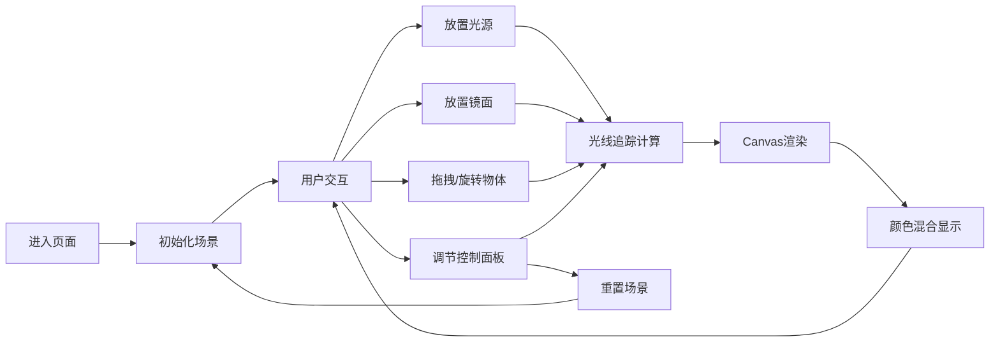

## 1. 产品概述

交互式2D光学实验台应用，用于物理教学中直观展示光线折射、反射及颜色叠加效果。用户可通过鼠标放置光源和反射镜，实时观察光线传播与颜色混合的物理现象。

- **核心问题**：物理教学中难以直观展示光线反射与颜色叠加的动态效果
- **目标用户**：物理教师、学生及光学爱好者
- **产品价值**：通过交互式可视化降低光学学习门槛，提升教学效果

## 2. 核心功能

### 2.1 用户角色

| 角色 | 注册方式 | 核心权限 |
|------|---------|---------|
| 普通用户 | 无需注册 | 使用全部交互功能，放置光源和镜面，调整参数 |

### 2.2 功能模块

1. **画布区域**：800x600 固定尺寸画布，居中显示，支持放置光源和反射镜
2. **光源系统**：支持至少3个点光源，RGB颜色可调，锥形光束角度可调
3. **反射镜系统**：矩形和三角形反射镜，支持拖拽移动和旋转
4. **颜色混合系统**：加色混合算法，重叠区域颜色实时计算与显示
5. **控制面板**：右侧控制面板，包含光源开关、透明度滑块、路径显示切换、重置按钮

### 2.3 页面详情

| 页面名称 | 模块名称 | 功能描述 |
|---------|---------|---------|
| 主页面 | 画布区域 | 800x600 Canvas画布，深灰色背景，光源和镜面交互 |
| 主页面 | 光源模块 | 点光源放置、颜色选择、光束角度调节、开关控制 |
| 主页面 | 反射镜模块 | 矩形/三角形镜面放置、拖拽移动、旋转操作、角度显示 |
| 主页面 | 颜色混合模块 | 加色混合计算、重叠区域模糊过渡、浮动信息标签 |
| 主页面 | 控制面板 | 光源开关、镜面透明度滑块、光线路径显示切换、重置按钮 |

## 3. 核心流程

用户进入页面 → 查看初始场景（含默认光源和镜面）→ 点击画布放置光源/镜面 → 拖拽调整位置 → 旋转调整角度 → 观察光线反射与颜色混合效果 → 使用控制面板调节参数 → 点击重置恢复初始状态

## 4. 用户界面设计

### 4.1 设计风格

- **主色调**：深灰色背景 #1a1a2e，搭配柔和霓虹色系
- **光源效果**：发光效果（Canvas shadowBlur），光束半透明渐变
- **镜面效果**：金属拉丝纹理边缘，半透明填充
- **控制面板**：半透明毛玻璃设计（backdrop-filter: blur）
- **交互动画**：所有交互 0.2s ease-out 过渡动画
- **字体**：现代无衬线字体，清晰易读

### 4.2 页面设计概述

| 页面名称 | 模块名称 | UI 元素 |
|---------|---------|---------|
| 主页面 | 画布区域 | 800x600 Canvas，深灰背景，居中布局 |
| 主页面 | 光源渲染 | 发光圆点，锥形光束渐变，颜色叠加效果 |
| 主页面 | 镜面渲染 | 金属拉丝边缘，半透明填充，角度标签 |
| 主页面 | 控制面板 | 毛玻璃面板，滑块，复选框，按钮，颜色选择器 |
| 主页面 | 浮动标签 | 混合颜色信息，随鼠标位置显示 |

### 4.3 响应式

- 桌面端优先设计，画布固定 800x600 尺寸
- 整体布局自适应窗口缩放，画布始终居中
- 控制面板固定在右侧，宽度固定

### 4.4 性能要求

- 3个光源 + 8个反射物体时帧率 ≥ 30fps
- 光线反射次数最多支持5次
- 使用 Canvas 2D API 优化渲染性能
