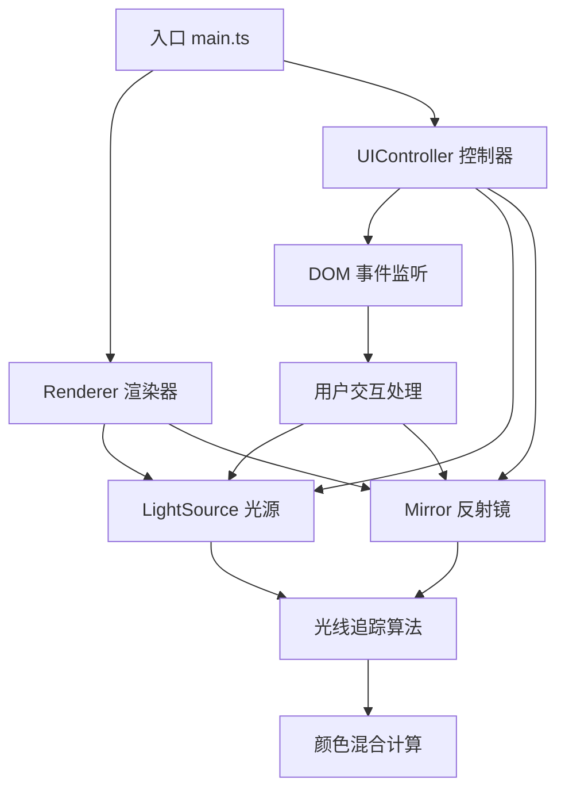

## 1. 架构设计



## 2. 技术描述

- **前端框架**：原生 TypeScript + Canvas 2D API
- **构建工具**：Vite@5.0
- **语言**：TypeScript@5.3（严格模式）
- **样式**：原生 CSS（毛玻璃效果、过渡动画）
- **状态管理**：原生变量管理，无额外状态库

## 3. 文件结构

| 文件路径 | 职责描述 |
|---------|---------|
| `package.json` | 项目依赖与脚本配置 |
| `index.html` | 入口 HTML，包含 Canvas 和控制面板 |
| `vite.config.js` | Vite 构建配置 |
| `tsconfig.json` | TypeScript 编译配置（严格模式） |
| `src/main.ts` | 入口文件，初始化场景、驱动渲染循环、管理事件 |
| `src/lightSource.ts` | 光源类，位置/角度/颜色属性，光束绘制，颜色叠加 |
| `src/mirror.ts` | 反射镜类，位置/形状/角度属性，反射计算，绘制方法 |
| `src/renderer.ts` | 渲染器，每帧绘制，光线追踪，颜色混合处理 |
| `src/uiController.ts` | UI控制器，绑定DOM事件，更新属性，触发重绘 |

## 4. 核心类设计

### 4.1 LightSource 类

```typescript
interface LightSourceConfig {
  x: number;
  y: number;
  angle: number;      // 光束朝向角度
  coneAngle: number;  // 锥形光束角度（默认30度）
  color: { r: number; g: number; b: number };
  enabled: boolean;
}
```

主要方法：
- `emitLight()`: 发射光束，返回光束线段数组
- `draw(ctx: CanvasRenderingContext2D)`: 绘制光源和锥形光束
- `containsPoint(px: number, py: number)`: 检测点是否在光源内（用于拖拽）

### 4.2 Mirror 类

```typescript
type MirrorShape = 'rectangle' | 'triangle';

interface MirrorConfig {
  x: number;
  y: number;
  width: number;
  height: number;
  angle: number;
  shape: MirrorShape;
  opacity: number;
}
```

主要方法：
- `reflect(ray: Ray): Ray | null`: 计算反射光线
- `draw(ctx: CanvasRenderingContext2D)`: 绘制镜面
- `containsPoint(px: number, py: number)`: 检测点是否在镜面内
- `getRotationHandlePos(): { x: number; y: number }`: 获取旋转手柄位置

### 4.3 Renderer 类

```typescript
interface RendererConfig {
  canvas: HTMLCanvasElement;
  lights: LightSource[];
  mirrors: Mirror[];
}
```

主要方法：
- `render()`: 执行单帧渲染
- `traceLightRays()`: 光线追踪（最多5次反射）
- `blendColors()`: 颜色叠加混合计算
- `clear()`: 清除画布

### 4.4 UIController 类

主要职责：
- 绑定控制面板 DOM 事件
- 光源开关、颜色选择器事件处理
- 镜面透明度滑块事件
- 光线路径显示/隐藏切换
- 重置按钮点击处理

## 5. 核心算法

### 5.1 光线追踪算法

- 从光源发射多条光线（锥形光束离散化）
- 每条光线与所有镜面求交
- 计算反射方向，递归追踪（最多5次）
- 每次反射亮度衰减 20%

### 5.2 反射计算

- 计算入射光线与镜面法线的夹角
- 根据反射定律计算反射方向
- 使用向量运算提高计算效率

### 5.3 颜色混合

- 采用加色混合模型（RGB叠加）
- 多光源重叠区域颜色值相加
- 使用 Canvas 的 `globalCompositeOperation = 'lighter'` 实现加色混合
- 边缘使用渐变模糊过渡

## 6. 性能优化策略

- 光线数量适当离散化，平衡效果与性能
- 离屏 Canvas 预渲染镜面纹理
-  requestAnimationFrame 驱动渲染循环
- 最小化每帧重绘区域
- 对象池复用，减少 GC 压力
