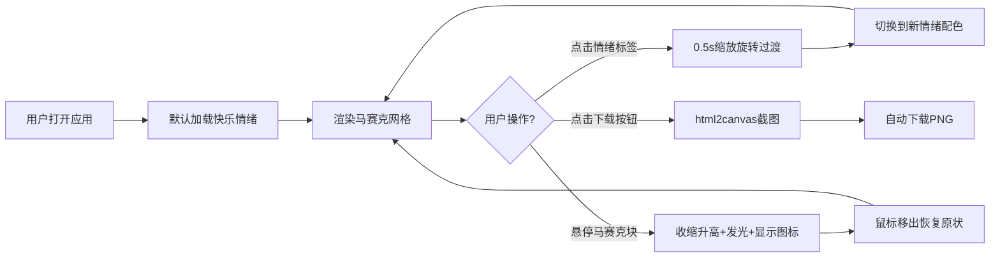

## 1. 产品概述

MoodMosaic是一款情感马赛克画板应用，用户通过选择不同情绪标签生成对应的抽象几何拼贴画，将抽象情感可视化呈现为绚丽的几何艺术作品。

- 核心目的：通过视觉艺术形式表达和探索情绪，提供沉浸式的情感交互体验
- 目标用户：喜欢视觉艺术、追求创意表达的年轻用户群体，以及需要情绪可视化工具的设计爱好者

## 2. 核心功能

### 2.1 功能模块

1. **情绪标签切换模块**：顶部六个情绪标签按钮（快乐、平静、忧郁、愤怒、惊讶、默认），点击切换当前情绪主题
2. **马赛克网格渲染模块**：根据当前情绪生成30+不规则多边形块的拼贴画，支持颜色渐变、随机形状、大小变化
3. **悬停交互模块**：鼠标悬停时块收缩升高、显示情绪图标、边缘发光效果
4. **情绪状态面板模块**：左侧显示当前情绪名称、描述文字、情绪强度进度条
5. **图片导出模块**：右下角下载按钮，将马赛克画板导出为PNG图片

### 2.3 页面详情

| 页面名称 | 模块名称 | 功能描述 |
|---------|---------|---------|
| 主页面 | 情绪标签栏 | 六个情绪按钮，主色背景，0.3s悬停放大，点击脉冲反馈，默认选中"快乐" |
| 主页面 | 情绪状态面板 | 左侧面板，深色背景，显示情绪名称、描述、脉冲动画进度条（60%-100%） |
| 主页面 | 马赛克网格 | 500x500px方形区域，30+多边形块，2px间距，三角形/四边形/五边形，20-80px大小 |
| 主页面 | 马赛克块交互 | 悬停：向内收缩、z轴升高、中心显示情绪图标、边缘互补色发光，0.3s缓动恢复 |
| 主页面 | 下载按钮 | 右下角固定位置，html2canvas截图导出PNG |
| 主页面 | 情绪切换动画 | 0.5s缩放+旋转过渡，Cubic Bezier缓动 |
| 主页面 | 响应式布局 | 宽度<768px时网格缩小为300x300 |

## 3. 核心流程

用户打开应用 → 默认显示"快乐"情绪马赛克画 → 点击其他情绪标签 → 网格以缩放+旋转动画过渡到新情绪配色 → 鼠标悬停马赛克块查看交互效果 → 点击下载按钮导出PNG图片

## 4. 用户界面设计

### 4.1 设计风格

- **主题风格**：深色霓虹风格，赛博朋克艺术感
- **主背景色**：#1a1a2e（深邃夜空蓝紫）
- **情绪主色**：
  - 快乐：#FFD93D（暖金黄）→ #FF6B6B（珊瑚红）渐变
  - 平静：#6BCB77（薄荷绿）→ #4D96FF（天空蓝）渐变
  - 忧郁：#6F69AC（薰衣草紫）→ #95A5A6（银灰蓝）渐变
  - 愤怒：#FF4757（烈焰红）→ #FF6348（橙红）渐变
  - 惊讶：#A55EEA（梦幻紫）→ #F368E0（霓虹粉）渐变
- **文字颜色**：霓虹白色、发光彩色标题
- **按钮样式**：圆角胶囊形，悬停放大1.05倍，点击缩放脉冲，带柔和阴影
- **字体**：展示字体使用具有几何感的装饰字体，正文字体使用现代无衬线字体
- **布局风格**：三栏式布局（左状态面板 + 中网格 + 右下下载），整体居中对齐
- **图标风格**：SVG矢量图标，细线描边风格，与情绪主题匹配

### 4.2 页面设计概述

| 页面名称 | 模块名称 | UI元素 |
|---------|---------|-------|
| 主页面 | 情绪标签栏 | 顶部居中，6个胶囊按钮，横向排列，主色背景，白色文字，悬停发光，激活态有脉冲光环 |
| 主页面 | 情绪状态面板 | 左侧垂直面板，半透明深色背景，渐变边框，标题发光，进度条渐变+脉冲动画 |
| 主页面 | 马赛克网格 | 中央展示区，500x500px方形，微妙阴影边框，悬停块有3D透视效果 |
| 主页面 | 下载按钮 | 右下角悬浮，圆形霓虹按钮，下载图标，悬停旋转+发光 |
| 主页面 | 全局动效 | 情绪切换：整体缩放0.9→1.0 + 旋转±5°，Cubic Bezier(.34,1.56,.64,1)缓动 |

### 4.3 响应式设计

- **桌面端（>768px）**：三栏式布局，网格500x500px，状态面板固定左侧
- **移动端（≤768px）**：垂直堆叠布局，网格300x300px，状态面板移至顶部，标签栏可横向滚动
- **触摸优化**：增大点击热区，touch事件替代hover，长按触发交互效果

