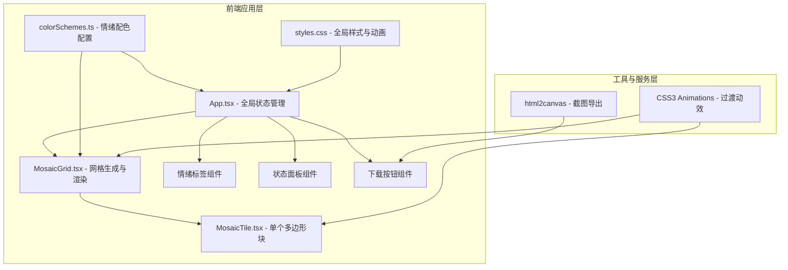

## 1. 架构设计



## 2. 技术说明

- **前端框架**：React 18 + TypeScript 5
- **构建工具**：Vite 5 + @vitejs/plugin-react
- **状态管理**：React useState/useEffect（轻量级全局状态）
- **样式方案**：原生CSS3 + CSS变量，动画使用Cubic Bezier缓动函数
- **导出库**：html2canvas（PNG截图导出）
- **渲染方式**：SVG多边形渲染（更适合不规则几何形状+渐变）

## 3. 文件结构

```
auto127/
├── package.json              # 项目依赖配置
├── index.html                # 入口HTML
├── vite.config.js            # Vite配置（端口3000）
├── tsconfig.json             # TypeScript严格模式配置
└── src/
    ├── App.tsx               # 主组件：全局状态、情绪切换、布局
    ├── MosaicGrid.tsx        # 网格组件：生成30+多边形、排列、过渡动画
    ├── MosaicTile.tsx        # 单个马赛克块：SVG多边形、渐变、交互
    ├── colorSchemes.ts       # 情绪配色方案、形状权重、图标映射
    └── styles.css            # 全局样式：布局、动画、响应式
```

## 4. 数据模型

### 4.1 类型定义

```typescript
// 情绪类型
type Mood = 'happy' | 'calm' | 'melancholy' | 'angry' | 'surprised';

// 颜色方案
interface ColorScheme {
  name: string;           // 中文情绪名
  description: string;    // 情绪描述
  primary: string[];      // 主色调色板（≥4色）
  gradients: [string, string][];  // 渐变色对（≥3组）
  shapeWeights: { triangle: number; quadrilateral: number; pentagon: number };
  icon: string;           // 情绪图标符号
  glowIntensity: number;  // 发光强度
}

// 马赛克块数据
interface MosaicTileData {
  id: string;
  x: number;              // 中心坐标X
  y: number;              // 中心坐标Y
  size: number;           // 尺寸 20-80px
  sides: 3 | 4 | 5;       // 边数（三角形/四边形/五边形）
  rotation: number;       // 旋转角度
  colors: [string, string]; // 渐变色
  glowColor: string;      // 互补发光色
}

// 情绪强度
interface MoodState {
  current: Mood;
  intensity: number;      // 60-100随机
  tiles: MosaicTileData[];
}
```

### 4.2 配色方案配置

| 情绪 | 主色调 | 渐变色 | 形状偏好 |
|-----|-------|-------|---------|
| 快乐 | 金黄、橙红、暖粉 | 黄→橙、橙→红、粉→金 | 五边形偏多（圆润感） |
| 平静 | 薄荷、天蓝、湖绿 | 绿→蓝、蓝→青、白→绿 | 四边形偏多（稳定感） |
| 忧郁 | 灰紫、靛蓝、银灰 | 紫→灰、蓝→靛、灰→白 | 三角形偏多（尖锐感） |
| 愤怒 | 烈焰红、橙红、深赤 | 红→橙、赤→红、黑→红 | 三角形极多（爆发感） |
| 惊讶 | 梦幻紫、霓虹粉、电光蓝 | 紫→粉、蓝→紫、粉→金 | 混合均匀（变化感） |

## 5. 核心算法

### 5.1 网格布局算法
- 使用非重叠随机散布算法（带碰撞检测）
- 生成500x500区域内随机中心点
- 保证块间最小间距2px
- 尺寸按情绪形状权重随机分配20-80px
- 不足30块时迭代重试

### 5.2 渐变与互补色算法
- 线性渐变角度根据位置随机（0-360°）
- 互补色通过HSL色轮反转色相（+180°）计算
- 发光强度随情绪强度线性映射

### 5.3 动画参数
- 情绪切换：`cubic-bezier(0.34, 1.56, 0.64, 1)` 0.5s 缩放0.9→1 + 旋转±5deg
- 悬停过渡：`cubic-bezier(0.4, 0, 0.2, 1)` 0.3s 缩放0.92 + 提升translateZ
- 进度条脉冲：`cubic-bezier(0.4, 0, 0.6, 1)` 0.2s 间隔

## 6. 性能优化

- SVG渲染优于Canvas（更好的CSS动画支持）
- 使用React.memo避免不必要重渲染
- 使用CSS transform（GPU加速）而非布局属性做动画
- 情绪切换时使用key强制重挂载触发动画
- 限制最大块数50个保证30fps+

