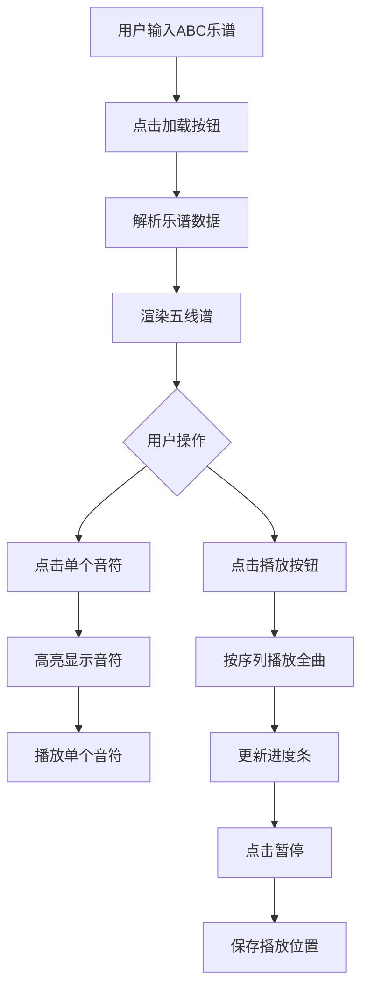

## 1. 产品概述
交互式乐谱标记与演奏辅助Web应用，让用户可以在网页上查看、编辑标准五线谱乐谱，并通过点击音符或播放按钮聆听MIDI演奏。
- 主要用途：音乐学习、乐谱练习、交互式音乐教学
- 目标用户：音乐学习者、教师、乐谱爱好者
- 核心价值：将传统乐谱数字化，提供交互式学习体验

## 2. 核心功能

### 2.1 功能模块
1. **乐谱导入与显示**：支持ABC乐谱字符串输入，渲染标准五线谱
2. **音符点击演奏**：点击音符播放对应MIDI音高，带高亮反馈
3. **整曲播放与暂停**：按谱面顺序演奏，支持进度条指示和暂停续播
4. **乐器切换**：钢琴、电钢琴、弦乐合奏三种音色可选
5. **速度调节**：BPM 60-200范围调节，实时生效

### 2.2 页面详情
| 页面名称 | 模块名称 | 功能描述 |
|-----------|-------------|---------------------|
| 主页 | 乐谱输入区 | 文本框粘贴ABC乐谱，加载按钮触发渲染 |
| 主页 | 五线谱显示区 | Canvas渲染乐谱，显示谱号、调号、拍号、音符 |
| 主页 | 播放控制区 | 播放/暂停按钮、进度条、乐器切换、速度调节 |

## 3. 核心流程

### 3.1 乐谱加载流程
用户输入ABC乐谱字符串 → 点击加载按钮 → 解析并验证乐谱 → 渲染五线谱 → 准备播放状态

### 3.2 音符点击流程
用户点击五线谱区域 → 命中检测（±3像素精度）→ 音符高亮（蓝色圆形，500ms）→ 调用合成器播放 → 控制台输出日志

### 3.3 整曲播放流程
点击播放按钮 → 从当前位置开始 → 按音符序列依次演奏 → 进度条实时更新 → 点击暂停保存位置 → 再次播放从暂停处继续

## 4. 用户界面设计

### 4.1 设计风格
- **主色调**：深暖色调背景 #2D1B00，五线谱区域米白色 #FFF8E7，谱线深棕色 #3E2723
- **强调色**：金色渐变 #D4AF37 到 #FFD700，用于标题和按钮
- **按钮风格**：圆润设计，悬停1.1倍缩放，浅金色发光阴影
- **播放/暂停按钮**：圆形设计，暂停状态绿色，播放状态红色，0.3秒平滑过渡
- **速度滑块**：金色轨道，白色圆形滑块
- **字体**：标题使用衬线字体增强古典音乐氛围，正文使用清晰易读的无衬线字体

### 4.2 页面设计概述
| 页面名称 | 模块名称 | UI元素 |
|-----------|-------------|-------------|
| 主页 | 乐谱输入区 | 多行文本框、金色渐变加载按钮、悬停动画 |
| 主页 | 五线谱显示区 | 米白色背景、深棕色谱线、进度条覆盖层、音符点击高亮 |
| 主页 | 播放控制区 | 圆形播放/暂停按钮、乐器切换按钮组（带下划线动画）、速度滑块（带数值显示） |

### 4.3 响应式设计
- **宽度≥1200px**：五线谱占屏幕70%，居中显示
- **宽度700-1200px**：五线谱占90%，居中显示
- **宽度<700px**：谱面可横向滚动，自动缩放字体大小

### 4.4 动画与交互
- 按钮点击反馈：波纹扩散动画
- 乐器切换：下划线滑动动画
- 播放/暂停切换：颜色平滑过渡（0.3秒）
- 音符高亮：蓝色圆形闪烁（500ms）
- 进度条：水平平滑移动

## 5. 性能要求
- 交互响应延迟≤50ms（点击高亮、播放进度、滑块拖动）
- 渲染4个小节五线谱FPS≥55
- 音频播放无延迟，点击音符即时发声
