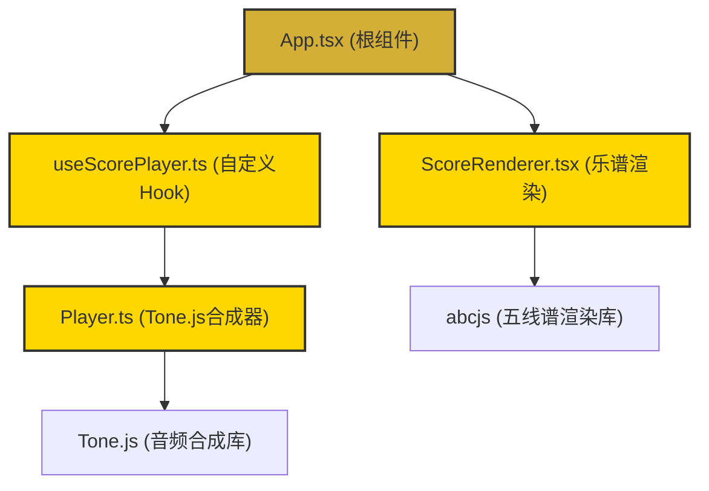

## 1. 架构设计



## 2. 技术描述

### 2.1 技术栈
- **前端框架**：React 18 + TypeScript
- **构建工具**：Vite
- **乐谱渲染**：abcjs
- **音频合成**：Tone.js
- **样式方案**：原生CSS（CSS变量 + 响应式媒体查询）

### 2.2 依赖说明
| 依赖包 | 版本 | 用途 |
|--------|------|------|
| react | latest | UI框架 |
| react-dom | latest | DOM渲染 |
| vite | latest | 构建工具 |
| @vitejs/plugin-react | latest | Vite React插件 |
| typescript | latest | 类型系统 |
| @types/react | latest | React类型定义 |
| @types/react-dom | latest | React DOM类型定义 |
| tone | latest | Web Audio合成 |
| abcjs | latest | ABC乐谱解析与渲染 |

## 3. 模块职责划分

### 3.1 App.tsx（根组件）
- 维护乐谱数据状态（ABC字符串）
- 管理全局UI状态（播放状态、当前乐器、BPM）
- 分发渲染与播放指令
- 整合子组件和Hook

### 3.2 ScoreRenderer.tsx（乐谱渲染组件）
- 使用abcjs库渲染五线谱到Canvas/SVG
- 响应式调整谱表宽度
- 处理点击事件坐标，返回对应音符的音高和时值
- 音符高亮显示

### 3.3 Player.ts（播放器模块）
- 封装Tone.js合成器
- 提供`playNote(note, duration)`方法
- 提供`stop()`方法
- 支持三种乐器音色切换
- 播放时控制台输出日志

### 3.4 useScorePlayer.ts（自定义Hook）
- 串联ScoreRenderer和Player
- 将点击音符的坐标转化为音高字符串
- 调用Player播放音符
- 管理播放状态（正在播放/暂停/停止）
- 管理播放进度

## 4. 数据结构定义

```typescript
// 音符信息
interface NoteInfo {
  pitch: string;      // 音高，如 "C4"
  duration: number;   // 时值（拍）
  startX: number;     // 音符在Canvas上的X坐标
  endX: number;       // 音符在Canvas上的X坐标终点
  y: number;          // 音符在Canvas上的Y坐标
  measure: number;    // 所属小节
}

// 乐器类型
type InstrumentType = 'piano' | 'electricPiano' | 'strings';

// 播放状态
type PlayState = 'stopped' | 'playing' | 'paused';

// 播放器状态
interface PlayerState {
  playState: PlayState;
  currentMeasure: number;
  bpm: number;
  instrument: InstrumentType;
}
```

## 5. 核心接口定义

### 5.1 Player类接口
```typescript
class Player {
  constructor();
  setInstrument(instrument: InstrumentType): void;
  setBpm(bpm: number): void;
  playNote(note: string, duration: number): Promise<void>;
  stop(): void;
  playSequence(notes: NoteInfo[], onProgress: (measure: number) => void): Promise<void>;
  pause(): void;
  resume(): Promise<void>;
}
```

### 5.2 useScorePlayer Hook接口
```typescript
function useScorePlayer(): {
  playerState: PlayerState;
  handleNoteClick: (note: NoteInfo) => void;
  togglePlay: () => void;
  setInstrument: (instrument: InstrumentType) => void;
  setBpm: (bpm: number) => void;
  setNotes: (notes: NoteInfo[]) => void;
  highlightedNote: NoteInfo | null;
  currentMeasure: number;
};
```

### 5.3 ScoreRenderer Props
```typescript
interface ScoreRendererProps {
  abcString: string;
  onNoteClick: (note: NoteInfo) => void;
  highlightedNote: NoteInfo | null;
  currentMeasure: number;
  width: number;
}
```

## 6. 性能优化策略

### 6.1 渲染优化
- 使用CSS `will-change` 优化进度条动画
- 音符命中检测使用空间分区（按音符X坐标排序，二分查找）
- Canvas渲染使用离屏Canvas预渲染谱线

### 6.2 音频优化
- Tone.js合成器预初始化，避免首次点击延迟
- 使用AudioContext时间戳调度，确保播放精度
- 音符停止使用快速衰减，避免爆音

### 6.3 响应式优化
- 使用ResizeObserver监听容器尺寸变化
- 防抖处理窗口resize事件
- 移动端使用touch事件优化点击响应
